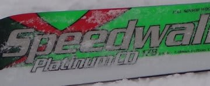

# 新しい仲間が増えたよ…VOLKL PLATINUM CD 178cmのインプレッション

📅 投稿日時: 2013-01-24 00:31:12

さてさてさて．

ってことで．

長い前フリ[1](e7fa96c3f88bd94ba6390c710d6538679.md),[2](e2417d511869d49d0e1e493c47fbd692c.md),[3](ecc72330cb8bfe2567d1b372d6b1bb067.md)が続きましたが．

想定外に購入した，VOLKL Platinum CD speedwall 178cm.

昨シーズン試乗して，すごく気に入ったのでこいつにしたわけですが．

購入してしばらく履いてみての，インプレッションをば…

メーカー一押しの長さは171cmですが，今回は大回りメインということで

長めの178cmを選んでみました．

いやー．むちゃくちゃ軽いよ．この板．

持った時の重さが，165cmのATOMIC SXより軽い！

この軽さのおかげで，178cmという長めの板でも，

振り回したときの軽さは170cm程度に感じます．

…が．滑ったときの安定度は180cm級の感じ．

圧雪整地でのグリップ力は強い．

結構がっつりグリップします．

板の張りも，軽さに似合わないしっかりした張りがあり，

かなりのスピード耐性．

ポジションは，今風のしっかりしたかかと軸．

土踏まずよりテール寄り．

ロッカー板なので，トップを押さえる動きは不要です．

トップの押さえが強いと詰まっちゃったり，トップが逃げたりすることも…

整地で，かかと軸で切り替えていくと．

なんだか，谷回りだけで回っていくような，見事な谷回りが勝手にできて行きます．

切り替えで上体を適切な角度に運び，板を走らせていくと，

フォールラインに絡むまでの谷回りの間に．

雪面に手がついてしまうほどの軸の傾きが出せます．

ターン前半でのグリップの立ち上がりの早さ，グリップ力がピカイチ．

そして．

谷回りでしっかり傾いていけるので．

山回りは足元のしっかりしたグリップを感じつつ傾きを戻していくだけでよく．

山回りの抜けのよさを感じられます…

178cmだとRは18.6mってことですが．

整地でトップスピードで滑った感じでは，張りがしっかりしているからか，

感覚的にはもう少し大きい感じに感じます．

かなり長－－－い谷回りが作れます．

＃不整地で履くと，トップ＆テールロッカーだからかスイングウエイトが軽いからなのか，

＃もう少しRが小さく感じるという不思議な板

うーん．

普通のロングベースオールラウンドなら，やっぱり171cmがベストですね．

171cmで，十分な安定度の大回りができそう．

あ，慣れてくると，178cmでも，小回りっぽい滑りができるようになってきます．

まぁ，178cmのこの板を履いて，小回りをしようとはあんまり思わないです(笑）．

で．

この板のすごいのは．

整地ではなく，

不整地や荒れた雪．

なんだか，不思議な履き心地．

荒れた斜面に突っ込んだとき，普通なら，

「あ，衝撃がくる！」

と身構えるものですが．

まるで，スポンジが足と雪面の間に入っているかのように．

板がたたかれること無く，荒れたエリアを高速大回りで回っていけます．

普通なら，ばたばたと飛ばされて，ラインが落とされていくような

細かな凹凸が続く斜面でも，滑らかに滑っていけます．

…これは，文章では上手く説明できないなぁ．

なんにしろ，荒れた斜面での安定度は

「なんじゃこりゃぁ」

って感じです．

うーん．

これがロッカーの効果なのか？？

ちょっと178cmだと長い気がするけど，コブにも入ってみたいなぁ…

コブのピッチが細かすぎなければ，結構いけそう．

あー．やっぱり，171cmにしといたほうが良かったかな．

それならコブもいけるでしょう…

とりあえず，まとめると．

やっぱり．

いい板です！

買ってよかった…

## 💬 コメント一覧

### 💬 コメント by (kotaro)
**タイトル**: Unknown
**投稿日**: 2013-01-24 07:27:19

はじめまして。

いつも拝見させていただいております。

私も今期CDを購入しました(海外版ですが)

この板、荒れた雪でギャップを舐めていくような

不思議な安定感がありますよね。

慣れてから、前の板に戻すと違和感ありありでした。

### 💬 コメント by (mari)
**タイトル**: Unknown
**投稿日**: 2013-01-24 09:51:30

フォルクルのSWもぺらぺらで軽いのに安定感があります。

恐らく構造は同じだと思うのですが、板とビンディングの間にあるプレート状の物体がミソなんだとか。このプレート、かかと側は板とくっついているのですが、つま先側がフリーで浮いているため、雪面から受けた振動をここでうまく吸収するんだそうです。Sさんもいらっしゃってたダイヤモンドの試乗会のとき、SWがあまりにも気に入って何度も借りてたら、メーカーのおじさんが教えてくれました。薄くて軽くてぺらぺらなのに不思議に安定してるのは、そーいう秘密があるんだそうです。

ちなみに、CDは硬過ぎて私には扱えないなーと思ったんですが、SWを中二の息子にお買い上げ。彼自身は試乗してないんですが、ものすごく気に入って履いてくれてます。息子が部活で来れないときには私が奪って履くつもり…ｗ

### 💬 コメント by (ひろりん)
**タイトル**: Unknown
**投稿日**: 2013-01-24 11:24:11

＞板がたたかれること無く，荒れたエリアを高速大回りで回っていけます

そう！

かたい雰囲気あるんですけど、身構えて荒地に入ると肩透かしみたいな。

その、かたい雰囲気のせいでコブテストしなかったんだけど、入ればよかったです。

でも私の技術では多分発射して終わる・・・orz

てか、大回りもこいけるし、スピード落としても板振り回せるし、何用なんだろ、この板？？？？？って感じでした。

### 💬 コメント by (Skier_S)
**タイトル**: 皆さんCD履いた事あるんですね…
**投稿日**: 2013-01-24 23:50:10

>kotaroさま

はじめまして…

海外版というと，CODE　Speedwallですか？

国内では普通には売ってないような気が…

なかなかマニアックですね．

一旦この板で荒れた斜面を滑ると，元の板に

戻したときに「い，板がたたかれるっ！！」

って感じが強烈ですよね…

ホントに，不思議な安定感です．

あと，この板に慣れすぎると，トップを押さえないと

曲がらない古い板は履けなくなります（笑）．

>mariさま

SWもすごく軽くて扱いやすい板ですよね～．

昨シーズンからのVolklの軽さと扱いやすさは

ピカイチですよね．

そーでしたか．

それには，そんな秘密があったんですね～．

息子さんと板が共有できるって，うらやましい…

うちは嫁さんがPlatinum Rなので，履いてみたいのですが

ブーツサイズが違いすぎて…

ビンディングの調整の仕方がわからないので，

いまだに履けてません．

＃夫婦でVolklを履くとは思わなかった

>ひろりんさま

いやー．

CDの171cmで，こぶに入りましたけど良かったですよ．

軽さとロッカーのおかげで，かなり自由に振り回せます…．

で．この板．

何用かというと．

おそらく…不整地大回り用かと（爆）．

