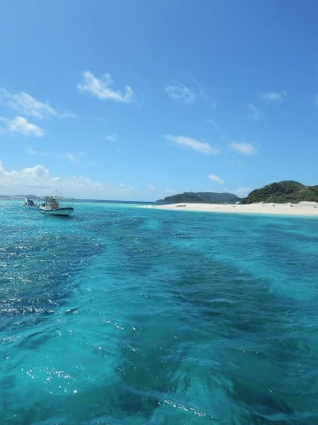
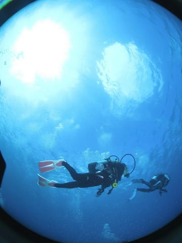
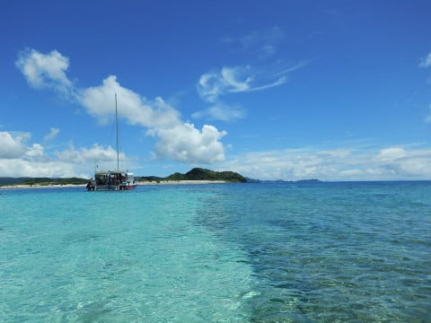
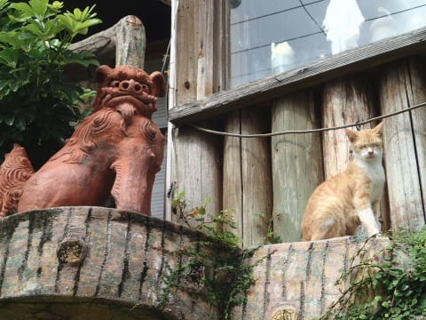
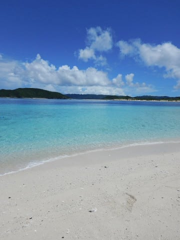
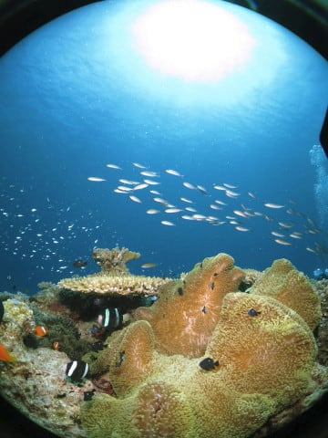
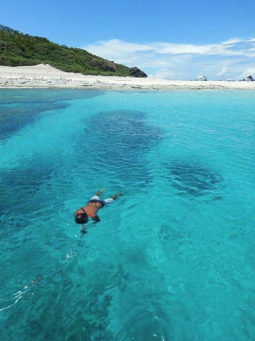

# 2018年8月，子連れ座間味で小5の娘とファンダイビング！エピローグ

📅 投稿日時: 2019-10-02 03:17:55

ってなことで．

モアルボアルでCカードを無事取得して．

今回が，娘と初めてのファンダイブ旅行．

両親のどちらかが船に残る必要もなくなり．

子供が生まれてから，夫婦交代で

潜っていたので，ダイビングの本数が

半分になってしまい．

例えば，普通なら4日の遠征で，

一日3本ずつの12本潜れるところが，

一人6本ずつしか潜れないとかで．

年間で潜る本数がぐっと減ってしまって

いたところ．

娘がダイバーになった今回は，

両親二人とも，フルでダイビングを

楽しむことができるようになったわけ

ですが．

…フルで潜れるようになってみると．

「そりゃ，あたりまえだろ」

と思うことに，あらためて気づかされるわけで．

…それは何かというと．

夫婦合わせたダイビング本数が倍になり，

娘のダイビングフィーもかかるので，

ダイビング費用が3倍になる

ということに…

いや．

分かっていたんです．

娘をダイバーにする前から

分かっていたことなんですが．

…実際にダイビングの支払いをする

時に，改めて思い知らされたわけで…

痛い．

…これは，お財布に痛い…（涙）

まだ小学校5年生なので，

宿泊費や航空費が子供料金

だからいいけど．

これであと2年経つと，

これらも大人料金になるのか…

…

…

娘が中学生になったら，

これまで通りの，年2回のダイビング

遠征は厳しいかも…

いや．

しかし．

中学生になったら，父親と

旅行に一緒に行ってくれないという

可能性もあるので．

娘が一緒に潜りに行ってくれる限りは，

なんとか頑張って稼いで，

一緒に潜りに行こう…

と．

ダイビング代の請求書を見ながら思った，

Skier_Sだったのでした…

　

　

　

　

