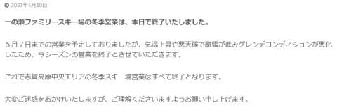
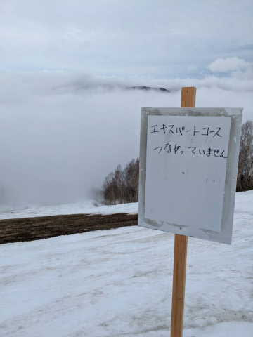
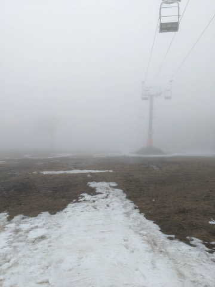
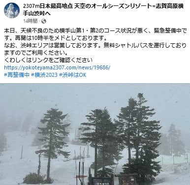
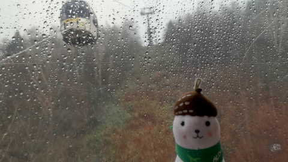
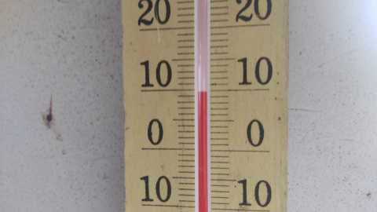
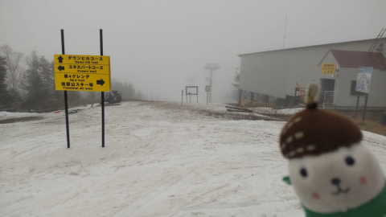
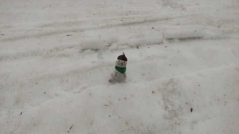
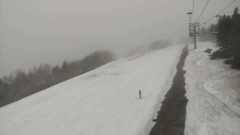

# なんと！5月1，2日は休めたよ！明日から志賀高原へ行ってきます～！！…でも今日の雨で中央エリア終了，熊の湯ペアも下だけ，奥志賀も第2は終了（涙）

📅 投稿日時: 2023-05-01 00:28:02

🏷️ カテゴリ: [日記](cc4b5682fb7b8b144980957a978653fb0.md)

ってなことで．

GW前半の29，30日は，涙の出張でスキーに

行けなかったわけですが…

そのかわり，5月1，2日は休みをもらえました～！！

滑らなきゃ死ぬので，明日から滑りに行きます…

でも．

今日もついさっき，出張先から新幹線で

帰ってきたばかりというのに…

あと3時間半後に出発できるのか？？

休日出張を含む7連勤のあと，睡眠時間

3時間で無事志賀高原に着けるのか？？？

…こうご期待…！！←無事に着けなかったというオチに期待しろということか？？

…ということで．

5月1日から滑れることになったのは良かったんですが…

でも．

今日の雨で，志賀高原もかなりやられちゃった

ようです（激涙）

やはり予想通り，一の瀬ファミリーが息絶えて．

本日をもって中央エリア全リフト，今シーズンの

営業終了（涙）

（[志賀高原中央エリアホームページ](https://shigakogen.co.jp/archives/14929)より）

そして，熊の湯もやられてしまい…

本日をもって，山頂からの滑走終了（泣）

明日からは，ペアリフト中間駅から下だけになります…

さらに，奥志賀高原．

特派員からの写真によると，

予想通り，第2ペア沿いのエキスパートコースが

途切れたようで…

いや…これはひどい…

今日はコースが途切れたこの部分，

板を脱いで歩いて滑ったようです…

ここを向こうまで歩いて行ったのか…

ってなことで．

奥志賀第2ペアリフトも，本日をもって死亡．

明日からはゴンドラで上がって，その上の

第3，第4リフトのみ滑れるようです．

早朝営業はやりません…

そして，横手山．

横手山もかなりやられたようですが，

本日はまだ第1，第2，第3リフトと渋峠，

全て動いたようです…

あ，第1，第2はコース整備で10時半からの

営業だったようですが．

…明日，第1動くのかな…？？

とりあえず，渋峠は6時から早朝営業するようです．

（[横手山スキー場Facebook](https://www.facebook.com/yokoteyama2307/)より）

ってなことで．

今日の雨で，

一の瀬ペア

奥志賀第2

熊の湯山頂まで

が死に絶えて…

残るは，

奥志賀第3，第4

熊の湯第2ペア下半分

横手山第2，第3，渋峠（第1，明日動くのかな…？）

という感じです．

…寂しくなったもんだ…

あぁ…雨でやられる前の29日に滑りに

行きたかった…

そして．

今日の雨がどれくらい悲惨だったか，いつもの

おこみん特派員が送ってくれましたが…

今日は朝9時過ぎには止む予想だったのに…

実際に雨が止んだのは昼過ぎ，12時半だった

ようです…

誰だ？？適当な予想をした奴は！？？←お前だ

そして，気温は10時ごろで+10℃と高く．

雨＋高温のコンボで雪をいじめてくれます（泣）

おかげで，雪はかなり減って…

雪質を期待してはいけないレベルの，大変

悲しい雪だったようです…（涙）

ただ．

奥志賀第3，雪は薄くなったものの，まだ雪が

そこそこあるように見えますね…！！

よく今日の雪に耐えたものだ…

奥志賀もかなり雪が薄くなりながらも，まだ

生き残ってるみたいだし．

この異常高温の3月にも関わらず，

GWに雪が残ってくれただけ，まだマシだと

自分に言い聞かせよう…

ってなことで．

あと3時間後に出発です～！！

…あと2時間ちょいしか寝られない…（泣）
