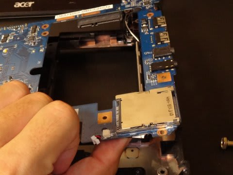

# ACER aspire 1830Zの時計バックアップ電池を交換してみた　その2

📅 投稿日時: 2014-10-21 02:39:34

🏷️ カテゴリ: [PC,カメラ&小物](c0d8caed13e597efe97b661a8ae56bed0.md)

ってことで．

ようやっと電池までたどり着いたので．

この電池を外しましょうか．

…マザーボードに，両面テープでしっかり

貼り付けてあるので，バリバリとはがします．

ええ，バリバリと．

そして，コネクタを外せば…

ようやっと，RTCバックアップ用電池の

取り外しが完了です！

…長かった…

この電池．しっかりビニールでくるまれているので．

このビニールを，カッターでためらいなく切り刻みます．

何のためらいもなくズバズバ切ってしまいましょう．

そうすると，現れ出でたる，ボタン電池様…

って，おい．

これ．

電池の表面に，直接電極が溶接してあるよっ！？？

え？電池表面に溶接って，できるの？？

…コストダウンのために，ここまでやるのか…

とりあえず．

力技で引っ張れば，溶接点は電池から外れますので．

引っ張って電池から電極を外しましょう．

この電池の電圧を測ってみると…

0.8Vでした．

あー．やっぱり．

完全に死亡ですね…

なので，新しい電池を取りつけるわけですが．

さっき電池から取り外した電極板．

ぐにゃぐにゃに曲がってしまったので．

この電極板を，テープで押さえただけでは

上手く電池に接触してくれません．

＃一回やってみたけど，ゆすったり，テープを貼ってから

＃時間がたったりすると接触不良を起こしました（涙）

なので，矢印部分でカットして金属板を取り除いたあと，

裸線を出して．

それに電池を直にはんだ付けしてみました．

＃電池内部のセパレータが破損するほど加熱しちゃうと，

＃電池が内部ショートして破裂するので，はんだ付けは

＃お勧めしません（^^;

＃裸線をただテープ止めする方が安全かも…

んで．

こいつを，テープでぐるぐる巻きにして…

マザーボードにとりつけます．

最初に電池が入っていた，マザーボードの裏に電池を

回して…

マザーボードの裏にテープ付けして…

そのあとは，

分解したのと，全く逆の手順で組み立てていきます．

そして，組み立て完了．

スイッチを押すと…

無事，起動しました！

…これで．

再起動してみても，バッテリーをいったん外してみても．

時計がリセットされることなく，無事に時計が動き続ける

ことが確認できました…

あー．

長い道のりだった…

ということで．

ACER Aspire 1830Zをお持ちの方で．

時刻が毎回リセットされるようになった方は．

この方法をお試しください！

＃って，ホントにやる人いないって

## 💬 コメント一覧

### 💬 コメント by (megalith)
**タイトル**: Unknown
**投稿日**: 2014-10-23 14:50:10

すみません。

ボタン電池の電池の半田付けですが、非常に危険です。

もし爆発した場合どのようになるのか。

ググったらありましたのでURLを乗せておきます。

http://tamzortho.exblog.jp/10786857

このブログの人もけがはありませんでしたが、半田ごてが

見事にダメになっていました。

今回は無事に作業はできましたが、一歩間違えれば火災

や大けがになりかねません。

少なくとも、おすすめはしない方がよろしいかと思います。

### 💬 コメント by (Skier_S)
**タイトル**: megalithさま
**投稿日**: 2014-10-24 00:46:47

お久しぶりです～！

お元気でしたか？

いやー．

このサイト，見せてもらいましたが．

あんな熱容量の大きそうな電極を

はんだ付けするとは…

危険ですね～

＃人のこと言えませんが

ご指摘の通り，マンガンLi系ボタン電池ですから．

内部のセパレータを溶かすほどの熱を加えると，

ショートして破裂します！

…そーゆー意味もあって，私も

電池に電極を直接ウェルディングしてあるのを見て

ビビったわけです．

＃US溶着じゃなく，明確に抵抗溶接…

確かに，はんだ付けは万人に薦められる

技ではないですね（＾＾；

なぜ，私が着けたリードの裸線部分が

これだけ短いのか，電池表面のはんだの濡れが

これだけ少ないのか…とかに気づいてくれる

レベルの人ではないと，はんだ付けは危険かも．

本文に注意書きを加えておきました

### 💬 コメント by (十九)
**タイトル**: とても参考になりました
**投稿日**: 2015-09-20 12:01:00

徒然スキーヤーさん

こんにちは。

電池交換の記事、ありがとうございました。

私の1830Zも時計がリセットされるようになり大変困っていました。WEBで検索してここに辿り着いたしだいです。写真付きで詳細に解説頂いているお陰で、何とか私の1830Zも復活しました。トップパネルが中々外れず苦労した（アルミテープが繋がっていたのが原因）以外は大きな問題は有りませんでした。

組立後起動して1時間ほど動かしていますが、今のところ順調です。

ただ作業後にコメントを読んで、ボタン電池半田付けの際に爆発しないで良かったとドキドキ。はんだごての写真とても恐いですね、気軽な気落ちと状態で作業したので。

ノートパソコンの分解は初めてで、ここの解説がなければ、途中で諦めていたと思います。

徒然スキーヤーさんの知識とチャレンジ精神、羨ましい。

本当に助かりました、ありがとうございました。

### 💬 コメント by (Skier_S)
**タイトル**: 十九さま
**投稿日**: 2015-09-20 23:43:58

ようこそ！わがBlogへ…

この記事が役立ったようで何よりです．

＃こんなPCのバックアップ電池を換えようって人が

＃まさかいるとは思いませんでした…（笑）．

ボタン電池の半田付けですが，リードに電極を

つけたままだとコテを長いこと当てなくてはならず，

リードの金属部分を切り取って半田付け

しているところがミソです（汗）．

私もノートパソコンの分解は初めてでしたが，

何でも分解して直しちゃう人なので…（＾＾；

また，今後もこのBlogを読んでやってください．

よろしくお願いします～！！

### 💬 コメント by (ううう)
**タイトル**: Unknown
**投稿日**: 2016-03-24 21:31:59

とても助かりました

私のPCも時計が狂ってしまって

こういう記事を探してました

### 💬 コメント by (K)
**タイトル**: Unknown
**投稿日**: 2018-10-14 22:59:55

大変参考になりました。Aspire5330ですが、起動しなくなったので分解して清掃したりしましたが解決せず、ボタン電池ではという結論に。交換しようと思いましたがやはり直接ボタン電池に電極つながっているようなので、交換考えていました。とても参考になりました。まだためしていませんが、近いうちにやってみます。またボタン電池にハンダはご法度の記事も大変助かりました。危うく私もハンダ使うところでした。ありがとうございました。

### 💬 コメント by (Skier_S)
**タイトル**: Kさま
**投稿日**: 2018-10-15 00:43:10

はんだ付け，慣れてる人なら大丈夫なんですが…

私の写真を見て，電池の大きさと比較すれば，

コードの長さも最小限，乗ってるはんだの量も最小限に

なっているのがお分かりかと．

ほとんど加熱せずにすぐはんだ付けできるように，

こうなってます…

これを一瞬(1秒程度）ではんだ付けできるスキルを持っていれば，

はんだ付け可能ですが…

電池が熱くなるほど温めるとおそらく破裂します．

ご注意ください(笑)．

ちなみに，RTC用電池が死んでも起動はするはずなのですが…

我が家の場合は，時計が狂うだけで起動はしたのですが…

全く起動しないってのは，BIOSが飛んでる気がします．

とりあえず，電池を換えても起動しなければ，電気屋さんに

持っていくしかないかと思います．

ご健闘を祈っています！

