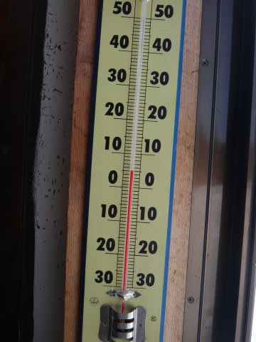

# 天気予報大外れ…12月15日の志賀高原は晴れたけど，春の雪(涙)

📅 投稿日時: 2012-12-15 17:55:47

…なんということだ．

志賀高原の天気予想，かなりの精度だと自負していたのに．

近来まれに見る大はずしではないか．

…南風が吹き込み，気温が異常に高くなって，雪が悪くなるところは

当たったんですが．

なぜか．

なぜなんだか．

雨のはずが，晴れました！

…まぁ，うれしい方向に外れてくれたんで，いいんですけどね～．

朝のうちは曇り気味だったけど…

午前のかなり早い段階から，時折日が指し．

10時ごろからは，雲が多いものの，完全にお日様が顔をだして

きました！

そして．

今週から，焼額第1ゴンドラが運転開始！！

…でも．

強風で第2ゴンドラは動かず．

第1ゴンドラも減速運転とのこと．

ちと残念．

山頂は…

うひょー，

シマシマだっ！

と，喜び勇んでゲレンデへ飛び出したところ．

…

あれ？

なんだか．

板が雪に貼りつく…

みたところ，ゲレンデ状況はよさそうなんですが．

コンディションはすごくよさそうに見えるんですが．

かなりいけてる感じに見えるんですが．

気温は朝からプラス．

…春の雪だよ，こりゃ．

板が滑らない，すごい重い雪です．

昼には山頂でもプラス5度と，暑いくらいにまで気温が上がり…

…滑ってて楽しくない（泣）

もさもさ雪はでこぼこになっていきます(涙)

ゴンドラも，第2ゴンドラが強風で一日動かなかったので，

第1ゴンドラに人が集中します．

まぁ，運がよければ待ちなし，悪ければ3-4分待ちという

むらがあった感じかな．

どうしようもないほど込んだ，ってわけではないです．

うーん．

予想外に晴れてくれたものの．

残念ながら，ちょっといまいちな感じで．

先週ほどは楽しめなかった志賀高原でした…

…

しかし．

志賀高原，

今も雪が降ってません．

…

明日の朝はそこそこ冷え込むと思うので．

朝は今日融けた雪がカチカチに固まって硬いかも…

いい雪になることを祈りましょう．．．．

＃明日は昼間また気温が上がりそう…

## 💬 コメント一覧

### 💬 コメント by (otto-N)
**タイトル**: Unknown
**投稿日**: 2012-12-22 12:13:56

「アトミックロッカースキー」の検索からやって来ました。当方は、チョウチョの写真ブログをやっています。一度、場違いにもロッカースキーの記事を載せました。昔は、こぶ狙い、今は、出来たら深雪、天気のいい日だけ滑りたい派ですが、春のかぐらのコブ画像、ヒールキックでがんがんやりたくなりました。もうチョウチョもいないので、貴ブログにときどきお邪魔するかもしれません。よろしく

### 💬 コメント by (Skier_S)
**タイトル**: ようこそ…
**投稿日**: 2012-12-22 21:05:23

ようこそ．

わが雑記置き場へ(笑）．

残念ながら，私にはチョウチョは全く分からないもので…ブログ拝見させてもらいましたが，あまりにも崇高すぎて…(汗）．

こちらはスキーと海の記録しかないですが，また暇な折に

覗いてやってください．

