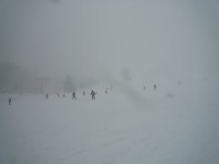
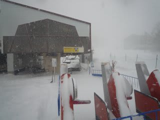
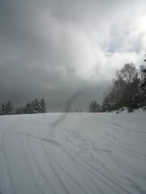
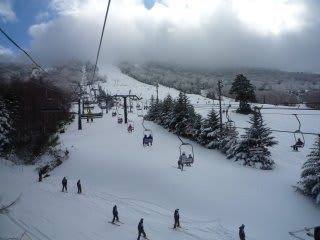

# 今日の志賀は大雪！！

📅 投稿日時: 2010-12-23 20:19:30

今日の志賀は積もってます！

結構な雪です．

朝方，信州中野まで雨だったんでちょっと心配でしたが，

上林チェーン場から上は雪．

すごい勢いで降り積もってました．

一晩で30～50cm積もったのかな．

朝，コース整備のためリフト営業開始が

遅れ，焼額は1時間45分遅れの8時45分から．

圧雪の上に20cmほどのパウダーが乗ったゲレンデコンディション．

一気にゲレンデ状況は改善！！

焼額第2ゴンドラも，コース上のブッシュは完全に隠れました．

第2高速も幅いっぱい滑走可能．

一の瀬もメインコースてっぺんから滑走可能になりました．

一日中雪は降り続け，今も降り続けてます．

明日までにはさらに積もりそう…

恵みの雪！
