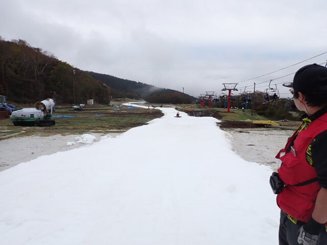
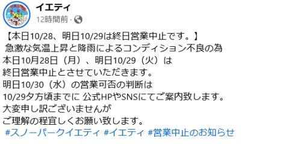
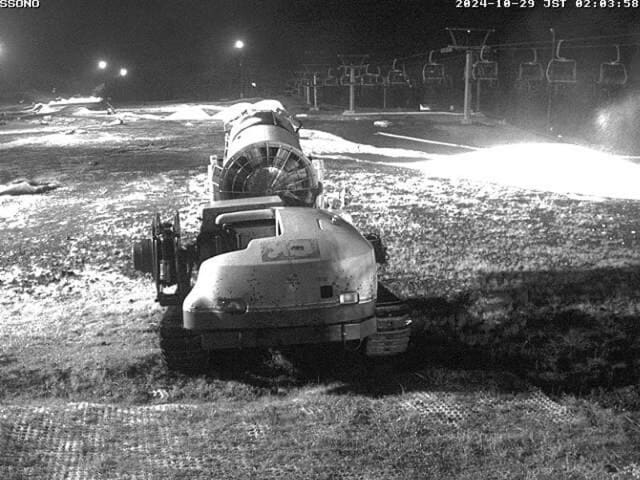
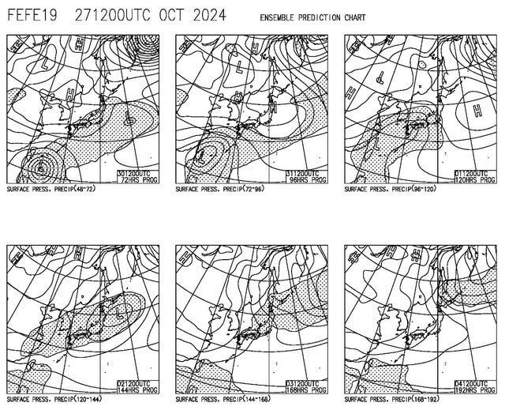
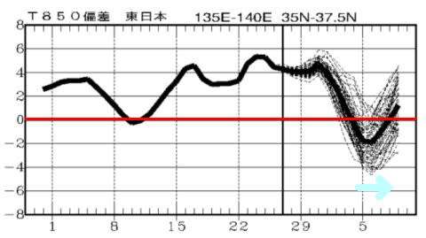

# イエティは10/29(火)も営業見合わせ．たぶん30日も厳しいと思う…そして3連休が終わってから冷える

📅 投稿日時: 2024-10-29 03:35:35

ということで．

10/25の金曜日にオープンしてから，

26日に初滑りをしてきたわけですが…

その後，26(土)，27(日)と2日間営業したあと．

コースコンディション悪化で10/28(月)の営業

見合わせがアナウンスされたYeti.

どうやら，29日(火)も営業を見合わせるようです…

（[イエティFacebook](https://www.facebook.com/YetiSnowtown/posts/pfbid0A37Wi9cFFTiXHsSPqkXiG3nGTRp56mA8tiWh7Kshz6p8Hxzvi7yUMYgwgxVPu1vHl)より）

現在のイエティのライブカメラを見ると．

必死にまた雪山作成に取り掛かっているよう

ですが…

雪山の間は雪が途切れてるところもあるし．

あと明日…というか，日付が変わった今日の

火曜1日で，コースが復活させられるほど

造雪できるといいなぁ…

（[WNIライブカメラ](http://webcam.wni.co.jp/KAC24326/loop.html)より）

ただ…

どう天気図読んでも．

雨のピークは本日29日夜から30日午前に

かけてで，30日午前も強く降りそうなので…

雨がひどく降る29日から30日朝にかけては，

積雪積み増し作業がおそらく不可能．

だもんで，30日も，たぶん営業は厳しいと

思います…（涙）

30日まで休んで，31日から営業再開できれば

いいけど．

ヘタすると，29日からの雨で，30日にはまた

かなり雪が解けて，営業再開が遠のくかも…

うーん．

ヘタすると，再オープンは3連休の11/2ぎりぎり

までずれ込むという可能性もありうる…（涙）

ちなみに，天気図を見ると．

31日は1日高気圧に覆われ晴れそうだけど．

それ以外の10/30，11/1,2,3の4日間は網掛けの

降水域がイエティにかかっているので…

まぁ，1日の夜から3日の昼くらいにかけては

また雨が降り続けそう（泣）

3連休初日，2日目は雨だよ…（涙）

11/1オープンの軽井沢は，オープン後

しばらく雨に悩まされそうな感じ…

…でも．

2週間の850hPa気温傾向を見ると…

水色の矢印部分，11/4～8日くらいにかけて．

実に久しぶりに，平年より気温が冷えそうなのだ…！

天然雪はちょっと期待薄な感じだけど．

山の上は人工降雪機が動かせるくらいに

冷えるかも…！！

横手山とかは，人工降雪機を動かしだすかも？？

とりあえず．

11月4日以降に期待…！！

ってなことで．

私の方は，無事2025シーズンスタートしましたが．

昨シーズンは異常高温のため，月山が6月

第1週といつもよりかなり早くに終わってしまい．

さらにイエティも，例年より1週間遅いスタート

だったので…

今回のオフシーズンは，いつもより長めの

4か月と3週間．

オフが短いときは，4か月を切るときもあるのに…

今回のオフはいつもより2～4週間長かった

感じですね（涙）

しかし．

耐えがたきを耐え，忍び難きをしのび…

何とかシーズンインを迎えられました～！！

でも．

今シーズンは，夏にダイビングに行ったり花火に

行ったり，

いろいろオフもイベントがあったのもあり．

さらに仕事が忙しく，バタバタしている間に

あっという間に時間がたって…

意外と早く，自分の心の準備ができないうちに

シーズンに突入してしまった感．

そのせいか，

あるいは夏に山を走るようになり，体力や

筋力，バランス力などが鍛えられるように

なったからか…

今シーズンも最初の1本目から，まったく

違和感なく滑ることができて．

今シーズン初の，実に4か月ぶりのスキーとは

思えず，

先週も滑ってたんじゃなかったっけ？

というくらい，シーズン最初の違和感を全く

感じることなく，普通に滑れました…！！

…そして．

イエティで30本程度滑るくらいじゃ，

全く運動をしたようには感じられず．

うーん．

確実に夏に山を歩いたり走ったりしてるのが

効いてるんだろうなぁ…

トレッキングポール2本もちというのもあり，

下り坂は完全にスキーで滑ってる時を

イメージして走っていて．

足場の悪いところで次の足場を探しつつ

走る判断力，

バランスの悪い足場で走りながら体を

支える体幹力，

そのほか心肺能力など，

山を走ると，スキーに必要な要素がかなり

鍛えられる気がする…

スキーをやる人は，山歩き（時々走る）をすると

いいかも…！

## 💬 コメント一覧

### 💬 コメント by (ねも)
**タイトル**: Unknown
**投稿日**: 2024-10-29 06:33:08

Ｓさん　あちらに返信ありがとうございます。

｢耐えがたきを耐え……｣←爆笑です。

いやぁ滑らない期間が４ヶ月ちょっとなんですか⁉️　４ヶ月滑れば十分でしょ！って、ご家族などから突っ込まれない？(笑)

たしかに、知り合いのスキー○カも春から秋は山歩きしています✌️

### 💬 コメント by (けんけん)
**タイトル**: Unknown
**投稿日**: 2024-10-29 06:59:42

ヤケビのホームページに新しいパウダーコース追加されてますね！

### 💬 コメント by (Skier_S)
**タイトル**: なに？焼額新コース？
**投稿日**: 2024-10-30 02:05:42

＞ねもさま

私のオフシーズンは短ければ4か月切りますね…

雪が多ければ7月上旬まで月山に滑りに行く年もあり，

そのときはスキーを履かない月は8，9月だけになります（笑）．

わが家族は鍛えているので，10月から6月まではスキーシーズンだと

思ってくれてます．

＞けんけんさま

あああ！

毎日焼額のホームページ見ているのに気づかなかった…

ご指摘ありがとうございます！！

