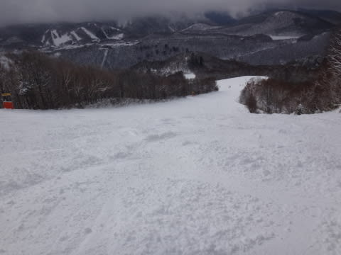
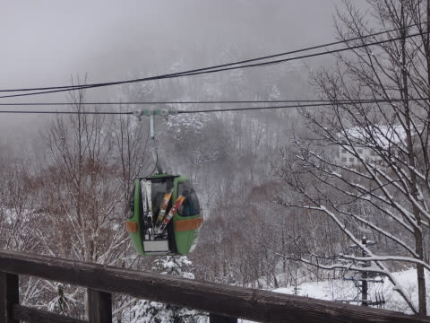

# 1月9日，3連休最終日の詳細モード…朝はブーツパフだったけど，標高が低いところは重い雪．まだ積雪が足りない！

📅 投稿日時: 2017-01-11 02:52:09

🏷️ カテゴリ: [2017スキー滑走日記](c7d777cecfc91bdf0fa464ad62c6d49ab.md)

というわけで．

昨日速報した，3連休最終日．

1月9日の志賀高原の詳細レポートです～

えー．

まず，朝起きて，外を見てみると．

一晩雪が降り続いたはずですが…

…車の上の積雪は20cm弱かな？

もう少し積もっているかと期待したけど…（ちょっと残念）．

とりあえず，

朝イチの山頂に上がってみると…

うむ．

気温は-5℃と，そこそこ冷えてますね．

そして．

ゲレンデは…

あううーーー．

全面ガスに覆われてます（涙）．

ゲレンデは，圧雪コースでは圧雪の上に5cmほどの新雪．

…そして．

新雪のオリンピックコースは…

うーむ．

ブーツパフか…

もう少し深い積雪を期待したんだけどな～．

しかし．

オリンピックコースの，この新雪．

すでにファーストトラックにかなり食い荒らされて，

通常営業の一番乗りでは，すでに荒れ荒れ（涙）．

そのため，下地の固いのが出始めており．

そのうえ視界が悪いと来てるので…

す，滑りにくいよ…（涙）．

そして．

営業開始から1時間も経つと…

ゲレンデの人も増えてきて．

朝に積もった雪が蹴散らされて凸凹になり．

そして下地の固い雪がでてきてしまい…

このうえ，視界が悪いとくれば．

…もう，滑りにくいことこの上なし（涙）．

これは．

かなりゆっくり滑らないと，恐ろしいんですけど…（泣）

もう，普段の私を知っている人は

「Skier_Sって，こんなにゆっくり滑ることができるんだ！？？」

…と，びっくりするに違いないほどゆっくり滑ってました（笑）

でも．

年末から続いた，人が多めの毎日でしたが．

今日はそれほど多くなく，ゲートの外まで

列がつくことは無し．

ゴンドラは結構空いてましたよ～！

…で．

あまりにも視界が悪くて．

楽しくないので．

「焼額の呪い」がかかっていて

焼額から脱出できないはずの私が．

この日は，昼前にちょっと焼額から脱出してみました…

まずは，一の瀬正面バーン．

新雪が結構モサモサの凸凹になってます…

この写真を撮った昼ごろから．

ガスが上がり，チラチラ青空が覗けるように

なってきましたよ！

うむ．

ようやく楽しくなってきたかな！

パーフェクターコースは全く圧雪が入ってないのか．

本気の荒れ荒れボコボコ斜面．

こんなボコボコのパーフェクターコースは，

ちと楽しくないですな．

ここも下地は固めで，

ちょっとブッシュさんがコンニチハしてました…

そして．

西館の方まで遠征してみましたが…

雪質が…

雪質が，ヤケビや一の瀬と全く違う！

標高がわずかしか違わないのに．

西館から下は，かなり重くて，ボコボコに

固まった，かなり滑りにくい雪なんですけど…（涙）．

そして．

さらに．

あれ？ブッシュが？？

ホントに一の瀬・焼額方面とわずかしか標高が違わないのに．

西館より低いところ．

全然積雪が足りない…（泣）

今朝積もった雪も，雪不足解消には足りなかったようです（残念）．

だもんで．

エアコンもエンジンもついてないというのに．

高級外車より高い…！という噂の新搬器を導入した，

東館ゴンドラに乗って．

＃タマゴゴンドラよりかなり中は広かったです

かなりボコボコになった，

一の瀬ファミリーを経由して．

また焼額方面へ戻ってきました～！

午後2時ごろの焼額は，すっかり晴れ上がり．

ちょっとゲレンデは荒れ気味というものの…

雪質は，西館と全然違うよ！

冷え冷えGoodな雪質！！

まぁ，急斜面は一部下地の固いのが出てきてたとはいえ．

やっぱり私は焼額がいいなぁ～．

…しかし．

午後の焼額．

人がすごい少ないんですけど．

で．

一旦晴れたこの日ですが．

午後3時ごろにはまた雪が降りはじめ…

たぶん明日の朝は，いいパウダーが積もって

そうだな…

って感じの強い雪の中．

営業終了の16:15きっちりまで滑り続けたのでした…

ということで．

12月3連休から続いたシアワセスキー漬け期間が

終わったわけですが．

まぁ，雪は例年より少なめとはいえ．

焼額はちゃんと全面滑走可だったし．

昨年に比べればずっとマシなコンディションで

楽しめたな～…と，満足なSkier_Sなのでした．

## 💬 コメント一覧

### 💬 コメント by (かず)
**タイトル**: 返信ありがとうございます
**投稿日**: 2017-01-11 12:28:19

風向きで思い出したのですが、年末年始気温が低く軽めのパウダーを期待した日があったのですが重い日がありました　気温より志賀でも海からの風向きが重要なのでしょうか？直接聞きたかったのですがなかなかゴンドラで会えないので…

### 💬 コメント by (はなげ親分)
**タイトル**: 平日スキー
**投稿日**: 2017-01-11 12:35:19

きのうは久しぶりに平日スキーを楽しみました。

夕べからの軽い雪が脛下まで積もり、天気は終日快晴と言うこと無しの１日でした♪

貸切状態のジャイアントスラロームはオシッコチビリそうでしたｮ!!

### 💬 コメント by (Skier_S)
**タイトル**: 今週末はパウダーデー！
**投稿日**: 2017-01-12 03:27:44

＞かずさま

雪の重さについては，私も「気温に比べると重いなぁ…」

と思うことが多く．

その傾向をつかもうとしているところですが…

仮説として，湿数が大きい空気が日本海から

きれいに吹き込んでいれば軽めの雪，

湿数が0の空気がもたらす低気圧系の雪は

重めなのかな…

と推測しています．

風向きより，むしろFXFE5782,5784，577の天気図の

湿数を参照する形になりますが…

きれいな北風で日本海から運ばれた雪が志賀に積もれば軽い雪，低気圧がもたらす雪は重い雪，という感じでしょうか．

＞はなげ親分さま

うをををを！！！

うらやましいっ！！！

うらやましすぎます！！

今週末はパウダーになりそうですが…

でも，晴天にはならなさそうなので．

晴天パウダー＆貸し切り朝イチGSコース．

もう，よだれが出そうなほどうらやましいです！！

