# 3月3日(土)の志賀高原は…かなり暖かい春スキーだったけど，意外と雪はひどくならなかったよ！

📅 投稿日時: 2018-03-04 00:54:13

🏷️ カテゴリ: [2018スキー滑走日記](c11b88dc181f34079ab41db74a3587646.md)

ということで．

本日．

予想通り，かなり気温が上がって，

すごい晴天で暑いくらいになったのですが．

…意外と今日は，雪はそこまでひどくならなくて

ラッキーな一日でした～！

まず．朝イチの志賀の登り道路ですが…

…やっぱり，雪がないね（涙）

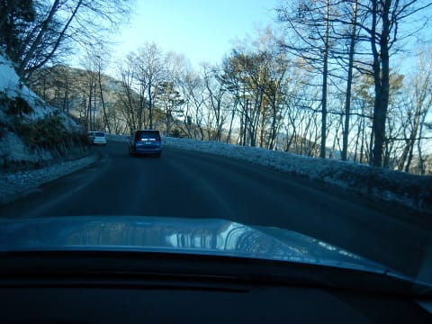

焼額近辺までやってきて，やっとちょっと

雪が出てきましたけど…

これは，木曜のあとほとんど雪が積もって

ないということで．

ゲレンデは硬いだろうなぁ…

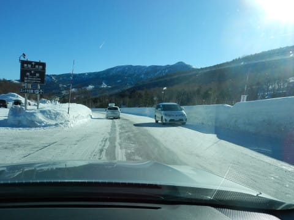

いつも通り，朝イチは焼額の第1ゴンドラオープンに

並びますが…

列はせいぜいこの程度．

まぁ，だいたいいつも通りの人数ですね．

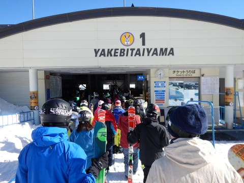

そして，山頂に上がると…

気温は-4度．

あれ？？予想より冷えてますよ…？？

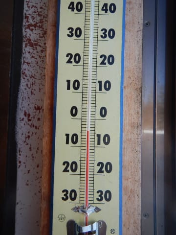

で．

天気は晴天！

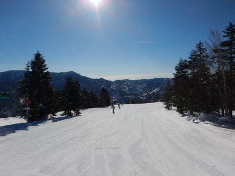

そして…

意外と金曜に積もったようで．

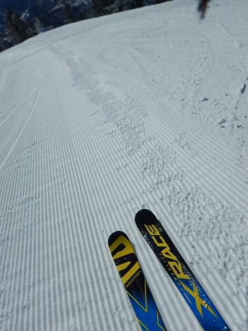

意外といいコンディションなんですけど！？？？

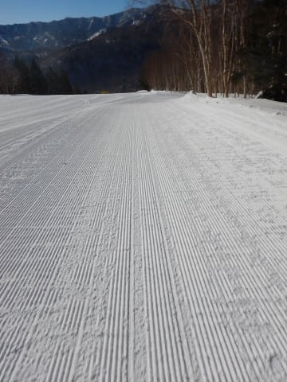

結構エッジががっつり食いつく

超快楽シマシマなんですけど！？？？

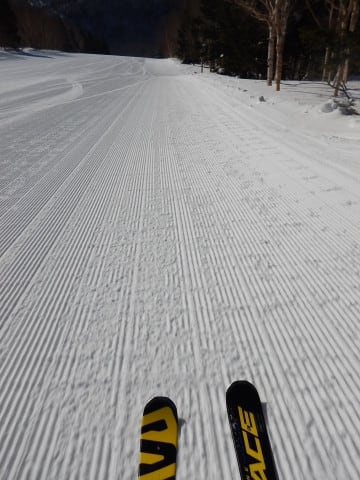

絶対に今日の朝は硬い斜面だと思っていたのに．

硬い斜面対策に，ガンガンにエッジを研いできたのに．

そんな必要性がこれっぽっちもない，

結構いい感じの圧雪斜面なんですけど！？？？

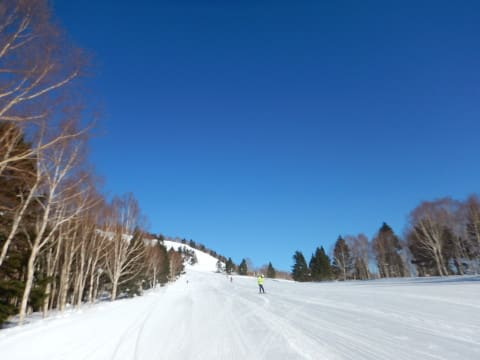

いやーーー．

木曜に雨が降って壊滅的と思ったのに…

木曜の雨もそれほどひどくなく．

金曜に意外と積もっていたらしく…

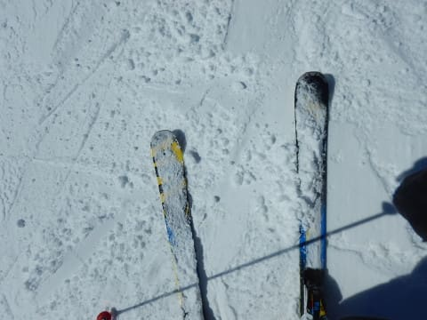

いや，意外といい雪じゃないですか！！

これで晴天と来れば…

かなり楽しいじゃないですか！

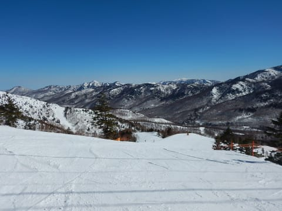

いや，

最高っ！

予想以上に最高！

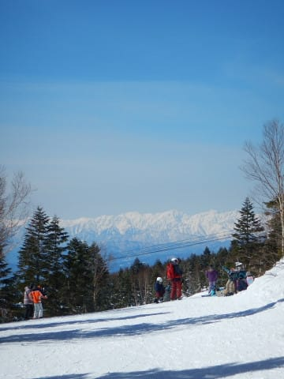

…

でも．

やっぱり．

午前10時ごろには，ちょっとゲレンデが混みだして…

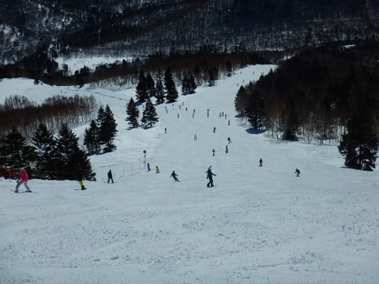

激混みとまではいかないけど．

GSコースは，トップスピードで飛ばすのが

難しい人口密度になっちゃいました（泣）

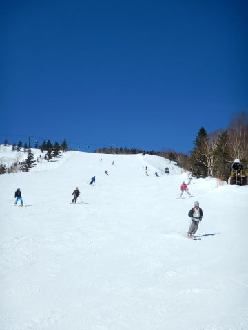

…でも．

急斜面のオリンピックコースはガラガラだし．

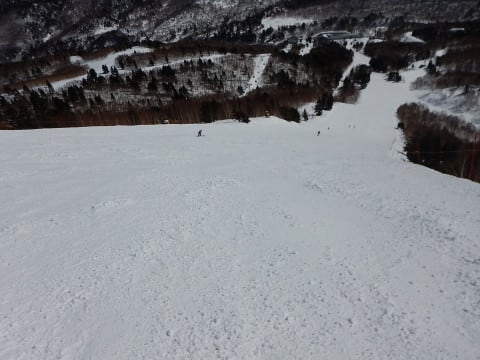

第1ゴンドラは，ピークでもゲートの外に

ちょっと人がはみ出すかどうか程度．

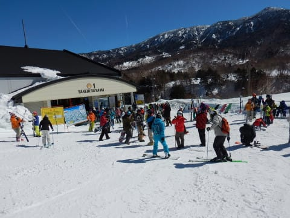

タイミングによって，こんな感じで

2-3分待ちになることもあったけど，

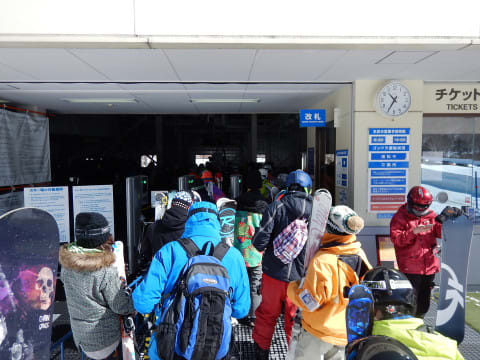

終日ほとんど搬器数個待つ程度で乗れましたよ～！

朝から日差しは強く．

暑く感じるくらいの晴天だけど…

昨日は気温が低く，積雪がそこそこあったので．

雪が冷えていて，

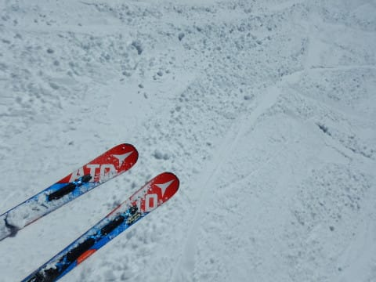

それほど一気に雪が緩むことはなかったけど…

…でも．

朝日が当たる東側斜面，オリンピックコースや

GSコースのごく一部は，

昼前ごろには強烈な日差しで，ダマダマな感じの

カタマリがコース上にでき始めてきて…

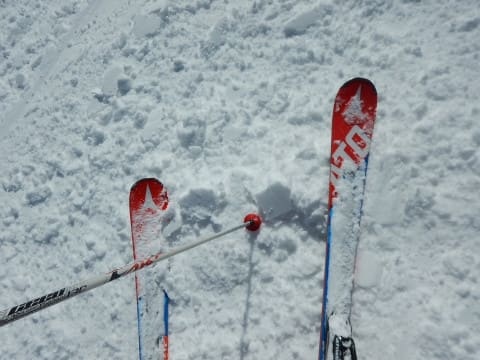

こういう，重い固まりかけた雪がところどころ

溜まった感じで．

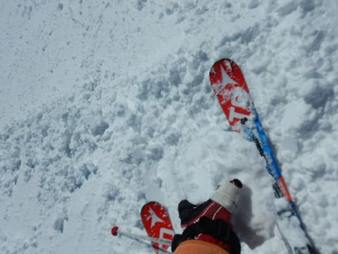

うむ…

さすがに，ちと滑りにくくなってきた…（涙）

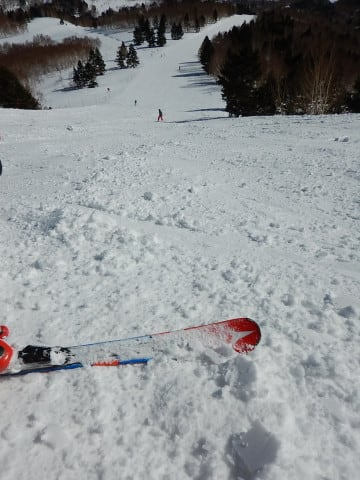

そして．

昼の気温は山頂で+2度と．

ついにプラス気温になっちゃって．

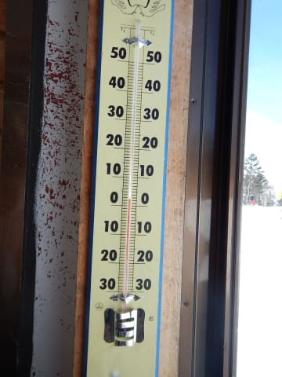

そして，ゲレンデには容赦ない日差しが照り付け．

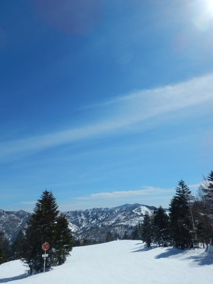

滑っていて暑いくらいなんですが…

…今，3月初めですよね？？

数日前まで2月のトップシーズンですよね？？？

気分的に，もう3月末～4月上旬のポカポカ

春スキー気分なんですけど？？（涙）

でも，北に向いてるGSコースのメイン部分は，

昼になっても意外といい雪のままで．

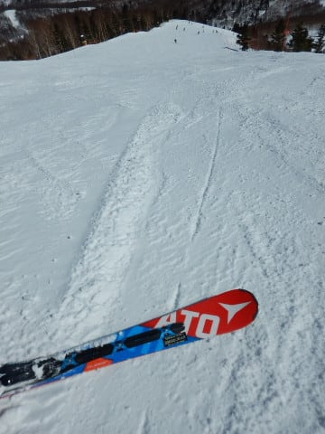

それほどひどい春の雪にならなかったのが

良かったかな！

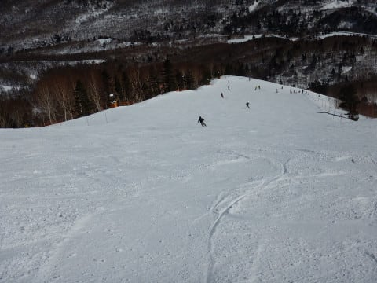

昼を過ぎると，コースの人口密度も

減っていったけど．

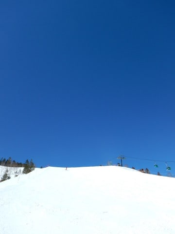

ちょっと，ところどころ重い雪に

なって来たところもあるので．

北斜面の奥志賀は，雪がもう少しいいかな？

…と，覗きに行ってみたところ．

さすが北斜面！

焼額よりは雪がいいよ！

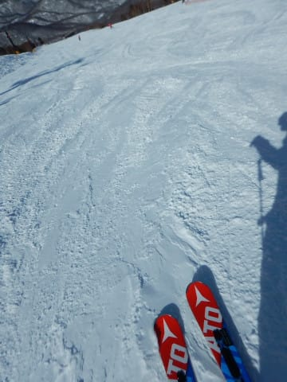

でも．

エキスパートコースを降りようとしたところ．

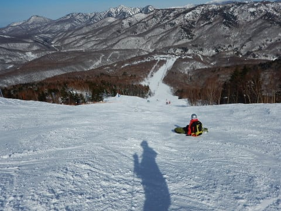

え？

なに？？？

第2ペアリフト故障で停止中？？？

その影響で．

奥志賀ゴンドラが混雑して，

5分以上待ち…（涙）

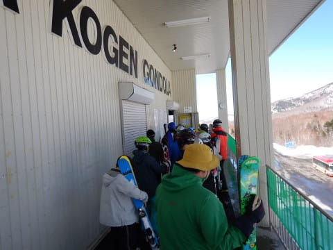

だもんで．雪が良かったものの，

奥志賀は即座にあきらめ，再び焼額へ戻り．

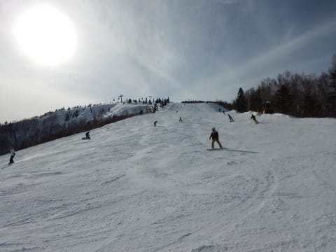

夕方になると，ちょっと雪が締まっていい感じに

なって来たので．

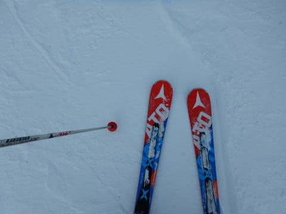

予定より15分延長営業になった焼額を．

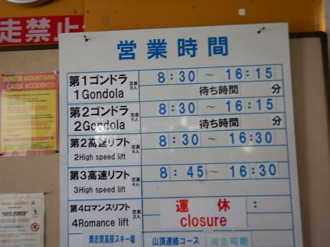

また，日が暮れる最終リフトまで

滑り倒してきたのでした…

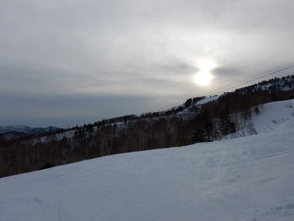

いやーーー．

意外と良かったよ，今日．

予想よりは，ずっと良かった…←それは予想を外したということでは？？

…こんな良かった日は．

そうです．

もっとたくさん楽しむために，ナイターへ

行かなくては！←こんな日じゃなくても，あなたはいつでもナイターに行くでしょ

今日はサンバレーナイターです！

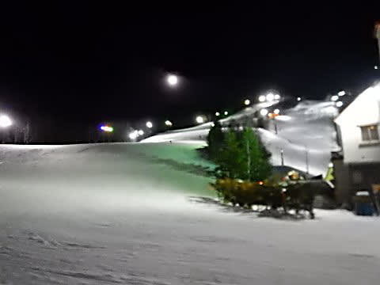

圧雪かけたて，ぴかぴかのナイターへ，Go！

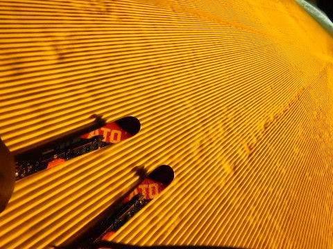

でも…

昼間に気温が上がった雪が圧雪されて，

冷えた状態なので．

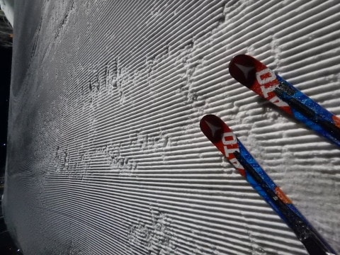

しばらく滑ってシマシマが崩れてくると…

…うぎゃーーー！

コロコロ地獄！！！（泣）

…ちょっと快感度は低いよ…（涙）

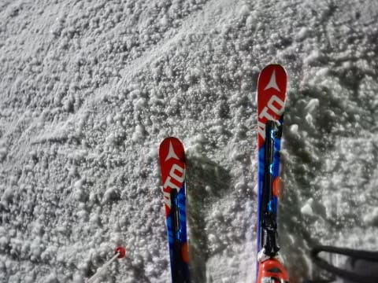

でも．

それほど硬くなかったので，殺人コロコロと

まではいかなかったのが救いか…

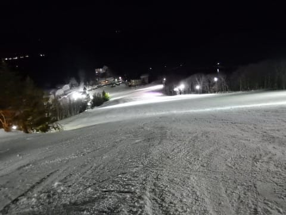

ってな感じで．

コース全面に広がるコロコロを踏みつぶしながら，

ナイターラストまで滑りつくしたのでした…

…まぁ，いろいろあったけれども．

アイスバーン＆春の重い雪を覚悟していた本日．

朝は最高圧雪だったし．

昼間も日が直接当たるバーン以外は，それほど

ひどく緩まなかったし．

意外と楽しめた本日でした～！

…でも．

明日は今日よりもっと気温が上がるんだよなぁ…

一体明日はどんな雪になるのか，

ちょっと怖い…

## 💬 コメント一覧

### 💬 コメント by (いっぽ)
**タイトル**: 膝や腰
**投稿日**: 2018-03-04 07:17:22

体で痛い所は無いですか？健康を通り越し丈夫なんですね。

### 💬 コメント by (naoちゃんねる)
**タイトル**: ２度目まして
**投稿日**: 2018-03-04 07:49:06

昨日はまたお会いできて嬉しかったです。

お陰さまで娘はすっかり志賀高原が好きになってくれました。

周りは暖かくなった！春がきた！と喜んでいますが、私たちには恨めしくてしょうがないですね。娘には自作の冷え冷え踊りを踊らせ、私は寒いギャグを言い続けます！

### 💬 コメント by (かず)
**タイトル**: Unknown
**投稿日**: 2018-03-04 07:54:32

想像より良さそうですね　今回も見送りました　月曜の雨が心配ですが　火曜以降冷えてきそうなので来週末に期待します

### 💬 コメント by (michi)
**タイトル**: Unknown
**投稿日**: 2018-03-04 17:12:20

昨日はブナ平から下はザクザクでしたが上は思っていたほど悪くならず久しぶりのピーカンで楽しめました。

Sさんに言われて気付きましたが今シーズンは皆勤賞です（爆）ヤケビに行くと皆さんが居るので1人でも行ってしまいます。で、皆さんのスピードで滑るのが楽しいですね(^^)

次週も行く予定です。また宜しくお願いします。

### 💬 コメント by (Skier_S)
**タイトル**: あぁ…春ですね…（涙）
**投稿日**: 2018-03-05 02:14:33

＞いっぽさま

…初コメントですよね？？

コメントありがとうございます！

で．身体は極めて快調です．

痛いところは無いです．

（お財布はいろいろ痛いですが）

…スキーをやらない方がよっぽど体調が

悪くなる人間ですので(笑)．

＞naoちゃんねるさま

またお会いできてこちらも嬉しかったです～！

志賀が気に入っていただけたようで

良かったです…

これからもぜひ志賀にお越しください！

で，志賀のいいコンディションが続くよう，

娘さんともども踊り続け，寒いギャグを

言い続けてください～！！

＞かずさま

土曜は，予想よりは良かったですが．

日曜はすごいことになりました…

もう，志賀のほとんど全面残すところなく

貼りつき雪になっちゃいました．

月曜は運が良ければ雪になってくれそうです…

ただ，金曜がまた雨になりそうで…

そうなると，この週末もヤバそうです（涙）．

＞michiさま

をを！

やっぱり皆勤ですよね！

毎週しっかり朝礼に参加されて，

もう完全に志賀高原に嵌ってらっしゃいますよね…

抜けられなくなってますよ，もう(笑)

