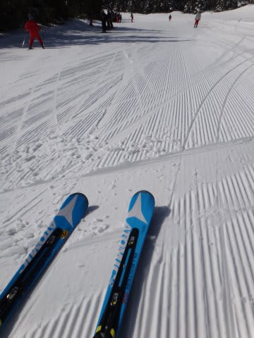

# ATOMIC BLUESTER DEMO SXは，どうやら私にあっているらしい…

📅 投稿日時: 2012-12-30 00:00:09

🏷️ カテゴリ: [スキー雑談](c1f9d2cb7478308da16419928ea3945e9.md)

さて．

今日はスキーに行っていないのですが．

志賀高原は，今日は晴れて，そこそこ良かったようですね～．

問題は，気温が超あがってしまう，明日．

昼間に降ると，下手すると雨．

…志賀高原だと，ミゾレ程度に収まると信じたいですが…

降り始めが夕方だと，雪になってくれるんですけどね～．

降り始めが遅くなることを祈りましょう…

…ということで．

私は明日から志賀高原へ出動です．

正月休みはひたすら焼額を滑ってる予定…

んで．

本題．

先日．

[ATOMIC BLUESTER DEMO SXを購入](e06ff03392356a872ae2cb4034a92b750.md)し，

[インプレッションを報告](e03a9cb9f07bab79a5035e1b84db307a2.md)したばかりですが…

この板，チョー気に入ってます．

で．

私はシーズン数回，某都道府県連の元○×委員長とかいう，偉～い方と

一緒に滑らせてもらうことがあるわけですが．

先日も，今シーズン初めて，その上手い方と滑ったわけですよ．

その時．私の滑りを見たその上手い方が．

上手い方「おー．いいじゃんいいじゃん，その小回りっ！」

私　「え，そうですか…？」　(この人に褒められるって…めずらしいっ！）

上手い方「いやー．ほんとにいい小回りしてたよ．すごいね～，その板」

私の心の中のリフレイン　（すごいね～　その板　その板　その板　…）

そーですね．

そのとおりですね．

すごいのは私の滑りではなく，

板がすごいんですよねっ！

まぁ，その方は私の小回りが超マズイことをよーく知っているし．

そんな私の小回りが一気に変わったので，板のせいだと見抜いたのでしょう…

ということで．

ATOMIC BLUESTER SX．

小回りが超マズイ人も，それなりの小回りに見せてしまうという．

すごい板のようです…

＃いいんだ…レジャースキーヤーは板に頼れば…
