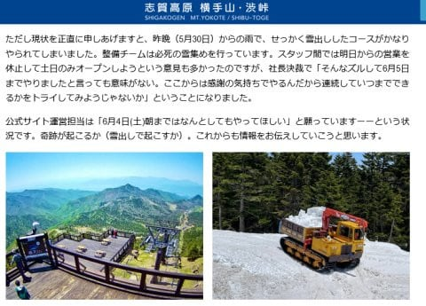
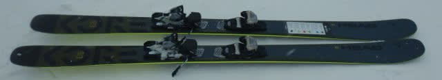
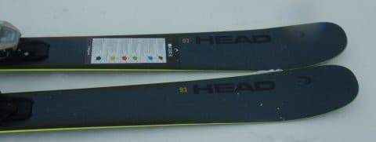
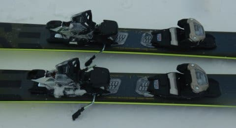
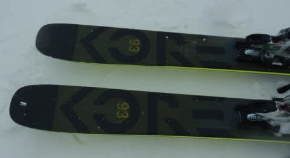
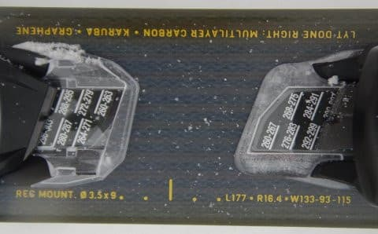

# 2023シーズンモデルのスキー板，試乗レポートその8…HEAD KORE 93

📅 投稿日時: 2022-06-01 01:03:50

そろそろ横手山のホームページでも，

今週末までの営業がヤバそうな感じの

表現になってきましたね（涙）

どうやら，昨日の月曜からの雨で

せっかく雪出ししたゲレンデが

かなりとけちゃったようです（涙）

（[横手山ホームページ](https://yokoteyama2307.com/news/17748/)より）

うーーーーん…

このあと，2日夜から3日にかけて，

また雨が降りそうなので，

今週末，ダメかも…

今週末は渋峠に行けたら行きたいなぁ

と思っていたのに…’

とりあえず．

これから奇跡が起きて．

6月2日夜から降るのが雨じゃなく

雪にならないかな？←無理だから

ってなことで．

今日も2023シーズンモデルのスキー試乗レポート．

今回もセミファット板のインプレッション．

ヘッド編です．

では，どうぞ～！

○HEAD KORE93 177cm

セミファット

この板も，FISCHERのRANGER同様，

オンピステもオフピステもどっちでも

行けるという売り込みの板ですが…

実際履いて滑ってみると．

これ，結構いいよ…！！

トップ133，センター93，テール115mmの

サイドカーブ16.4mと，長さ177cmとしては

比較的サイドカーブがきつめの板なんですが．

そのサイドカーブに沿って，しっかり

カービングで曲がっていきます！

それも，驚きのエッジグリップ！

ファットだという先入観を持たずに滑ると，

整地用オールラウンド板ですか？

という錯覚を覚えるほどのグリップ力と

サイドカーブ＆たわみでの旋回力．

かなりメタルのばね感の強い張りを

感じる板で，スピードを出していって

ガッツリ傾いて滑れます！！

足元もしっかりしていて，プレート付きの

基礎系板と同じくらいに感じます．

サイドカーブに乗って，大回りから

中回り程度の弧で板がまわって行きます．

力を入れなくても板が回ってくる，

旋回力の強さがあるので，乗り手が

何もしなくても板が回ってくれる

楽さがあります．

…ただ，整地ではまっすぐ目に落とそう

としても，この旋回力の強さで板が

回ってきちゃう…という感じですが，

でも，良く回る板です．

スピードを出してたわませると，

小回りに近いところまでもっていけます．

それなのに，93mmというセミファットの太さを

それほど感じずに自然に切り返せるので，

履いた感じはセミファットと思えない…！

それでいて，トップはしっかり広くて

パウダーの浮力を受けられます．

試乗した日は新雪が積もっていたので，

コース脇のパウダーにつっこんでみると…

センター100mm越えの板ほどの本格的な

浮力は得られないものの．

これなら，パウダーでも基礎や競技用の板に

比べれば十分な浮力をえられるので，

新雪はかなり滑りやすい！

おそらく，春雪などの荒れた雪でも，

これなら荒れた雪面を蹴散らして

滑っていけるんじゃないかな？

板自体は結構軽く感じます．

グリップが強い板ですが，この軽さで

軽快に履けます．

軽さのおかげで，板を簡単に動かすことが

できるし．

パウダーの中でも板が沈まず，浮力を

十分に感じられます…

セミファットと思えない良く回る旋回力で，

ゲレンデをカービングで切っていきつつも，

荒れた斜面やパウダーでも滑って行ける…

という，これぞまさに一粒で二度おいしい

板かも…！
