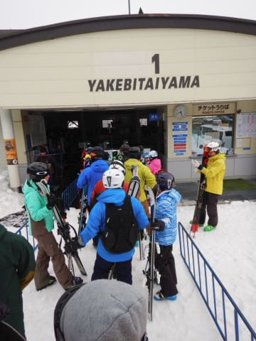
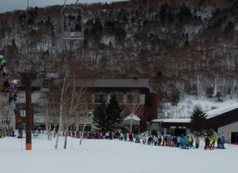

# 2020/2/16(日)の志賀高原スキー場，詳細モード！…朝からプラス気温，雨がぱらつき，強風でゴンドラすべて運休という悲しい一日（涙）

📅 投稿日時: 2020-02-18 00:31:25

ということで．

昨日レポートしたように．

日曜はかなり激しく悲惨な

一日でしたが．

昨日1日でかなり雪が解けてしまったので，

焼額のオリンピックコースは，ところどころ

雪が薄くなり．

圧雪がかけられないレベルになってしまった

ようです…（激涙）

うーむ．

昨日の雨はそれほど激しくなかったけど．

雨というより，高温と強風でやれれちゃった

ようですね…（泣）

ただ．

そんな高温に負けないように．

焼額では，未だに人工降雪機を動かし

続けているようです！！

す…すばらしいっ！！

（以上2点，[焼額山Facebook](https://ja-jp.facebook.com/yakebitaiyama/)より）

しかし．

やはり，まだ2月なので．

本来なら天然雪を願いたいところ…

とりあえず．

本日から冷え込み始めた志賀高原．

今は雪が積もり始めたようですが…

（[北信建設事務所道路気象情報ページ](http://hokushin.pref-nagano-roadcamera.jp/)より）

18日はそこそこ冷えて，

これから18日火曜の夕方ごろまで

雪が降りそうな感じではありますが．

…西風なので，志賀高原はそれほどドサドサ

積もらないかも…

最低でも，20cmは積もってほしいところ…

で．

その後は，週末までは雪が降らなさそう（涙）

うーん．

18日の雪で，ゲレンデ状況が改善，

週末までそのままもってくれることを

願うばかり…

ということで．

昨日速報した，16日の日曜の志賀高原，

詳細レポートへ，Go！

まず．

朝，志賀へ登ってくる道路は…

雪，無いですね（涙）

気温はプラスで，凍結している

気配すらありません…（泣）．

で．

いつも通りの焼額第1ゴンドラに，

朝イチの営業開始前から並ぶわけですが．

天気の悪い予報の本日，待ってる人は

少なめで．

さらに，待っている間に，ポツリポツリと．

2月の志賀高原で降ってきては行けない

液体が…（泣）．

山頂へ出てみると．

うっすら太陽も見えますが．

空からは無慈悲な液体がぽつぽつと

落ちてきているうえに．

さらに，生暖かい南風が吹き続け…

2月の朝8時半，標高2000mというのに．

＋5℃近い，超激烈高温なんですけど！？？

2月としては，あってはいけない

気温なんですが！？？

そして．

高温の当然の結果として．

朝から雪は…4月の雪（涙）

ってか，4月でも朝イチは普通氷点下

なので，4月の朝でも硬い雪になるところ．

今日は朝イチから緩みまくりの雪で．

とても，2月の朝イチの志賀高原の

雪とは思えない…（激泣）

とりあえず．

あさイチは春の雪ながらも，

しっかりエッジが食い込むシマシマなので．

「今は4月下旬だ…4月下旬なんだ．

　4月なら，重めでも，シマシマなフラットバーンなら

　まだ楽しめる…」

と，自己暗示をかけながら滑ってましたが．

強烈な南風のために，ゴンドラは思いっきり

減速運転で，山頂までに時間がかかるうえ…

ゴンドラ減速運転の影響で輸送力が低下し，

いつもならまだ混まない朝9時半に，

すでにゲートの外までゴンドラ待ちが…（泣）

高温，雨，強風で，さらにゴンドラ待ちか？？

次は何が来るんだ？？

…と．

半ばやけになって滑っていたら．

…今度は，9時半ごろに奥志賀ゴンドラ運休だと！？？

南風なのに，北斜面の奥志賀が止まるとは！？？

…そのせいで．

奥志賀から人が流れ込み．

第1ゴンドラがさらに激込みに（涙）

なので，第2高速リフトの唐松コースに逃げますが…

当然こちらも激重の春の雪（泣）

まぁ，まだこの時点では，リフト待ちが

それほどひどく無かったですが…

が．

次に第1ゴンドラへ戻ってくると…

えええええ！！！

何？？

第1ゴンドラ，強風で運休！？？？

なに？？

それだけじゃなく，第2ゴンドラも止まったの！？？

焼額の2本のゴンドラ＆奥志賀のゴンドラの，

3本すべてのゴンドラが止まったの？？

…なんということだ…（止まらない涙）

そして．

そのせいで．

第1ゴンドラから人が流れた第3高速は

激込みになり…

これはたまらん．

第2高速側に脱出しよう…

と，第4ロマンス側に下りると．

こちらも長蛇の列（激涙）

ゴンドラが動かず，ペアリフトのみでしか

スキーヤーが登れなくなったサウスコースは

ガラガラですが…

うーむ．

激遅リフトに並んでまで，滑りたくはない．

第2高速リフト沿いの唐松コースは…

うむ．

ゴンドラがアウトになると，ここに人が

集まるので．

コース上の人口密度，高いよ…（涙）

ダメだ…

これはダメだ，と．

さすがの私も，本日は焼額をあっさりと脱出．

一の瀬ファミリーにやってきましたが…

焼額・奥志賀から人が大量に流れてきたのか．

リフト待ちはほとんどなかったけど，コースの

人口密度が高め（涙）

だもんで，早々に高天ヶ原に移動すると…

こちらは人口密度がそれほど高くないよ！

…というより，ガラガラですね…

でも．

なんだか，土が見えてるのですが！？？？

普通なら一番積雪の多いこの時期に，

コース上ではないとはいえ．

なんだか，そこかしこに土が

顔を出しているのですが…！？？

…そして．

コース上にもわずかながら，

雪が薄い部分が…（涙）

本日．

雨雲が空を覆ったものの．

それほど雨雲は厚くなく，

そこそこ遠くも見通せるほどの

空模様で．

せいぜい時折，ウエアに水滴がつく程度の

弱い雨がパラパラと降る程度．

雨は強くなかったけど．

昼間の気温が10℃近くまで上がったうえ．

奥志賀・焼額・高天ヶ原の全ゴンドラが

止まるほどの強い南風が吹き付けて…

そのせいで，かなり雪が解けてしまった

ようです…（涙）

あぁ…

まだ2月というのに．

2月の志賀高原でこんな雪になって

しまうとは…（止まらない涙）

一の瀬に戻り，今度はパーフェクター

コースを滑ってみますが．

パーフェクターコースのとりつき部分は，

土が完全に出てしまっているうえ…

パーフェクターコースの，

この急斜面部分．

途中に…

なんと．

もうブッシュが出かかってます（涙）

なんということだ…

まだ2月というのに．

いつもなら，シーズンで一番雪がいい

2月というのに…

人工雪がつけてある一の瀬正面バーンは，

さすがに土が出たり，ブッシュが出たり

ということはありませんでしたが．

かなり多くの人が滑っていたので，

夕方には，激烈に重い雪が蹴散らされた，

荒れ気味斜面になってました…

ダメだ…

今日は，ダメだ…

そして．

最後は焼額に戻ってきたわけですが．

うむ．

ただでさえ人の少なくなる，日曜午後．

さらにゴンドラが動いてないので．

ガラガラですね．

…でも．

第2高速乗り場あたり．

朝は全然真っ白だったのに．

夕方になると，茶色くなっているの

ですが…！？？

…そして．

1ゴン乗り場へ戻ってくると…

うぎゃーーー！！

1ゴン乗り場も，雪が解けて，

茶色くなってきてるよ！？？

…なんということだ…

高温・強風・悪天候（パラパラ程度の雨で済んだけど…）のうえ．

ゴンドラ運休，激烈に重い雪，さらには強烈な雪解けという．

5重苦，6重苦が…（涙）

とりあえず．

なんとか16日はリフトストップまで滑り続けたけど．

シーズンでもそうそうない冷え冷え

パウダー天国の[5日前](ed5617426d1e52e1f1cf3716e64ef3f59.md)と比べると，

ありえない短期間で地獄まで突き落とされてしまい．

天国から地獄へ突き落された感じの，

かなり悲しい感じの一日だったのでした…

あぁ…

今週末までに積雪によるコンディション改善が

期待できるのは，18日の1日のみ．

18日に冷え冷え新雪が10cmじゃなく，

10mほど積もってくれるよう．

ひたすらひたすら，狂ったように，

冷え冷え踊りを踊り続けるしかありません…

## 💬 コメント一覧

### 💬 コメント by (Seeker.NT)
**タイトル**: 終わってしまった
**投稿日**: 2020-02-18 01:19:10

やはり雪は増えるより減る方が加速しますね。

Sさんにご報告があります。わたくし、予定されていた海外出張が１ヶ月以上前倒しとなり、スキーシーズンは先日の11日で突然終了となってしまいました。

現地のメンバーとKickoffをして本日一旦帰国しましたが、明後日には再び成田の人です。2回は帰国できそうですが約2ヶ月の長期出張となり、かなりトホホな状況です。

なぜ、このタイミングで・・・。心の整理もできておらず、未練がましくお守り代わりにシーズンパスを財布に忍ばせて旅立ちます。

チーン。。

### 💬 コメント by (Hide)
**タイトル**: 今シーズンは・・・
**投稿日**: 2020-02-18 07:24:29

S 様

ホントに2月とは思えないですね。

雪の多いシーズンの4月並みってところでしょうか？

やっと23日に出動できるのですが回復を祈るのみです。

今シーズンは柔らかいシマシマ滑ってない・・・。

1年限定の九州勤務が今シーズンで良かったと思うしかありません。

### 💬 コメント by (炎の北海道民)
**タイトル**: Unknown
**投稿日**: 2020-02-18 08:09:34

S様

今年はGWまでの営業は厳しそうですね(北海道も)。わざわざ九州から北海道に修学旅行でスキーに来ている高校生を見かけますが、パウダースノーじゃなくかわいそうですね。本当はもっといい雪なんですけどね。

### 💬 コメント by (宇都宮のかつぱ)
**タイトル**: Unknown
**投稿日**: 2020-02-18 12:03:52

いつも読ませてもらってます。

今日の奥志賀のエキスパはウハウハ、さいこーです。ブーツパフくらいで、すぐに売り切れました。

ただ強風でリフトが止まりました。焼額山にぎりぎり滑りこみましたが、今度は団体地獄で危険。

さて、午後はどうしたものか。

このまま週末まで、冷えるといいですね。

### 💬 コメント by (レインボー)
**タイトル**: Unknown
**投稿日**: 2020-02-18 19:13:40

志賀高原情報

今日は強風降雪でしたが、オリンピック30の積雪、しかも、さらはらフワフワのゆきで、レインボーまでパウダー維持の最高の日でした。どうぞ、羨ましがってください。

これが最後のパウダーになるかもしれないと心配するのですが、昨年もまた雪は降ってくれました。

スーパーマンエスさんの力で、降らせてくださいませ。

### 💬 コメント by (かず)
**タイトル**: Unknown
**投稿日**: 2020-02-18 19:52:43

週末は大変でしたね…僕はもちろんパスでした  レインボーさんの情報によると復活してるようですけど土曜の雨が…悩みます  暖冬＋○ロ○もあって早く行っておいたほうがいいような…

### 💬 コメント by (Skier_S)
**タイトル**: コメント回答遅れてごめんなさい
**投稿日**: 2020-02-20 01:03:53

＞Seeker.NTさま

ええええ！！

シーズン終了ですかっ！！

これから2か月の海外出張，お気をつけて…

GWごろには帰国でしょうか？

その時に雪が残っているように，日本で踊り続けてます…

＞Hideさま

23日は冷えそうですが，雪が降らない…（涙）

ホントに先週は雪質・量とも4月並みでした．

3月4月にドサドサ積もって回復するのを

願うばかり…

＞炎の北海道民さま

いや．

GWまでもつ．

4月に奇跡の積雪＆冷え込みで，GWまでもつ！！

…そう強く信じています…

＞宇都宮のかつぱさま

ををを！！

火曜はコンディション良かったみたいですね…

うらやましいです…

これから週末までは冷えそうですが，週末土曜が終末な感じです（涙）

＞レインボーさま

30cmの積雪！！！

うらやましすぎ…

でも，これからまだまだ積もるはず！！（と信じる）

＞かずさま

先週末は悲惨でした…

この週末，パウダーはなさそうですが．

日曜なら締まったバーンを楽しめるかな？？

