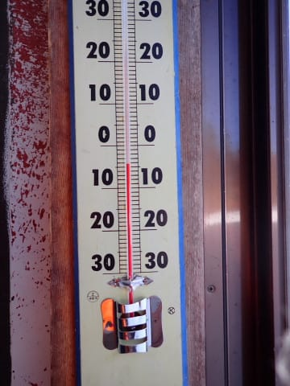
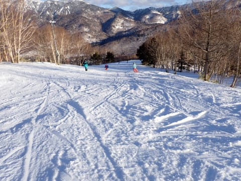

# 2024/2/17(土)の志賀高原焼額山スキー場は…終日晴天，かなりの高温で雪は緩み気味．でもストップ雪になるほどじゃなかった

📅 投稿日時: 2024-02-18 00:15:32

ってなことで．

今日も睡眠時間を削って，志賀高原で

滑ってました～！！←そこ自慢するところじゃないから

まずは，志賀高原への上り坂ですが…

うーん．

道路の雪の少なさが，2月とは思えないん

ですが…？？

まぁ，スキー場に近づくとところどころ

ちょっと積雪路はありましたが．

かなり雪が少ない上り坂でした…

ただ，駐車場に着くと．

2㎝ほど雪が積もっていたので．

昨晩うっすらと積雪があったようですね…

で．いつも通り焼額山営業開始の

8:30前に第1ゴンドラ前に並びますが…

今日は列はそこそこの長さですが．

先週の3連休よりは少ないですね～…

多分，今日はそんなに混まない感じかな．

山頂につくと…

いや！

これは，雲一つない快晴…！

そして，朝の気温は-4℃と，

予想よりちょいと高めながら，

マイナスをキープしていたので．

おかげで，あさイチは昨日の高温で

緩んだ雪が冷えて固まったような

ちょいと硬めの雪質．

うん．

悪くないシマシマだけど，あさイチのGSコースは，

ちょっと足元が流れる感じが時々するような

シマシマかな…

しかし．

あさイチは見事な雲一つない晴天だし．

ゲレンデの人も少ないし．

白樺コースとかは板が流れる感じが

全くない，いい感じのシマシマだったし．

まぁ，ちょっと朝のGSコースはコロコロが

出たところもあったけど…

でも，日差しがあったのでコロコロも

10時ごろにはつぶれるような感じになり．

雪質は全般的にしっとりしてきたものの，

まだ楽しく滑れるな…！！

…と，思ったところ．

本日，朝から奥志賀高原ゴンドラが運休

というのもあり…

いつもなら一ノ瀬方面からやってきて，

奥志賀に流れる人が．

奥志賀に行くことなく，焼額に滞留した

からか．

ゲレンデの人が，予想以上に増えてきて…

さらには，午前10時半には．

ゴンドラの列がかなり伸びてきました（泣）

さらに，第2高速もちょっと列が伸びて

来ましたね…（涙）

…でも，ゴンドラの列が長いとはいえ，

相乗りレーンに行けば最長でも5分

ちょい待ちで済みましたし，

11時15分には，列はゲートの中に納まって．

昼にはゴンドラもかなり列が短くなり…

午後は搬器数台待ち程度のガラガラ！

第2高速リフトも，待ちは搬器数台程度で．

午後は，リフト・ゴンドラともに待ちが少なく

快適でした～！！

だけども…

最高気温が山頂でもプラスに振れた本日．

そのうえ，日差しもかなり強かったことも

あり，かなり厚く感じるほどで…

そのおかげで，昼頃には雪がかなり緩んで

しまいました…（涙）

で．

人はそれほど多くないとはいえ．

コースとタイミングによっては，午後に

なってもこの程度の人がいることも

あり…

そのせいで，午後になると，柔らかく

緩んだ雪はところどころで結構荒れ始めて…

昼過ぎまで結構フラットでよかった

オリンピックコースも，ラストのころには

結構凸凹になってきちゃいました…

でも，午後になっても全面完全に凸凹に

なったわけではなく．

GSコースの上部や白樺コースは

夕方まで比較的フラットだったし．

まぁ，GSコース下部は凸凹になった

ものの，標高が下がったこの辺りは

春のような雪で，柔らかコブでそこまで

滑りにくくもなかったし．

春スキーと考えれば，

天気も良くて，ところどころフラットな

雪もあり．

いい感じの一日だったのではないかな～…

春スキーと考えれば…

という感じで．

今はトップシーズンの2月だ

という事実は忘れたことにして，

日が暮れる16:15のラストリフトまで，

いつも通り昼休みも取らず，ひたすら

春スキーを楽しんだのでした…

…ってな感じの一日でしたが…

そうです．

まだ終わらない．

まだ，リフト営業は終わってません！！

はい．

皆さんわかってますよね？？

そうです．

今日も当然，焼額のナイターに参戦です！！

…見よ！！

この，焼額クオリティのシマシマを！

ナイター参加者は，朝に続けて再び

このシマシマを味わえる特権を得られる

のだ…！！

ということで．

さっそく，いただきま～す！！！

…

うほぉ！！

シマシマっ！！

…でも，朝と同じく．

ちょっと硬めで，表面が崩れていく感じの

シマシマで，

ちょいと板が流されるのが惜しい…

シマシマが崩れると，ところどころ

コロコロが出てきて．

板がグリップしないのがわずかに

惜しくはあったけど…

でも，人が少なくて，ラストまで雪は

フラットだし．

飛ばしたい放題思う存分飛ばせるナイターを

ひたすら官能の限りぐるぐるしてきたのでした…

うーん．

しかし．

もう，白樺コースやGSコース下部，

ブナコースで数か所茶色いところが

出始めてきて．

2月でこれだったら，4月はヤバいんじゃないか…？？

という積雪の少なさです（涙）

今，2月のトップシーズンだよね…？？

明日はもっと気温が上がるから…

完全に4月の春スキーになりそう（泣）

今，ホントに2月だよね…？？

## 💬 コメント一覧

### 💬 コメント by (ねも)
**タイトル**: Unknown
**投稿日**: 2024-02-18 17:29:45

Ｓさん　お久しぶりです。

連日晴天はうれしいけど、暖かすぎじゃない？　斑尾高原で滑ってましたが、似たような状況、まるで春先のスキー場(^-^;

妙高山や北アルプスまできれいでしたが、景色じゃスキーはできません(苦笑)　このままシーズン終わりにならぬよう祈りましょう！

### 💬 コメント by (副院長)
**タイトル**: Unknown
**投稿日**: 2024-02-18 19:11:10

ひょっとして今日も、日体大効果で、4時45分だったのでしょうか？

### 💬 コメント by (アツシ)
**タイトル**: Unknown
**投稿日**: 2024-02-19 00:09:55

ナイター私も滑りました。良かったですねー！ホント、滑らない人は人生の何分の...以下省略。

6時にリフト乗り場に着いたら、先頭にSさんの姿が。さすが、一番乗りキープですね。私も後ろに並んで4番目の搬器で追いかけました。しかし、追いつかない。何回ぐるぐるしても搬器1〜3台後ろ。Sさん全然、止まりませんね。それでも追い続け、ラスト30分は毎回リフト改札で追いつくもSさんご一行が毎回4人乗車のため次の搬器で追うという展開でした。なんか、片想いの女の子に話しかけたくても話しかけられない男子中学生みたいな50才のおっさんなのでした。あー気持ちわる🤮

### 💬 コメント by (Skier_S)
**タイトル**: とても2月と思えない
**投稿日**: 2024-02-19 03:20:26

＞ねもさま

暖かすぎますね…（涙）

23日から冷えそうですが，雪は降らなさそう（泣）

このままシーズンが終わっちゃいそうな危機です…

＞副院長さま

そうです～！

今日も16:45まで滑ってきました～！

＞アツシさま

あら．

昨日はそんなすぐそばにまで接近していたんですね…

こっちはひたすら気持ちよくかっ飛ばし続けてました（笑）

### 💬 コメント by (ヒロシ　kyoto)
**タイトル**: Unknown
**投稿日**: 2024-02-19 06:28:27

Sさま

ナイターではお世話になりました

あのハイスピードぐるぐる回しに誰も遅れる事なくの２時間は至福に時間でした

またよろしくお願いします🙇

### 💬 コメント by (Skier_S)
**タイトル**: Unknown
**投稿日**: 2024-02-21 08:54:20

>ヒロシさま

ナイターよかったですね～！

昼間寝てでもナイターに行ったほうが楽しいですよ…！

でも、ヤケビナイターも今週末でおわり。

寂しい…

### 💬 コメント by (富山県民)
**タイトル**: Unknown
**投稿日**: 2024-02-24 07:06:33

こんにちは。

2月17日は新潟県のかぐら田代みつまたスキー場に行きました。

こちらも快晴で山々の景色が綺麗でした。

新雪は5cmから10cmくらいで午前中はそこそこ雪質が良かったです。

### 💬 コメント by (Skier_S)
**タイトル**: ＞富山県民さま
**投稿日**: 2024-02-25 00:16:32

田代に行かれたんですね…

雪は十分ありましたでしょうか？

志賀が終わったらかぐらに行く予定なので，気になってます…

