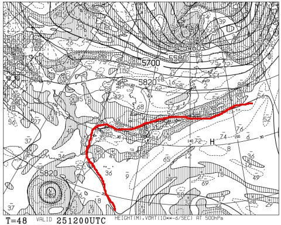

# ついに明日，10月25日にイエティオープン！スキーシーズン突入の週末のイエティの天気は…気温が高く時折パラパラ雨が降りそう（涙）

📅 投稿日時: 2024-10-24 02:03:18

ってなことで．

ついに明日，イエティがオープンしますよ～！

そして今週末には，私も2024/2025シーズン突入

です！！

とりあえず，あと30時間後くらいにはオープンの

イエティのライブカメラを見てみると…

まだ圧雪整備はされてないようですね…

（[WNIライブカメラ](http://webcam.wni.co.jp/KAC24326/loop.html)より）

一応雪山はつながってるけど．

気温が高く，かつ雨が降ったこともあり，

例年より雪山は低く，ぎりぎり何とか

コースが繋げられそうな程度の雪の量って

感じでしょうか…

明日のコース幅，かなり狭そうな感じ…

ということで．

今シーズンも，このBlog名物の

スキー場天気予想をぼちぼち始めようかと

思うわけですが．

まず，イエティオープン日，25日（金）

の地上天気図を見ると…

うーん．

いやらしい感じで，ちょうど太平洋側，

イエティの当たりにかけて，水色に塗った

降水量のあるエリアがかかってますね…

残念ながら，オープン日の金曜は，

曇り時々雨＆ガスって感じで，

あまり天気が良くなさそう…（残念）

ちなみに，この日の500hPa高度線を見ると．

夏の空気を表す5880m線（赤く記した線）が

太平洋側にかかっているので…

天気が悪いのに夏並みに気温が高く．

せっかく造った雪にとっては最悪の

天気になりそうです（涙）

そして，翌26日（土）の地上天気図を見ても…

うううーーーん．

ちょうど太平洋側に降水域がかかってますね…

ただ，イエティはぎりぎり降水域がかかるか

どうかという位置なので，

それほどひどくは降らないはず…

曇り時々パラパラと雨，という感じでしょうか．

続いて，27日（日）の地上天気図は…

うーん．

いかん．

この日は関東は全域が降水域に覆われてるので…

そこそこ雨が降りそう…！

昼間パラパラ雨が降り続け，時折やむタイミングが

ある程度か…（涙）

ちなみに，この日も気温が高そうです（泣）

ってなことで．まとめると．

25日(金)：朝から雨が降ったりやんだりで，

　時折パラパラとちょっと強めに降り，

　時によってガスが出る残念な天気．

　気温自体は20℃近くまで上がるけど，

　日が射さず雨でぬれるので肌寒く感じる．

　雪はかなりの勢いで解けて，

　コースにところどころ穴が開くかも…

26日(土)：基本的に曇り，ときおり雨．

　雨が降ってもそんなに強くなく，

　ポツポツパラパラと降る程度．

　この日も気温が高い．

　雨が降らなければ肌寒さは感じないが，

　日が射さないので暑いほどではない．

　この日もゲレンデは午後に向けて

　雪が解け，コース上は穴が開きそう…

27日(日)：雨時々曇り．時折本格的な雨．

　気温も高く，雨が終日パラパラ降り，

　時折雨が強まるかなり残念な一日．

　運が悪ければ，この日で結構

　壊滅的に雪が解けかねない．

　午後のゲレンデは結構ひどく荒れる．

　運が良ければ，雨がそれほど降らず

　雪がもってくれる可能性も…

ってな感じでしょうか．

なんだか，3日ともそこまでひどい

ザーザーぶりにはならなさそうですが，

パラパラと強めに降ってくる時もあり

そうで，それで気温が高いとなると…

雪がどれだけもってくれるのか…

今週末以降の天気も気になるので．

ここ一週間の850hPa気温を見てみますが…

あぁ…これはダメな感じ…

イエティオープンから週末にかけての

25，26，27日は水色で示したように

平年比+4℃の高温が続きそうで…

さらに赤矢印で記した28日以降は

30日まで，平年比+6℃くらいで推移しそう

なんですが…っ！！

いかん…

こんな高温では，せっかくの人工雪が解けて

しまう！

と，28日以降の地上天気図を見てみると…

さらに追い打ちをかけるように，秋雨前線が

停滞して，28，29，30日と3日間ずっと

雨が降り続けますね（泣）

高温で雨って…

イエティの雪，30日までもってくれるのか？？

おそらく28日以降，

イエティの造雪能力と高温の雨による雪解け速度，

どっちが勝つかの際どい勝負になりそう…（涙）

30日以降，ヘタすると一旦クローズを覚悟

しないといけないくらいか…？？？

30日以降冷えてくれるなら，ちょっとは期待

できるけど．

今後2週間850hPaの気温予報を見ると…

うああああ！ダメだ…っ！！

31日まで平年比+5℃，それ以降はちょっと

気温が下がるものの，今後2週間は平年比+3℃を

越え続けそうな予想…（激涙）

水色で示した，タダでさえ暑いと感じた

9月下旬よりも，これから11月上旬までの

方が，平年比の気温が高くなってる

この恐ろしさ…

とりあえず，秋雨＋高温のダブルパンチで，

11月2，3，4日の3連休に営業できるか，祈らないと

やばいレベルかも…？？

うーん．

2025シーズンスタートですが．

余り幸先よいスタートじゃない感じ…(涙)

でも．

10月が暖かい年は，その反動で11月下旬に

なってから冷えることがあるので．

そこに期待っ！！！
