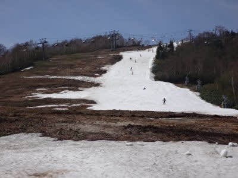

# 本日16日日曜は，かぐら全面運休．横手は雨…そして15日土曜のかぐら写真追加！

📅 投稿日時: 2021-05-17 02:58:18

🏷️ カテゴリ: [日記](cc4b5682fb7b8b144980957a978653fb0.md)

えー．

今日は一日家で仕事をしていたのですが…

なんと．

今日のかぐら．

強風で全面運休だったようですね(涙）

…昨日，スキーに行っておいて良かった…

（[かぐらスキー場Facebook](https://www.facebook.com/login/?next=https%3A%2F%2Fwww.facebook.com%2Fsnowkagura%2Fposts%2F3781252755335350%3F__xts__%255B0%255D%3D68.ARBZfYqqyds5fWhBwkWS9QlAo9FeVp72idTDhZlvvYqdAcsCsylp-nhKVEUf8F5uh8-tDEtmblQbZSXQcF084q5K4CIVHp11Sg24GTaqi18g2Ys-rrW8-AHrhWeNK8al3dVJsnsRKdy5d5NL9M54bSVoKULgWmKNvbWZmuuvajrpgUlLXnX-sGTUh23dfG198hiGBpHvYHz9SCmxrL6NsYegkpBHxD-RTxwnDanKxbsLM0XMydcL5RSY_Sx0dnO6rqkX5NXBWHpQBPpKzfvKhlgZN_UwCGHOsqThPRO6ViGA4s-DoA%26__tn__%3D-R)より）

そして．

今日の横手・渋峠．

横手は営業最終日ですが．

なんだか，朝7時ごろからひたすら雨で…

昼ごろには一旦止んだものの．

午後も降ったりやんだりの

繰り返しだったようです…

やはり．日曜は天気に恵まれなかった

ようですね…

そして，これからの天気図を見ると．

「早くも，梅雨か？？」

という天気図で…

これから一週間，雨が降り続けそう(涙)

…果たして，今週末まで．

かぐらの雪は無事にもつのか…？

とりあえず．

土曜のかぐらの写真，さらに追加で載せておきます…

激込みの土曜日．

朝9時前の駐車場の入りはこのくらい．

うーん．例年のピークよりは車は

少なかったんだけど．

ロープウェーの乗車制限(満員の半分くらい？）

のおかげで，ロープウェー待ち時間が

半端なかったですね…

で．

昨日の記事に書いたように．

メインバーン自体は，まだ雪がいっぱい

ある感じ！

最後の落ち込みのコブ部分，この写真の左側は

土が出ちゃってるけど…

まだ，十分な幅で滑ることが

できます！

和田小屋からクワッドリフト乗り場までも

まだ雪は十分あるし…

クワッドリフト乗り場付近も雪は

しっかりついているので．

クワッドリフトはまだ数日は

問題なく動きそう！

パークもまだ，巨大キッカーが残って

ますね…

で．

朝のうちは，メインバーンもフラットで

結構滑りやすそうなのですが…

雪の滑りは悪かったです(涙)

テクニカル下部は完全アウトだけど．

上部のコブも，残念ながら

途中で終わってる感じ…

あと，昨日の記事で，ジャイアントは

終わりかけと書きましたが．

一番細いところは，上から見ると

こんな感じだったので．

月曜にはコースが切れて，滑れなく

なっちゃうんじゃないかな…

で．

昨日の記事では，クワッドは終日

5-10分待ちで混んでたと書きましたが…

ペアリフトは，大体終日こんな感じの

待ち時間でしたね…

そして．

午前中はフラットだったバーン．

午後になると，全面コブになっていき…

雪が薄くなっているところもあるので，

真っ白だったバーンも，

コブが掘れてくると，下地が

見え始めるところが…(涙）

メインバーンの一番下，

パークの横あたりも，穴が空き

かけているところが多いです…

とはいえ，土が出始めているところは

まだ少なく．

まだ数日は安心して滑れそうかな…！

…しかし．

まるで梅雨のように雨が降り続ける，

これから一週間．

かぐらファイナルの次の週末まで，

メインバーンは無事にもってくれるの

だろうか…（かなり心配）

と，心配になりながらも．

2016年の写真を見ると．

5月15日でこんなだったので…

それに比べれば，128倍くらいマシだな

と自分を慰める，Skier_Sだったのでした…

## 💬 コメント一覧

### 💬 コメント by (naoちゃんねる)
**タイトル**: Unknown
**投稿日**: 2021-05-17 09:19:03

この時期は、営業中止になっても逃げれるスキー場が近くに無いから遥々来た人は悲惨ですね…(涙)

あ…そういえば、数年前のGWに営業中止の志賀高原から かぐらに遥々瞬間移動して滑った終わった人(褒め言葉)がいましたねぇ…(笑)

我が家は15日のラスト熊の湯に行ってきましたが、1週間前からびっくりする程雪解けが進んでいました…

もう1日、渋峠あたりで滑りたいと思ってますが、6月までは厳しそうですね…⤵

### 💬 コメント by (mae)
**タイトル**: Unknown
**投稿日**: 2021-05-17 22:53:17

土曜日はお疲れ様でした。

あの混雑は酷かったけど、山麓からゲレンデまでの移動は新緑を見ながらトレッキングしてるようで、これはこれで楽しかったです。

日曜日の全面運休は自分も初めてスキー場で体験しましたが、私は前日からなので良いけど、遠方から日帰りの方々には気の毒に感じました。

あっけないファイナルになりましたが、山にも登りたいので悔いはありません。

さて、週末はどこの山に登ろうかと(^^;

### 💬 コメント by (Skier_S)
**タイトル**: 今週はひたすら雨．かぐら大丈夫かな？
**投稿日**: 2021-05-18 01:09:43

＞naoちゃんねるさま

いや…日曜の朝の駐車場の混乱が目に見えるようです…

かぐらのみんなも，横手・渋に瞬間移動すればよかったんですよね！←終わった人の発想

でも．渋峠もいつまでもつことやら…

＞maeさま

日曜は滑れず残念でしたね…

でも，遠路日帰りで来た人はホントかわいそうですね．

これから山登りですか…

私も7月に入ったら山登りかな？

今年も海には潜れないのかな~…

