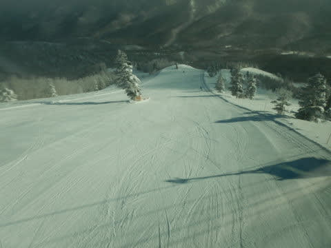
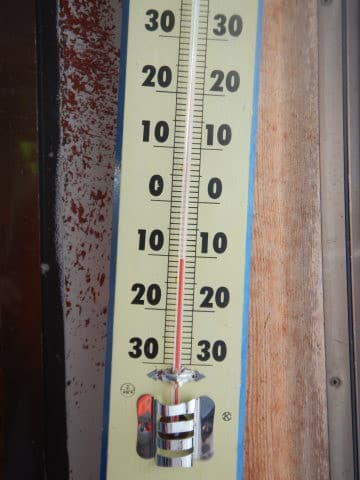
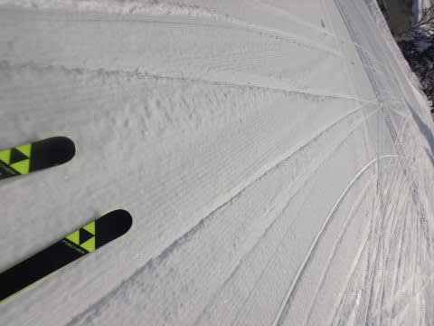
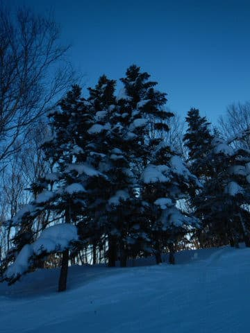

# 2022/1/8(土)の志賀高原スキー場は…晴天冷え冷え！絶好のスキー日和！それほど混まない最高デー！！

📅 投稿日時: 2022-01-09 00:17:25

ということで．

中3日仕事しただけで，再び志賀高原へ

舞い戻ってきたSkier_Sです．

いやーーー．

今日は良かった．

ホントに恵まれた，最高の一日でした…

まず．

あさイチは到着がぎりぎりになり，

8:30の焼額第1ゴンドラ営業開始の1分後に

ゲートに到着するという残念な事態でした…

(時計が8:31分(涙))

でも．

今日は数分の出遅れが生死を分ける

パウダーデーじゃないし．

ファーストトラックをやっている日なので，

8:30の通常営業一番搬器に乗っても，

誰も滑ってないノートラックのシマシマ…

ってわけじゃないし．

いいんだ…ちょっとくらい遅れてもいいんだ…←自分を慰めてる

ってなことで．

あさイチから1分出遅れた搬器に乗って，

山頂へ向かうと…

うほーーーー！

シマシマ！

そして，天気は最高晴天！！

さらに，気温は-11℃と冷え冷え！！

　朝の気温は-10℃近くまで冷える．

という予想よりもわずかですが

冷え込んでます！

だもんで…

冷え冷えで，雪質最高！！！

結構やわらかめの，トップシーズンらしい

シルキーな特上粉雪の圧雪バーン！！！

ぐほほ！

うほほほほほーーーーーー！

これで，

天気も晴天だし．

さらに気温も冷え冷えの最高やわらか雪の

シマシマが滑れるなんて…！！

そして，朝のうちはゴンドラもガラガラだし．

数本ゴンドラに乗っても，まだシマシマが

滑れるなんて…

最高！！！

天気・雪質・すき具合，すべて二重丸の

今日は最高の日だっ！！！

今日は終日，雲一つない晴天がずっと

続いたのに…

ウエアに着いた水滴がカチカチに凍るほどの

冷え込みなので，

今日は丸一日，最高雪質をキープ！！

そして，不思議なことに…

こんないい天気で，こんないい雪なのに．

混まない！

ゲレンデに人がいないんですけど…！！

みんな，出かける人は正月休みに出かけ

ちゃったので，この3連休はお出かけする人が

少ないのか…

こんなガラガラの晴天バーンで滑って

いいんですか？？？

シアワセ…

こういうのをシアワセというんだ！！！

とヨロコビを全身で味わいつつ，

晴天の冷え冷えバーンをかっ飛ばす！

この正月休みは，ほぼ毎日雪降りデーで，

パウダーおなか一杯だったけど…

今日は久しぶりのすっきり晴天デーで，

人がいない整地をゴンドラグルグルで

滑れるよ…

シアワセ…

シアワセだよ…

今日のゴンドラ待ちは，平均的には

このくらいで，ゲートから外まで列が

伸びるか伸びないか程度．

それも，相乗りOKの人レーンと相乗りNGの人

レーンがあって，相乗りOKの人レーンは

搬器数台待ちで乗れたので，ほぼストレスなし！！

雪も天気も最高で，それでいて混まないって…

シアワセ…

こんな日が毎日，一年365日続けばいいのに！！←毎日こんなにガラガラだったら経営的にヤバいから

ってなことで．

今日は午後に一瞬ここまでゴンドラが並んだ

瞬間はあったけど

こんなに待ったのは1回きり．

あとは相乗りレーンなら，終日そんなに待ちなく

乗れました！

…あ，2ゴンは昼間は5-10分待ちになった時が

あったみたいです．

コースも時々人口密度が高い一瞬があったものの…

ほとんどのコースで夕方までガラガラ！！！

そのため，GSコースの一部を除いて，

夕方までバーンは荒れず，ほぼフラットを

キープ！

いや…

ホントに，こんなに恵まれている日は

シーズンに何回あるだろうか…？？

というシアワセな一日を，あさイチから

夕方16時の日が暮れかけるラストリフトまで，

今日も昼休みを取り忘れて，ひたすら滑り

続けたのでした

いやーー．

良かった．

ホントに良い一日だった…

…

…

…

となれば．

そうですね．

その通りです．

今日も当然のごとく，ナイターに繰り出すのだ！！

…それも，今シーズンは正月とこの3連休しか

営業してくれない，私の大好きなサンバレーナイターへ

突撃するのだ！！

ってなことで，実に久しぶりのサンバレーナイターは…

うほほほーーーー！！

シマシマっ！！！

朝に続いて，ナイターも最高トップシーズンの

やわらかシマシマ！！

…それも，自分以外10人滑ってるかどうかという，

ガラガラバーン！！

ってな感じで，昼間に引き続き，ナイターもシマシマの

ガラガラバーンを，ひたすら営業終了の20:30まで

滑り倒したのでした…（21時まで営業じゃなくなったのが痛い…）

ってなことで．

今日はシーズン1度あるかないかの最高デー

だったわけですが．

明日も，雲が多めながらも晴れそうなので．

今日に引き続き最高デーになりそうな予感…！

## 💬 コメント一覧

### 💬 コメント by (アリス)
**タイトル**: 羨ましいです
**投稿日**: 2022-01-09 18:01:27

S様

日頃の行いがいいんですね～

ベストコンデイションですよね♪

羨ましすぎます・・・

画像を見てのた打ち回っています・・・

3連休は仕事をめいっぱい済まして、11日からの参戦です♪

### 💬 コメント by (crz)
**タイトル**: Unknown
**投稿日**: 2022-01-09 20:30:50

ガラガラサンバレーでチラッとお見かけしましたが日曜夜は他のエリアだったのでしょうか?

ラストナイターは倍以上の人出でした(T_T)

### 💬 コメント by (レインボー74)
**タイトル**: Unknown
**投稿日**: 2022-01-09 22:06:57

今日みんなで話した結論が、やけびでもっともおかしいスキーヤーは？　

おめでとうございます。満場一致でエス様が当選です。

どんな雪質に関わらず、最後まで！！　信じられません。

### 💬 コメント by (Skier_S)
**タイトル**: 今日も最高！
**投稿日**: 2022-01-09 22:36:54

>アリスさま

ホントにこの3連休，恵まれてます～！

大変残念なお知らせですが，11日からまた天気が崩れそうです…

そして，12日はまた大雪です．パウダーです！

＞crzさま

あら．サンバレーで目撃されちゃいましたか…

ナイターサンバレーで滑ってましたよ！

＞レインボー74さま

ヤケビで最もおかしいスキーヤー…

ヤケビに限らず，「志賀高原で」となれば，

一の瀬をひたすら滑る方やら年間200日滑る方やら，

恐れ多い方がいっぱいいらっしゃる気がしますが…(笑)

