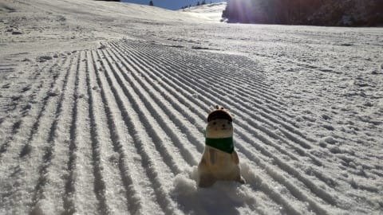
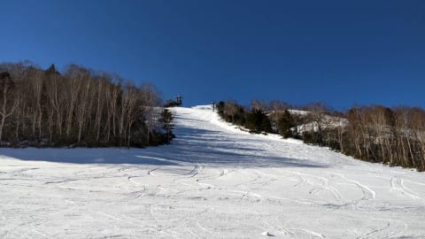

# 志賀高原の明日4日(土)は完全西風でそんなに積もらないかも…(涙)．とりあえず，焼額スキー場オープンへ行ってきます！

📅 投稿日時: 2021-12-04 00:44:59

🏷️ カテゴリ: [日記](cc4b5682fb7b8b144980957a978653fb0.md)

えー．

今日の志賀高原．

誰かは曇り空…と予想しましたが．

意外と晴れたようですね．

うん．

誰かの予想は外れたようだな…

ってなことで．

本日の志賀高原はすっきり晴天！

コース全体は，かなり硬めのバーン

だったようですが．

熊の湯は山頂から馬の背コースが

オープンしただけじゃなく…

なんと！！第4イベントコースも

オープンしたようです！！

おこみん特派員によると．

非圧雪のナチュラルバーンで，

ほぼオフピステ感覚だったとか…

イベントコースから一番下まで滑った動画を

送ってくれましたが．

バーン，かなり固そうな音を立ててますね…

うーむ．

明日までに雪が降って，明日は柔らかい

コンディションになってくれるといいん

だけど…

とりあえず，

4日の天気図を見ると，地上天気図はきれいな

冬型の縦縞で，志賀高原も一見雪が降りそう

なんだけど…

でも．

850hpa図を見てみると…

…まぁ，0℃線は太平洋側まで下がって，

結構冷えそうなところはいいんだけど．

しかし．

この図を拡大すると…

赤く囲った部分，完全に西風ですね(涙)

850hpaって，大体高度1500m付近なので．

…志賀高原当たりの高度は見事な西風で，

あんまり雪が降らなさそう…(泣）

地上天気図を見ると，縦縞で北風が入り，

志賀でも雪が降りそうな冬型の天気図

なんだけど．

高層天気図を見ると初めて分かる，

志賀高原が西風にさらされるという事実…(泣）

ということなので．

4日土曜：朝は硬めの下地の上に，

　数cm薄っすら積雪かな？

　朝の気温は-7℃程度，昼間は時々雪雲が

　飛んできて雪が舞う．時々晴れ間も．

　それほど積もらない．

　昼間も気温は-3℃程度までしか上がらず

　結構寒いかな？

5日日曜：朝は-8℃程度かな？

　朝までの積雪はほぼ無し．

　あさイチは結構締まったいいバーン！

　もしかしたらその上にうっすら積雪が

　乗るかも

　朝は雲が多く，雪が舞ってるかも

　しれないけど，昼前には晴れてくる．

　午後には気温が上がっていく．

　0度近くまで上がるかも．

　でも，山頂ではマイナスキープで

　そこまで気温は上がらないので

　雪はしっかり硬めをキープ

ってな感じですかね…

ドサドサ積もらなさそうなのは

残念だけど．

まぁ，熊の湯も山頂から滑れるし．

一の瀬も天狗コースのみとはいえ

クワッドリフトが動くし．

横手も第1，第2が動くし．

焼額もゴンドラが営業と．

ここ数年の12月第1週を振り返れば，

結構恵まれた週末かな～．．．

では，この土日は焼額で滑ってます！！

…そして今から2時間半後に出発(涙）

ほとんど寝れない…

## 💬 コメント一覧

### 💬 コメント by (ikkun)
**タイトル**: Unknown
**投稿日**: 2021-12-04 09:53:52

おはようございます  もはや滑っていらっしゃいまし？ 色々準備中でなかなかですか  あ但しチューンナップ預けた二台お金払わず戻りました(・・;)部屋にスキーを置くと上がります❗暖かい焼酎を傾けながら(笑)

私しはいつなるか？

### 💬 コメント by (新米パパ)
**タイトル**: Unknown
**投稿日**: 2021-12-04 10:11:20

いよいよですね。

レポ楽しみにしております。

私も、再来週末あたりから参戦できたらなと考えております。

コロナクラスターの話もいくつか耳に入っておりますので、早め早めに行っとかないと、、ですね。

### 💬 コメント by (Skier_S)
**タイトル**: ホームゲレンデへ復帰！
**投稿日**: 2021-12-04 23:47:55

＞ikkunさま

もう滑ってます～！！

ホームゲレンデ復活です！！

＞新米パパさま

再来週，志賀高原ですか？？

お待ちしています～！

