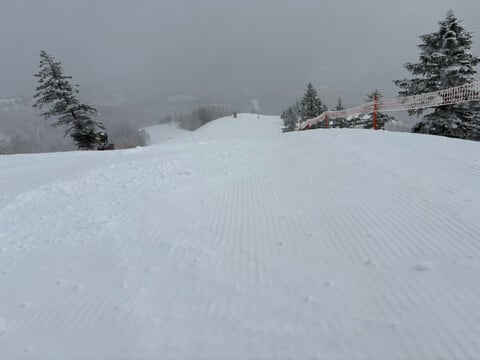

# 4月4日の志賀高原スキー場はうっすら積雪，小雪で時折晴れ間も！明日土曜は，朝のうちはバーンコンデションはかなりいいに違いない…

📅 投稿日時: 2025-04-05 00:48:20

🏷️ カテゴリ: [日記](cc4b5682fb7b8b144980957a978653fb0.md)

えー．

本日も平日というのに，志賀高原で滑って

いる特派員が何人かいたようですが…

皆さん意外と楽しめたようで．

やはり4月でもいい雪にあたるときがあるのが

志賀高原のすごいところだよな～…

とりあえず，朝の志賀高原への道路は

完全に積雪路面だったようで…

冬に逆戻り？？

朝イチの気温は-4℃と，この時期なら

まぁまぁの冷え込み！

朝までに，2-3cmの積雪があったようで．

木々に雪が乗ってますね！！

バーンの下地は硬いシマシマだけど，

その上にうっすら積雪があったので，

結構滑りやすかったようです…！！

しかし，今日も誰も滑ってない，

強烈ガラガラバーンですよ～！

そしてどうやら昼間はわずかに日が射す

タイミングもあったみたいですが．

昼間もわずかに0度を越えるくらいまでしか

気温が上がらず．

一部，ふもとの近くは雪が緩んだところも

あったみたいですが…

でも，午後になるとまた冷え込み，雪も

ぱらついてきたみたいで．

終日板が滑る雪だし，バーンは緩まず

荒れなかったので，某焼額常連は

今日も昼休みを取らず滑り続けて

いたらしいです…

ってなことで．

今日もうっすら雪が積もってくれたし．

明日の朝は晴れてくれそうで，かなり

いいコンディションで滑れそうな

予感…！！！

そして，明日の焼額山は

第1ゴンドラ，第2ゴンドラ，第2高速の

全リフト・全コースが朝6時からオープンです！！

早朝2時間券，あるいは焼額限定4時間券か日数券

なら，朝6時から焼額すべてを滑れますよ～！！

全山共通券だと，8時からしか滑れないのですが．

明日は昼間雪が緩んで朝イチ勝負なので．

朝6時から滑りたいところ…

ちなみに明日，明後日の天気は

5日(土)：朝から晴れ！終日晴れ！

　朝イチは-4℃で硬い下地の上にうっすら

　圧雪が乗った，結構いいコンディション！

　ただ，日差しが強く，昼間は+5℃近くに

　上がりそうなので，日差しの良いバーンは

　朝のうち，それ以外のバーンも昼には

　緩む．

　午後は重い春の雪になり急斜面は

　バーンが荒れていく

6日(日)：朝から気温は+5℃近くで

　雪は朝から緩め．早朝はまだマシか…

　もしかすると風もちょっと出るので，

　ゴンドラは減速運転になるかも．

　朝はぎりぎり曇りだけど，

　午前中のどこかから雨．

　運が悪ければ早朝6時か7時から雨．

　運が良ければ11時くらいまで雨にならず

　もってくれるか…

　でも，昼頃には確実に雨で，

　午後はずっと雨が降ったりやんだり．

　昼頃には強く降るタイミングも．

ということで．

日曜はかなり残念な感じになりそうです…

でも，土曜の朝のうちは，4月と思えない

いいコンデションで楽しめるはず…！！

なので．

土曜は早朝から行きたいけど．

もう深夜1時近く…(泣)

早朝に行くためには，完全徹夜で

いかないと間に合いませんが，

さすが完全徹夜でスキーに行ったら死にます．

なので，今から2時間ちょいだけ寝て，

何とか通常営業の8時には間に合うように

行きたい…

ということで．

またこの週末も睡眠不足で滑ってます～！！
