# 愛用スマートウォッチ，Garmin Fenix7Xのバンドを純正バンドから1000円以下の激安ナイロン布バンドに変えてみたよ！

📅 投稿日時: 2024-09-14 04:39:53

🏷️ カテゴリ: [PC,カメラ&小物](c0d8caed13e597efe97b661a8ae56bed0.md)

とりあえず．

今週もいろいろあったけど何とか

終わった…

でも，3連休もどこにも行かず，仕事を

やっつけないと…（涙）

安息が…安息が欲しい…

でも，

明日は休みだし．

山にもどこにも行かず家で過ごそうと

決めたので，

今日はちょっとだけ余裕があるな．

…と言っておきながら．

今日は帰宅は深夜1時近く．

それから一仕事やっつけたので，

もう4時過ぎてるよ…

外が明るくなってきてるんですが（涙）

あぁ…

安息が欲しい…

ってなことで．

本題へ．

以前もちょっと記事にした，今やこれ無しでは

生きていけなくなりつつある我がスマート

ウォッチ，GarminさんのFenix7X．

ダイビングするときとお風呂の時以外は

ずっとつけっぱなしにして，24時間

心拍やら歩数やらの睡眠やらの，いろんな

データを記録しているわけですが．

この夏の暑さで24時間つけっぱなしに

していると…

暑さのおかげで，時計のバンドを着けている

部分が，ちょっとかぶれたみたいな感じに

なってきました…（泣）

うーん．

このシリコンバンド，ダイバーウォッチの

ウレタンバンドに比べれば結構柔らかくて，

着け心地は悪くないんですが…

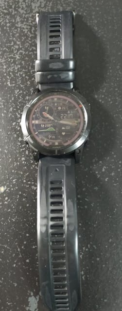

この夏の暑さ続きのせいで，時計を

つけっぱなしにしておくといつまでも

かぶれが治らない（泣）

かといって時計を外してログが取れないのは

いやだし…

うん．

だったら，かぶれない布バンドにすればいいんだ！

…と，純正の布バンドを調べると…

なぬ？？？

こんな布バンドで7700円！？？？

これだけで安い時計が買えちゃうよ…（泣）

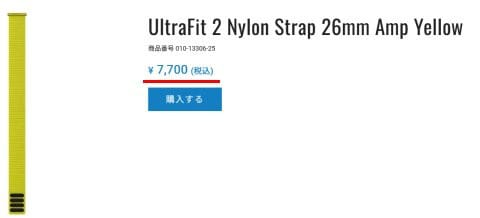

（[Garminサイト Fenix7 optionページ](https://www.garmin.co.jp/products/accessories/010-13306-25_010-02907-51/)より）

ってなことで．

さすがに純正は高いので，Amazonをさすらうこと

しばし…

見つけました！

[これ](https://www.amazon.co.jp/gp/product/B098T2VYP1)が唯一，1000円以下で買えるGarminの

26mm幅バンド対応のナイロン布バンドです！！

お値段968円なら激安！！

ってなことで．

早速購入してみました～！

注文2日後に無事到着！

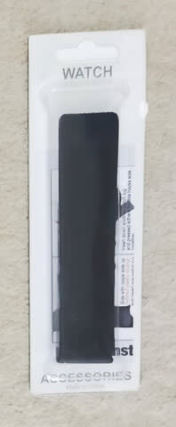

中身は…

取り付け方説明書とバンドのみ．

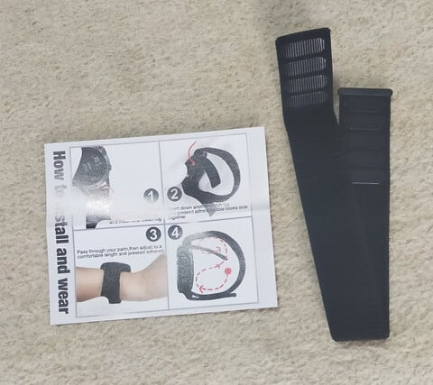

なるほど…こんな風に取り付けるのね．

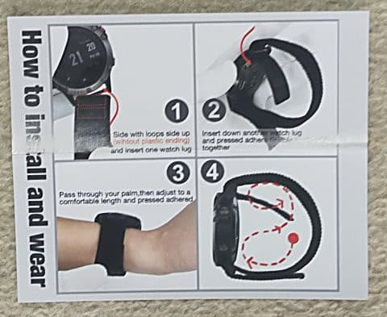

では早速取り付けてみましょう！！

まずは本体から純正バンドを外しますが．

GarminのQuickFitバンドは，ここをスライド

させれば簡単に外れます．

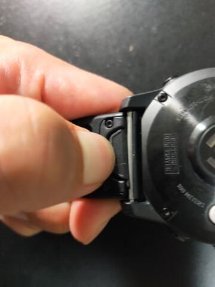

バンドが外れたら…

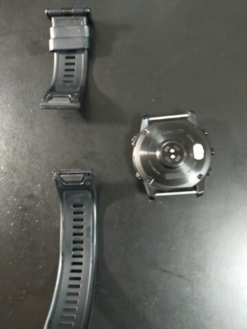

新しいナイロンバンドを，まずは時計の下側の

このピンの内側を通して…

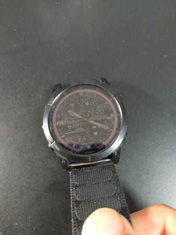

そのあと，時計の上側になるピンの外から内へ

通し…

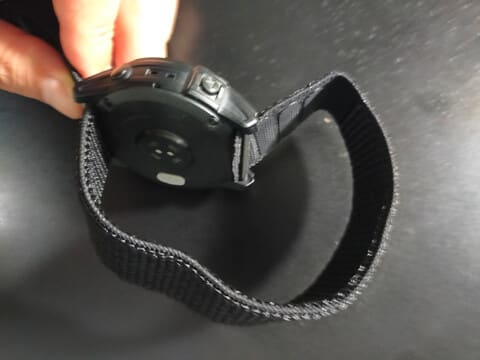

マジックテープを止めたら，これで完成．

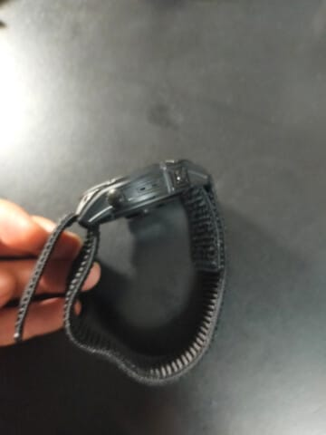

あとは実際に腕に着けるだけです！！

結構バンドは長くて．

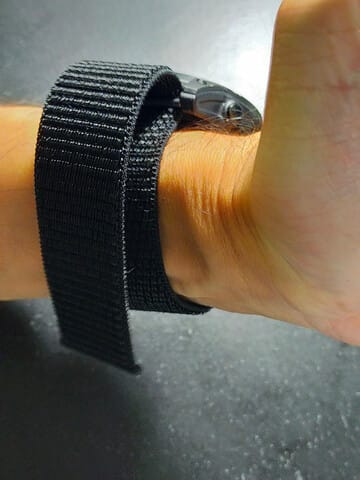

反対側のここまで来ますね…

これなら，結構腕の太い人でも，十分

対応できる長さですね…！

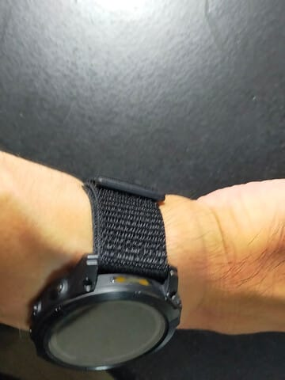

うん．

バンドが黒いので，見た目もそんなに

これまでと変わらず，いい感じ…

自分でも，これが布バンドだと忘れるくらい

自然な見た目だし．

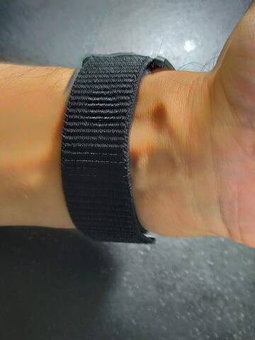

そして，布バンドに付け替えて数日で，

かぶれも引きました…！

実際こいつを着けて山も走ってみましたが．

マジックテープで固定なので，バンドの

穴で調整するシリコンバンドより細かく

調整できてぴったり取り付けられて，

走るのには布バンドの方がいい感じ…！

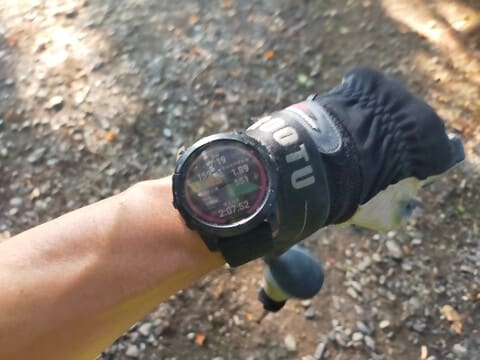

汗をかいてもバンドと手首の間に

汗が溜まって気持ち悪くならないし．

むしろ手首にぴったりしてゆらゆら

しなくなった感じで…

うん．

走るには絶対，布バンドの方がいいな…！

ってなことで．

かぶれが引いたら純正バンドに戻そう

かな…と思っていたけど．

見た目もそこまで安っぽくないし．

あまりにも快適なので，シリコンバンドに

戻す気がなくなりました…

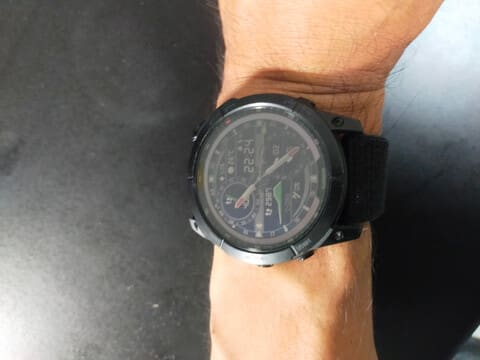

うん．

これで1000円でおつりがくるなら，

良い買い物だったな！！

## 💬 コメント一覧

### 💬 コメント by (副院長)
**タイトル**: Unknown
**投稿日**: 2024-09-14 10:34:01

確かに、汗ばむと少しかぶれます。参考になりました。結構種類あるのですね、足首と同様、手首も細いので、サイズの選べる一品を注文してしましました。

何本あってもよさげですね。

それと、ダイビングでは普通のように休憩されて、昼食も取られてるんだ（私ダイビングしないんで詳しくはわかりませんが）。弁当写真が出て、何か違和感（笑）でした。

### 💬 コメント by (Skier_S)
**タイトル**: ＞副院長さま
**投稿日**: 2024-09-15 01:32:41

1000円以下で買えるのに，思ったよりまともで使えますね…

しなやかな布なのでフィット感も良く，運動する人にはいいと思います．

あと，夏の暑いときに運動しても，シリコンバンドみたいいに汗が溜まらないので

快適です！

…で，ダイビングは1本でせいぜい1時間，潜水病を避けるために

1本潜るごとに最低1時間くらいの水面休憩が要るので，

スキーに比べるとのんびりです．

水面休憩時間にお昼も食べられます（笑）

