# 新カメラ，Nikon Coolpix AW130を使ってみて…うーむ．SONYのTX30とはかなり違うな…

📅 投稿日時: 2017-06-23 20:26:10

なんと。

昨日記事を書いたのに、投稿ボタンを

クリックし忘れてたようで…(涙)

だもんで、ちょっと珍しい時間に更新…

ー－ー

この週末．

関東地方，日曜は雨に祟られそうですが．

月山は土日とも，雨には降られずに済みそうですね～．

ただ，雲は多いかな～．

基本的に曇り，時折日も射す感じでしょうか．

あー．

日曜は，夕方に向けて崩れていくかもしれません．

午後はガスが出てくるかも…

…ただ．

この週末．

自分は月山に行けないので，予想に本腰が入ってません．

予想が外れても，責任はもてません（きっぱり）←いや，そこは自信もって言い切るところじゃなく．ちゃんと責任もとうよ…

という，いい加減な天気予想をした後は，

本題へ．

えー．

大変悲しいことに．

3年半愛用したデジカメ，SONYのTX-30を．

GW明けの[かぐらで無くして](e9c73c6de5ae77a84110cb54887e96426.md)しまい…（涙）

その後継機として，[先月，NikonのCoolpix AW130を新しく購入した](e83af8293e4666f3a4598af174c1acedd.md)のは，

皆さんの記憶に新しいところ．

で．こいつを使い始めて一か月以上経ったので．

このあたりで，使ってみた印象を書いてみましょうか…

えー．

とりあえず．

今のところ．

出た絵はの印象は，「普通」

というレベルでしょうか…

画像認識による補正がかなり入るようで．

風景撮影ではかなりカリッとした感じの，

シャープネスが高めの，エッジが効いて

コントラストが強い絵が出ます．

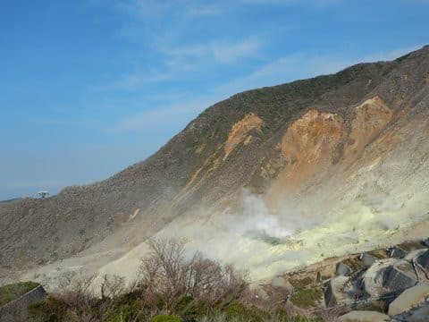

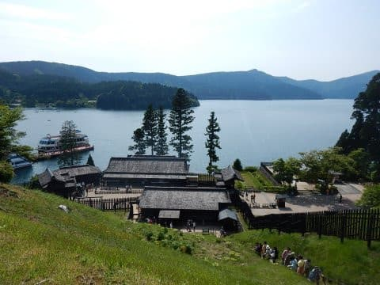

画像認識による演色は結構強くて．

画像認識に失敗して，「風景」とみなさないと

こんな色合いですが…

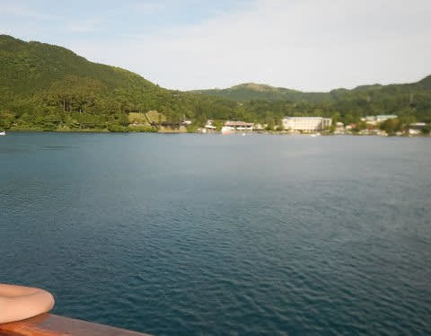

一旦「風景」と認識すると，空と水は

彩度が高めのくっきりした絵に仕上げてきます．

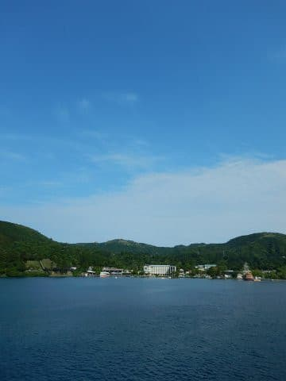

とりあえず．

諧調や色調の忠実さより，

見た目が「きれい」と感じる

写真に作り上げよう…という方向性が

強く感じられますね～

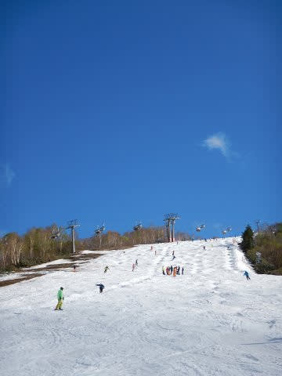

まぁ，記憶色ベースの演色は，最近の

コンデジの一般的方向性ですが（笑）．

ただ…

どうも，なんだか，スキー場の写真では．

この演色が上手く働かないのか何なのか．

色相がコケることが多いんですが…

雪面の白色の見た目がナチュラルに

感じる，これらの写真に対して．

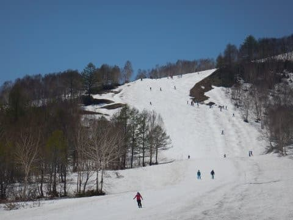

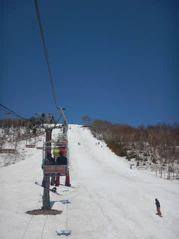

以下の写真は，とても同じ日，同じ雪を撮ったとは

思えないほど，雪面の色がシアン側にコケてます．

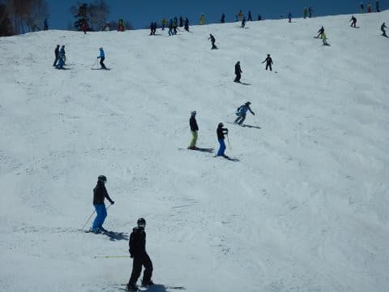

えらい派手に，シアンが勝っている雪面の色になってます…（涙）

どうも，雪以外のモノがほとんど写っていない状態で，

さらに空を入れると，なぜかホワイトバランスが

狂い，異常に色温度が高いほうに倒れるようで…（泣）．

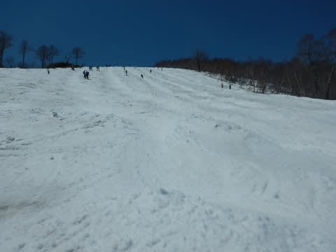

うーむ．この色のばらつき，何とかならんか…

雪を撮るときはホワイトバランスを晴天

太陽光固定にするしかないのか…

そして．

このカメラ．

複数写真を重ね合わせて，暗いところと

明るいところを上手く合成する

HDR機能をもってますが．

以前使っていたSONYのカメラだと，

被写体のダイナミックレンジが大きい領域で，

積極的にHDRが入ったのですが．

…例えば，こんな場合．

自動的にHDR撮影になってくれて．

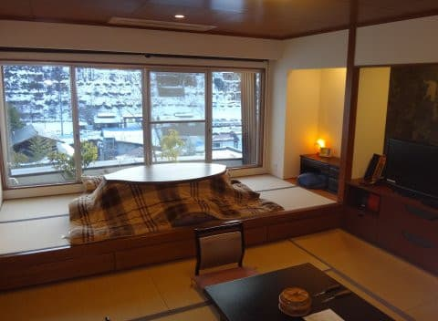

HDRのおかげで，明るい窓の外と暗い室内が，

両方ともきれいに映ってますが．

SONYのカメラで，意図的にHDRを切った場合は…

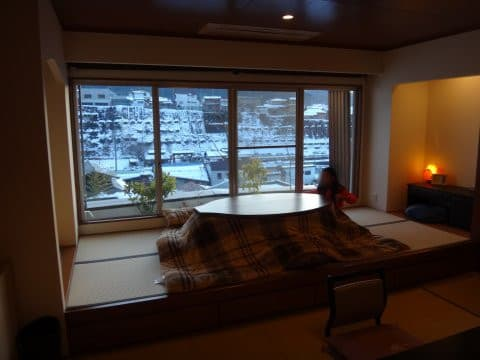

こんな感じで．

窓の外がきれいに写るような明るさで撮った場合，

室内は真っ暗になっちゃいます…

で．

こんな感じで，SONYのカメラでは積極的に

働いたHDR機能．

AW130では自動ではほぼ入りません．

手動で逆光モードに設定しないと働かない

感じ…

ただ，このカメラ．

撮影後にトーンカーブを調整して，

黒つぶれ部分を明るくする

「D-ライティング」機能があるので．

HDRが働かなくても，ある程度の補正ができる

ようになっています．

（D-ライティング補正前）

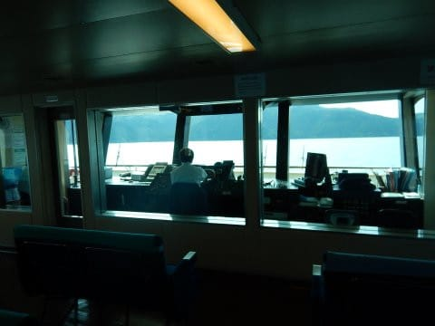

（D-ライティング補正後）

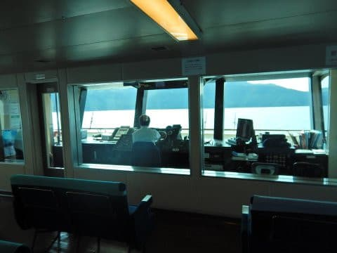

でも．

D-ライティングだと，やっぱりちょっと

諧調が足りない感じ…

窓の外はとび気味だし，暗い室内も

ディティールが分かるほど明るく

なってません…

うーむ．

もう少し積極的にHDRが効いてくれると

嬉しいんだけどな～．

…まだまだ書きたいことはあるけど，

長くなったので，続きはまた後日…

＃なんだか，マジメであんまりおもしろくない記事になっちゃった…（ちょっと涙）

## 💬 コメント一覧

### 💬 コメント by (かず)
**タイトル**: Sさん喜ぶいい情報聞きました
**投稿日**: 2017-06-24 18:57:57

今日地元で展示会がありまして　プリンスの方が来てたので話したのですが　あくまで予定ですか来シーズン期間が…………知ってたらすいません

### 💬 コメント by (Skier_S)
**タイトル**: かずさま
**投稿日**: 2017-06-25 00:45:27

ええええ～！？？

4月以降，ヤケビスタッフとは会っていないので，

何も情報が入ってないのですが…

そうなんですか？？

ってか，決定権限はヤケビスタッフではなく，

プリンスリゾート本社側がもってるので，

本社の判断ということでしょうか…？？？

