# 子連れコモドダイビングクルーズagain　その1

📅 投稿日時: 2011-08-27 00:26:41

🏷️ カテゴリ: [ダイビング日記](ce3a7a8d424d112fce83ee85c81a0e344.md)

今回．

昨年のレポートにもたびたび現れた，サザンスタークルーズの

人気女性ガイド，K村さんが．

この4月に残念ながら下船，帰国したという話を聞き．

「…日本人で2番目にコモドのダイビングに詳しい人が，

ついにコモドを去ってしまったか！」

という寂しさもあったけど．

それより，

我が娘にとって．

サザンスタークルーズの船に乗りに行くということは

「はしごのある部屋(2段ベッドのある部屋)に行って，

　K村先生 (遊んでくれる大人は幼稚園の先生と同格) と遊ぶ～」

ということで．

…どうやら，娘の楽しみの半分はK村さんと遊ぶことらしく．

「娘がクルーズに行く楽しみの半分が失われてしまったのか…」

と．

クルーズ前はちょっと心配だったけど．

出発を前に控えたある日，サザンスタークルーズのマネージャ兼ガイドの

K澤さんから，一通のメールが．

「8月1，2週はK村が特別ヘルパーとして乗船します」

おおお！

われわれが乗船するとき，K村さんが来てくれるのね！

それはありがたい＆嬉しい！

ということで．

娘も「K村先生と遊ぶ～」

と楽しみにしていることだし．

いざ，コモドへ出発！

子連れ海外も3回目となると，もう慣れたもの．

去年は午後初のJALデンパサール直行でしたが，

JALデンパサール便がなくなった今年，直行便はガルーダ（GA）のみ．

朝11時成田発のGAに乗り込みます．

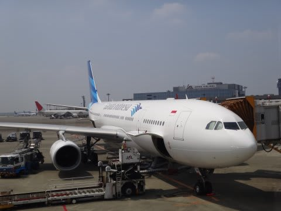

昔は，GAの機体ってぼろかったけど．

今回は最新のA320-300に変わり，きれいになりましたなぁ．

去年までは，飛行機でむずがって泣き叫ぶかも…と考えて，

「空港のプレイルームで遊び疲れさせて飛行機でぐっすり寝かせる作戦」

を実行してましたが．

幸い娘は飛行機好きに育ち，飛行機で泣き叫ぶこともなくなったので，

今回はあっさり搭乗します．

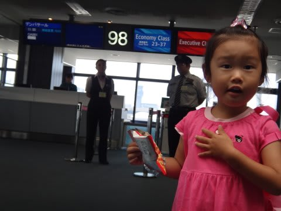

デンパサールまで8時間．

前半1時間ほどは寝てたけど．

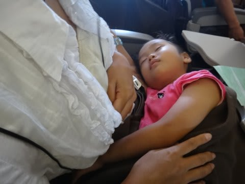

あとは，機内食を食べて，

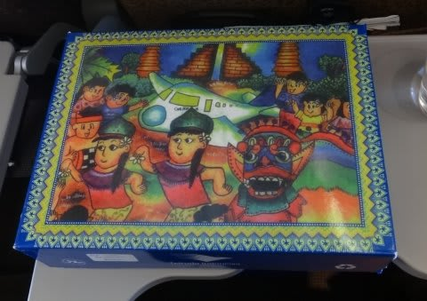

(チャイルドミールはこんな箱の中に入ってた！）

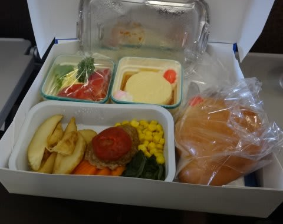

（チャイミルの中身)

（こっちは大人向け)

そのあとは，エンターテイメントの子供向け映画を見て，

ゲームを遊んで…

さすが最新鋭のGAの機体．エンターテイメントも最新で，

映画が30～40本以上見られて，子供向け映画も4-5本選べるし，

さらにゲームも画面タッチパネルなので，子供にも遊びやすい．

タッチパネルの神経衰弱ゲームなんて，1-2時間くらい遊んでたんじゃ

なかろうか…

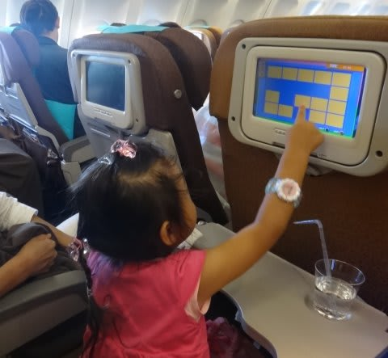

って感じで．

起きていた7時間以上の間，

娘は機内の座席にずっと座っておとなしくしてました．

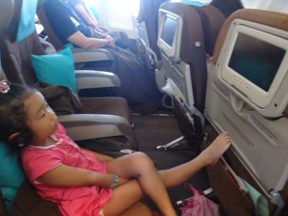

…おとなしくしてるというか．

ふんぞり返ってますが（笑）．

で．歩き回りたいと泣き出すこともなく．

退屈だと騒ぐこともなく．8時間のフライトを過ごしました．

なんか，飛行機はこんなものだともう分かりきってるようで．

んで．

現地時間午後5時ごろ，バリ・デンパサール空港に到着～

あー．

インドネシアは，入国時に＄25のビザ代を払って入国手続きをする必要がありますが．

今年から，GAでインドネシアに入国する場合は，成田の搭乗カウンターの横にある

こんなカウンターで事前に＄25払えば…

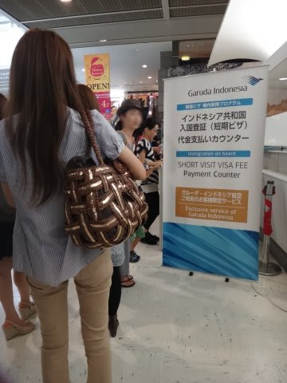

機内で入国手続きができるようになっているという．

飛行機に乗った後，機内で入国審査官が回ってくるので，＄25払ったレシートと

入国カード，パスポートを渡すと，パスポートにスタンプしてそれで手続き完了です．

んで，

機内入国審査が終わって，こういうカードをもらったら…

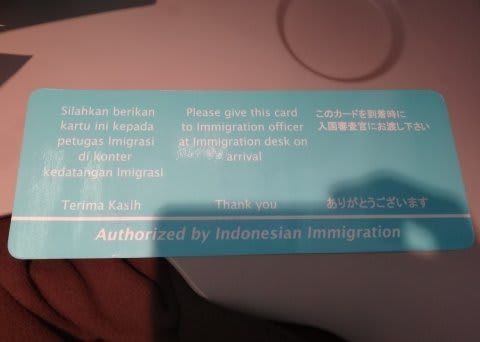

空港で入国審査の列に並ぶ必要がなく，スルーできます．

あとは，荷物を受け取って税関を通るだけです．

楽チンですねー．

で．今晩はバリのホテルに泊まり，乗船地への移動は明日なので．

空港からは旅行社の車の送迎でホテルへ．

今回利用したホテルは，Best Western Resort Kuta．

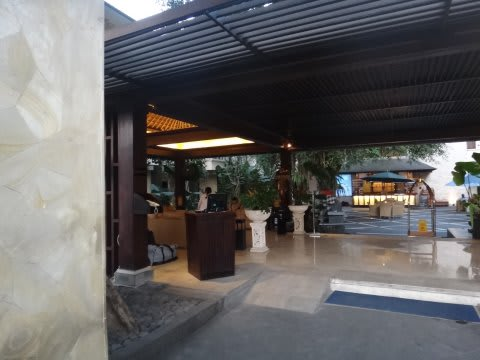

…Resortっていってるけど，ごちゃごちゃした街中にあるホテルです．

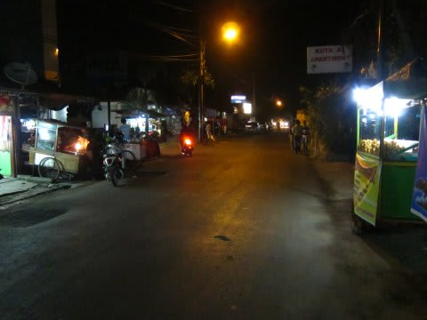

(夜にはあまり出歩きたくない感じのホテル前)

クタビーチまでも遠いし…

感じとしては，プールも広くきれいな，いつものRisataの方がいいなぁ．

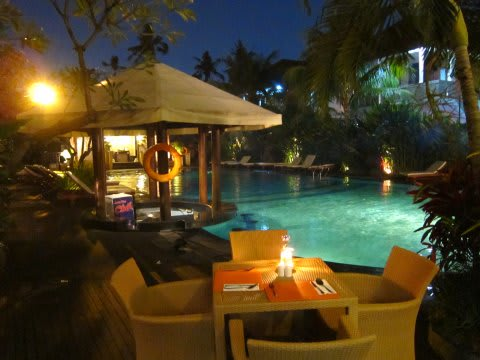

（一見きれいだけど，ちょっと狭いプール)

まぁ，無線LANも使えるし，部屋も広いし，夜到着して

明日の朝5時過ぎの出発まで過ごすだけだから

これでいいんですけどね～

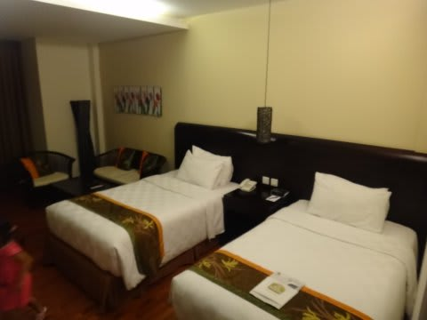

ホテルのそばで夕食食べて，ビール飲んで…

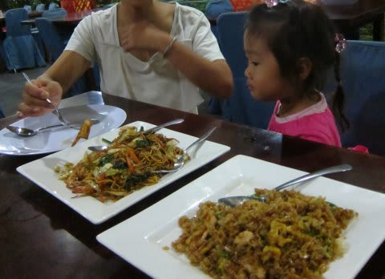

とりあえず，明日朝5時15分ピックアップとむちゃくちゃ早いので．

おやすみなさい～．
