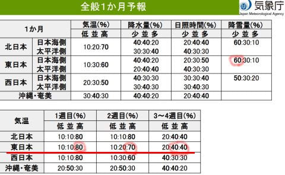

# これから2月中旬までの1か月予報が気象庁から出たよ！…これから1月いっぱいは高温になるけど，志賀高原はスキー場の雪が解けるほどではなさそう

📅 投稿日時: 2025-01-17 02:43:41

🏷️ カテゴリ: [スキー天気予想](c6554f5c3c106093b511a8daae23757e8.md)

えー．

本日木曜の焼額山ですが．

どうやら朝までに30cmくらい積もって，

朝は圧雪コースは圧雪の上にうっすら

雪が積もっていて，オリンピックコースは

新雪30cmだったようで．

（[焼額山スキー場ライブカメラ](https://www.princehotels.co.jp/ski/shiga/livecamera/)より）

そして，朝までは雪が残ったけど，

午前中に晴れて，それ以降はすっきり

晴天が続いたみたいで…

積雪20cmの予想が30cmになったものの，

予想がほぼぴったりの天気だったようです…！

（[焼額山スキー場ライブカメラ](https://www.princehotels.co.jp/ski/shiga/livecamera/)より）

ってなことで．

深夜2時現在，志賀高原は雪が降っている

ようで…

これは明日，金曜一日降り続けますよ！

明日は昼頃まで結構積もって，

昨日の予想通り，午後からは天気が回復に

向かいます…

明後日の土曜は朝は雲が多そうだけど

晴れて，積雪の後の晴天のスキー日和に

なりそうです…！

…ということで，本題へ．

昨日，水曜深夜恒例の志賀高原の

天気予想をしたということは．

そうです．その翌日の木曜は，気象庁の

1か月予報の発表日です～！！

なので，1か月予報を見てみるわけですが…

…

…

…なんじゃこりゃ（涙）

1週目，2週目ともに，気温が高くなる

確率が80％，70％とかなり高くて．

3-4週目も平年並みか高くなる確率が40％って…

冷える要素がないですね（泣）

そして，積雪が少ない可能性も60％とは…（涙）

とりあえず，簡単に内容を見てみると…

1週目の1/18～1/24の期間の850hPa気温は，

水色の平年比+3℃の線が志賀にかかってます（泣）

これはかなり気温が上がりそう…

でも，0℃線は志賀より南にあるから，

1月であれば，気温が平年比+3℃くらい

上がっても，雪がドロドロになるという

ほど高温ってわけじゃないのが救い．

そして，2週目の1/25～1/31の850hPa気温は…

うーん．

こちらも平年比+3℃の水色線と，

+2℃の線の間に志賀高原があるから…

だいたい平年比+2.5℃くらいか…

まぁ，1週目とほぼ変わらないレベル

だけど，やはり冷える1月なので，

それだけ気温が上がっても，0℃線は

太平洋側まで下がってくれてて，

そんな致命的にはならなさそう…

続いて3-4週目の2/1～2/14，2月前半の

850hPa気温ですが．

この時期は平年比±0℃の線と，

-1℃の水色線に囲まれているので，

まぁ平年比+0.5℃程度なのかな…

でも，図面の右に，「モデルよりも…

低温側にシフトして考える」

と書かれていて．

また，「このコンピューター予想よりは

冷える！」という気象庁の職人さんの読みが

あるようです…

だとすると，だいたい平年並みでしょうか．

ということで．

これから1月いっぱいは平年比+3℃から2℃，

2月に入ると平年並みに戻っていきそうという

予想だった，この1か月予報．

まぁ，1月なら平年比+3℃と気温が上がっても，

志賀高原では致命的に雪が解けるほど

気温が上がらないだろうし．

むしろ降るのが風で飛ばされる冷えすぎた

雪よではなく，しっかり積もってくれる雪に

なるぶん，むしろいいかも…

ということで．

これまでの冷え冷え祭りは一旦終わりそうですが，

2月にはまた平年並みに戻ってくれそうで，

致命的な暖かさが続くということはなさそうな

予報に，ちょっとほっとしたSkier_Sだったの

でした…

## 💬 コメント一覧

### 💬 コメント by (ふく)
**タイトル**: 大雪
**投稿日**: 2025-01-17 07:02:49

日本海側で大雪になり、志賀高原はあまり降らない年が多くなった気がします。

原因をネットで調べてみたのですが、よくわかりませんでした。地球温暖化と関係あるのでしょうか？

Skier_S//さんに聞くのは、お門違いかもしれませんが詳しそうなので、もしご存じなら教えてください。

### 💬 コメント by (サザビーワン)
**タイトル**: やっと繋がった
**投稿日**: 2025-01-17 08:52:50

いつも楽しく拝見させて頂いております。

gooblog携帯からは見れましたけど、パソコンからは入る事ができませんでしたが、

今日の朝やっとパソコンからも見れるようになりました。やっと朝のルーティンが戻りましたよ。

これからも宜しくお願い致します。

### 💬 コメント by (レインボー77)
**タイトル**: Unknown
**投稿日**: 2025-01-17 13:08:28

金曜日の志賀高原情報

湯田中は久々のさらさら雪が数センチ。朝の蓮池-9℃。強風でニゴンは減速運転。

白樺は新雪10~20。あまりにさらっさらで、風で雪が飛ばされて吹きだまりが多い。気持ち良すぎてなんか幸せ！

唐松は20~30で超快適。パノラマの壁が新雪30でマイベスト。勘違いしてしまう環境です。ずっと勘違いしていたいけど、明日になれば勘違いに気づきそうで怖い。そして最後はイースト老人保養所へ。

リフトやゴンドラで会う人が皆、雪が良すぎて興奮している感じ。流石のさすがの志賀高原でした。

### 💬 コメント by (Skier_S)
**タイトル**: 今週末も志賀高原！
**投稿日**: 2025-01-18 00:48:21

＞ふくさま

そうですねぇ…志賀の積雪量は減ってる気がします…

海沿いで，降るときにドサドサ降るんですよね．

冷える時とそうじゃない時の差が極端になったからというのがその現象の元なのですが，

寒暖が極端になるのも温暖化の傾向のようです…

＞サザビーワンさま

あら…パソコンで見れなかったんですか！

自分はPCで読み書きできていたのですが…

愛読ありがとうございます～！これからも読み続けていただけると嬉しいです！

＞レインボー77さま

今日の雪は冷え冷えだったので良かったみたいですね～！

明日から晴れますよ～！！！

