# 気象庁発表の全般季節予報を読み解いてみる…この冬はそこそこ冷えて雪が降ってくれそうな感じ

📅 投稿日時: 2021-09-27 01:49:43

🏷️ カテゴリ: [スキー天気予想](c6554f5c3c106093b511a8daae23757e8.md)

えー．

先日，[気象庁の10月～12月の3か月長期予報](e23a77b323b4f8be18ffd481bfab097e5.md)を

解説したばかりですが．

今度は，12月～2月までの，

冬の全般季節予報

が出ました～！

これは，この冬がどのような気候になるかを

予想したコンピュータの計算結果と，

その結果を簡潔にまとめた資料が出てくる

わけですが…

まぁ，予報の資料を全て細かく読まなくても，

結果を簡潔にまとめた，[FCCX94](https://www.sunny-spot.net/chart/FCXX94.pdf)の1枚目だけ

見ておけばなんとかなります…

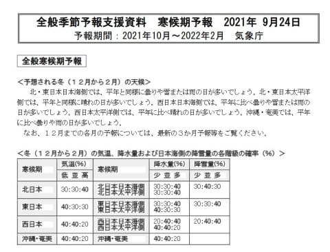

この資料で一番肝心な表の部分をじっくり

見てみると…

この冬は，

東日本では平年より冷える確率40％，

そして，

東日本の日本海側では平年より雪が多い確率40％

ということで．

平年より冷えて，雪が多い冬になる

可能性が高い

冬になりそうです…！

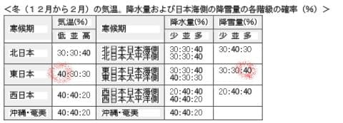

以上．

今シーズンは冷えるという予想でした～！！！

…

…

…で，終わらない．

これだけで終わらない．

天気図の詳細解説を売りにしているこのBlog．

もっとくわしく，全般季節予報の資料を

読み込むのだ…！！←これ以上細かい内容，気にする人いないって…

ということで．

FCCX94は，2ページ目以降も

こんなに長く続くので．

こいつを読み解いていきます…←マニアックすぎるから．誰もついてこないから

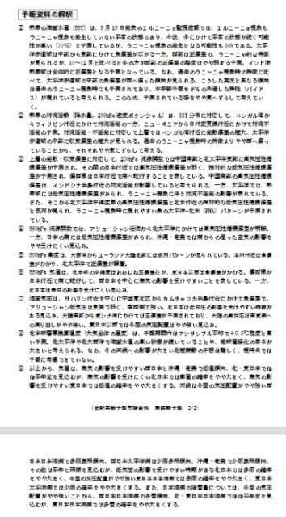

まず．

この資料の③段落目．

赤線部分を見ると…200hpa流線関数では

中国南部と北太平洋東部に高圧性

循環偏差…と書かれています．

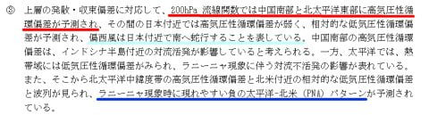

なので．

この200hpa流線関数とやらを見てみましょう．

こいつが載っているのは，[QXVL60](https://www.sunny-spot.net/chart/QLVX60.pdf)という資料です．

この図は，北半球で言えば白抜き部分が

右回り渦の高圧性循環，網掛け部分が

左回り渦の低気圧性循環が平年より

強くなる予想を示します．

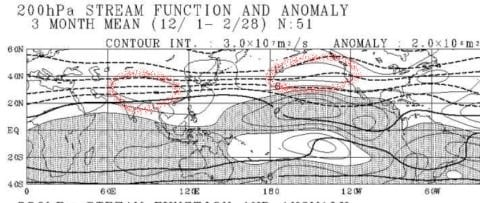

2か所，赤く丸で印をつけていますが．

この2か所の中国とカナダ西部が，

特に白抜きの右回りの高圧性循環が

強くなっている部分です．

そのため…

この右回りの渦に引っ張られて，

日本付近では，風向きが水色矢印の

ように南に垂れ下がる形になります．

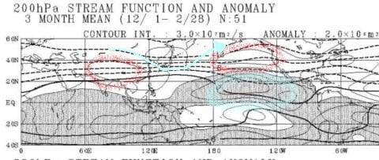

これが，この③段落にの水色下線部，

「偏西風は日本付近で南へ蛇行する

　ことを記している」

という意味です．

右回り渦が強いところに挟まれちゃった

日本付近では，風が南に垂れ下がるので，

偏西風は南へ蛇行して，冷たい空気が

日本付近で南に下がります…

そして，この図では，カナダ西側部分，

赤丸部分が強い高圧性循環ですが．

それに比べると，水色の丸で示した

北米大陸では，日本付近と同様に，

高圧性循環の白抜きに覆われているものの，

赤丸の部分と比べると，ちょっと

高圧性循環が弱まっています…

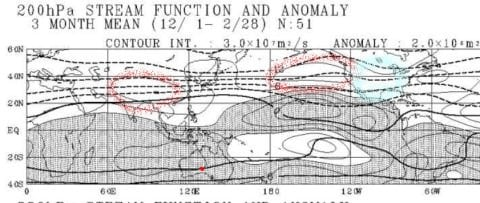

…これが，③段落の一番最後，濃い青線で

示した，「ラニーニャ現象時に現れやすい

負の太平洋-北米パターン」です．

ってなことで．

どうやらこの冬も，ラニーニャっぽい状態に

なる予想が現れています…！

うーむ．

ラニーニャだった昨年は一応，1，2月は

冷えてくれたから．

来年も1，2月は冷えるのかな…？

(1，2月はいいから3，4月に冷えてほしい…（本音))

そして．

さらに読み込みを進めると．←もう誰もついてきてないのでは…？

⑤段落の赤線部分．

「500hpa高度線，本州付近には負偏差がかかり…」

と書かれています．

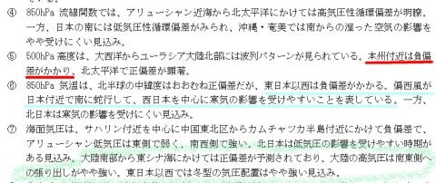

この500hpa図も，QXVL60に載ってるので

見てみると．

なるほど…赤丸で示すように，日本は

見事に網掛けの負偏差にすっぽり

覆われてますね！

この負偏差も，日本付近で矢印のように

風向きが南に垂れ下がることを

意味してます．

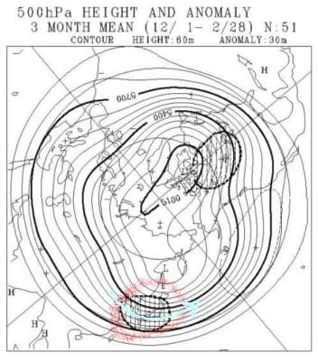

ふむ．日本はやはり，寒気の影響を

受けやすそうですね…

で．

次は⑥段落の水色の下線部を見てみると…

850hpaの気温でも，日本は負偏差になって

いると書いてあるので．

こいつもQXVL60の850hpa気温図を

見てみると．

…西日本はすっぽりと網掛けの負偏差

部分に覆われてます！

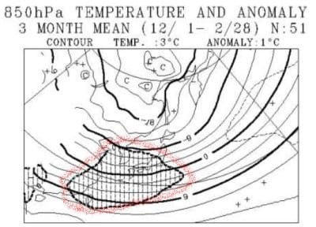

この網掛け部分は…

1500m付近の気温が平年より冷える

と言ってます．

今年は山は冷えてくれそう…！

…でも，負偏差部分，もう少し東日本に

かかってほしかった…

そして，最後に⑦段落の，緑で囲った部分．

海面気圧ですが．

「大陸南部から東シナ海に…東日本以西では冬型の

　気圧配置はやや強い見込み」

と書かれています．

こいつがどういうことか，これもQXVL60の

海面気圧を見てみると…

赤矢印で記した部分，平年より気圧が

高くなっており．

そのため，普段なら等圧線が水色の線の

ように斜めに傾いた形になるところ，

赤線のように等圧線が立った形になってます！

等圧線が立っている＝冬型が強い

ですので．

この冬は，西日本は冬型の影響をより

強く受けそうな感じです…！

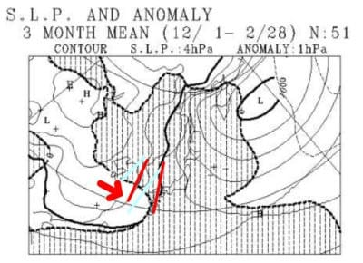

うむ．

惜しい…

東日本も冬型の影響が強くなってくれると

いいんだけど．

でも，東日本にかかる等圧線もしっかり立ち

気味なので．

東日本もちゃんと冬型になってくれて．

異常気象で冬型が続かない…

ってことはなさそうな感じ．

ってなことで．

長々と書いてきましたが．

⑧段落に書かれている要員．

この冬は，西日本は普段より冬の

冷え込み＆日本海側の降雪は多そうで．

東日本も例年並みよりちょっと冷え込み，

雪が多めの冬になりそう…

ってことでしょうか．

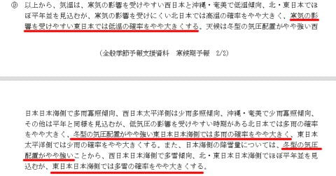

まぁ，昨シーズンも1，2月の志賀高原は，

冷えて雪がここ数年に比べて多かった

ようなので．

（私が行ってない時に冷えていい雪だったらしい…(涙））

来シーズンも，1，2月は冷えて雪が

多い感じかな～．

とりあえず．

気象庁の全般季節予報を見て．

まぁまぁ冷えそうな冬になりそう，

ということよりも．

この冬は，異常な暖冬になる可能性は低そう

ということに，

一安心のSkier_Sだったのでした…

そして，今日の記事を最後までまともに

読む人もほとんどいない…

とも，予想しておこう．

## 💬 コメント一覧

### 💬 コメント by (ozuriski)
**タイトル**: 天気図解説のファンですｖ
**投稿日**: 2021-09-29 21:26:31

3か月予報と違って、天気図や資料解説には皆ノーコメントなんですね…。これこそ他にはない独自コンテンツなのに。

この資料の読み込みまではしてませんが、3か月予報の時のQXVX41を初めてじっくり眺めてみたところ、「50：0：50」みたいなのもあってなかなか面白かったです。「平年並みでないのは確かだが、多くなるか少なくなるかは五分五分」って。

計算上はそうでも、他のもろもろのデータとつきあわせた結果、30と40だらけの可もなく不可もない予報になるわけですが。

寒候期予報などまるで当てにならないと知りつつ、高温少雪の確率が40％でもガッカリするし、逆に低温多雪の確率が40％なら嬉しくなるもので、とにかくせめて平年並みであれと願うばかりです。

### 💬 コメント by (Skier_S)
**タイトル**: ＞ozuriskiさま
**投稿日**: 2021-09-30 03:08:54

このマニアックなネタを，このBlog独自コンテンツと評価して

くださるとは…

いや！

お目が高い！！

…今回のネタは，さすがについてくる人はいないと思っていたのですが…

読んでくれる人がいらっしゃるのは嬉しい限り．

で，QXVX41ですが．

これは人為的に調整が入ったものなので，その元ネタとなるQXVX50と

見比べてみると，

「予報官がこれだけ解釈を入れて調整するんだ…」

と，なかなか面白いですよね．

### 💬 コメント by (ozuriski)
**タイトル**: 数字好きです
**投稿日**: 2021-09-30 20:43:51

QLVX61では、北陸より東では降雪量は「少」の確率が43～51％で最も高い。でもFCXX94になると「少」は30％。「冬の天候への影響が大きい北極振動の予想は難しく、現時点では予報に考慮できていない」が不安要因ですね。

QXVX50でも、12月の日本海側の降水量は、北陸・東日本・北日本・北海道に西日本までも「少」が37～45％で最も高いけど、FCXX93では「多」が40％。

「全般季節予報資料」を基に、さらに各気象事業者がデータや解釈を加えて予報を出すようですが、長期予報に関しては独自予報はまずないのかな？

基本的に冬型が強いらしいので（本当にそのとおりならば）一安心。西は寒くて北に行くほど寒気の影響を受けにくいみたいだけど、北は平年並みなら十分。

雪が多いか少ないかの確率も気になるけど、大事なのはその程度。「平年より少ない」でも、「平年の範囲からギリ少ない」のか一昨シーズンのように記録的・壊滅的に少ないのか。

シーズントータルでは平年並みでも、まずは12月上旬、そして3月下旬以降にも強い寒気がきてくれれば…。

### 💬 コメント by (Skier_S)
**タイトル**: ＞ozuriskiさま
**投稿日**: 2021-10-02 05:53:51

回答遅くなってすみません（謝）．

そうなんですよ…いろんな予報資料を突き合わせて読み解いていくと面白いですよね．

「数値予想がこうなったら，実態はこっちにずれることが多いのでこう予想する」

みたいなことが書いてあったりすると，

「完全な数値予想に見えるけど，実際は人間の経験則で補正された

『ベテランの技』の世界なんだなぁ…」

って思って，人間らしさ（？）をすごく感じますよね．

そして，私も全く同じく，12月上旬と3月下旬以降に冷えてほしいです…

4月がキンキンに冷えて，GWまでしっかり雪がもってくれると最高！

4月がキンキンに冷えると，志賀高原だと4月でも

かなりいい雪質で滑れるので…

しかし，天気図をここまで読み込むスキーヤーの方はあまりお会いしたことが無く，

ちょっと感動しています．

