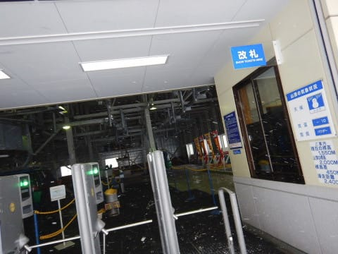
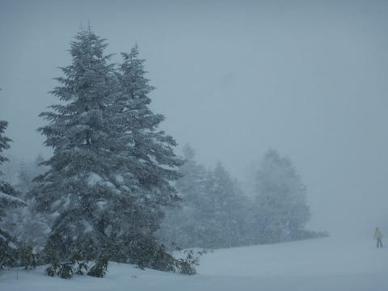
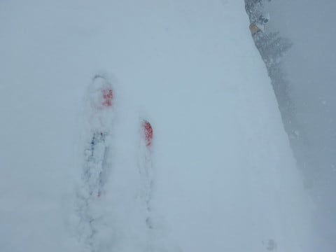

# 12月17日（日）の志賀高原，詳細レポート…もう1月トップシーズン？ってくらいの降り方，冷え方，雪の量．それでガラガラなんだから…

📅 投稿日時: 2017-12-19 06:17:16

ということで．

昨日速報レポートした，日曜の志賀高原．

詳細レポートです…

土曜の夜に降り始めた雪は，

日曜一晩降り続けたけど．

朝になってから本格的に積もり始めたようで．

うーん．積雪20cmってところか…

とりあえず．

天気は吹雪気味だけど（涙）

パウダーってことだし．

ブーツパフは楽しめそうかな！

ちなみに，焼額は，あとはSGSコースと，

運転開始していない第3高速沿いのコースを

除けば，ほぼ全面オープン！

12月3週としては，素晴らしい状況！

ただ，日曜のこの日．

風が強くて，奥志賀は全面運休だったようで…

だもんで，焼額のゴンドラに人が集中するかな？

と心配したけど．

幸い，第1ゴンドラは朝イチからガラガラ！

あ，この日は北風だったので，北風に強い

焼額のゴンドラ＆リフトは，強風の影響は全く無く，

減速はしませんでしたよ～．

って感じで．

山頂に出てみると…

うひゃーー！

気温は-12℃！

　朝の山頂は-10℃以下．激冷え．

と予想したけど．

いやーー．

これはホントに真冬の冷え込みですな…

そして．

…降ってます．

シンシンと雪が降り続け．

…寒いです．

真冬です．

激さむです．

その代り，雪質はいいのだ！

これで新雪がつもっているので…

今日もこいつが出動だ！

いざいかん！

非圧雪のオリンピックコースへ…

…って，オリンピックコースへ向かう

圧雪バーンでも，もう新雪5cm．

そして，オリンピックコースへやってくると…

うほう！！

ひざパフ！！

ゲレンデ麓だと20cmの積雪だったけど…

オリンピックコースは積雪40cm！

うほーーー！

パフパフだーーーっ！！

かなり軽めのパフパフだ―！！

と，喜んで飛び込むと…

すごい軽めのパフパフなので．

太板でも積雪40cmの下地に底付きして．

…で，その下地が．

昨日のクラスト気味新雪が荒れて凸凹になったやつが

そのままカリカリに固まったみたいな，

カリカリコブ斜面．

「カリカリコブ斜面の表面が全く見えないように，

新雪で隠しました～！」

というような，かなりのトラップ（涙）．

滑れなくはない…

パウダーの雪煙を上げて気持ちいいんだけど．

でも，その下地はカリカリの凸凹という，

「滑れるもんなら滑ってみな」

って感じの，チャレンジバーンで．

太板だと，幅広エッジがカリカリに引っかかって，

難しい…（涙）．

だもんで．

残念ながら，太板はすぐにご引退いただき．

SXに履き替えて，GSコースへ！

GSコースも，新雪が10cmほど乗っていて．

とても圧雪コースに見えない感じ…

時折，指導員研修会の団体さんにぶつかると，

ちょっとコース上に人が多くなっちゃうけど…

団体さんにぶつからなければ，ガラガラ！！

ゴンドラも飛び乗りで，待ちは全く無し！

…でも．

時折強く降る雪で視界は悪め（泣）．

そして，昼近くになると．

パウダーが蹴散らされて，GSコースのコンディションが

ちょいと悪めになってきたので…

再び，オリンピックコースを攻める！

それも，SXで攻める！

…下地が難しいコンディションでも．

我が信頼のSXを履いていれば，行けるのだ！

…ということで．

昼過ぎなのに．

オリンピックコースは滑る人が少ないので．

まだパフパフ！

午後になっても，新雪パフパフ！

…下地は固いけど（ちょい涙）

でも，難しめのバーンだけど．

昼間も-10℃程度の上に乗ってる雪はトップシーズン並みに軽いし．

午後3時近くになっても，膝パフ！

難しいけど，意外と楽しい～！←だから，あなたはどんなコンディションでも雪さえあれば楽しいんでしょ

午後3時ごろ，一瞬うっすら日が射すタイミングで

斜面を見てみると…

営業終了1時間前と思えない，まだまだ食べ残された

パウダーが残っているのが分かるかと…

…かなり難し目のコンディションだったので，

滑ってる人はほとんどおらず．

この写真にも，他に人が写ってません…

ってな感じで．

夕方近くまでオリンピックコースのパフパフを

腹いっぱいいただき．

その後，1ゴン側のGSコースやら2ゴン側の

パノラマ-サウスコースへ行ってみたけど．

GSコースは新雪が踏み固められ，

ちょいと疲れる凸凹バーン．

（この写真だと，フラットバーンに見えるけど…）

むしろ，2ゴン側，パノラマ-サウスが

フラットで楽しめたかな～

（逆にこっちの写真が凸凹に見えるなぁ…）

一日中，時折強く降り続いた雪も．

夕方のリフトストップごろには弱まり．

夕方は，コースがきれいに見えて．

そして…コースは貸し切り！！！

誰もいないよ！

いやーーー．

夕方の完全貸し切りパノラマ-サウスコースも

かなり面白かったかな～！！

という感じで．

天気が悪いながらも，軽めのパフパフを一日楽しめ．

ガラガラのコースを満喫できて．

今日も一日楽しめたな！

…って感じで．

今日もリフトストップまで滑り続けたのでした…

しかし．

コースコンディションは完全に1月のトップシーズン並み．

冷え込みもトップシーズン並みだし．

それでいて，混雑は12月らしい，ガラガラとくれば．

このまま1月にならず，人が増えないでいてくれると

いいな～…

などという．

ありえない願いを持ってしまうほど．

この12月，恵まれている…

と思わずにいられない，Skier_Sなのでした．

## 💬 コメント一覧

### 💬 コメント by (タカ)
**タイトル**: 早くも本番ですね
**投稿日**: 2017-12-20 00:50:58

もう太板登板ですか。オリンピックコースはもう少し積雪ほしいですね。でももうGSコースなんかは完璧ですね。SXきたら攻めまくります。太板はかぐら５ロマで使いましょ。もしくは八方の裏黒で

### 💬 コメント by (Skier_S)
**タイトル**: タカさま
**投稿日**: 2017-12-20 01:45:16

今シーズンは積雪が多いので…

まさか12月中旬で太板が出動するとは

思いませんでした．

焼額は，GSコースもオリンピックコースも

もう完璧です．

かぐら5ロマにも白馬にも行かない私は，

オリンピックコースを太板で攻めまくります！

