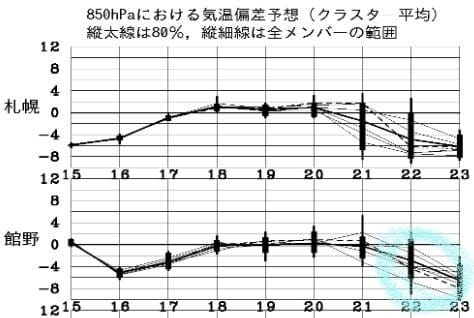
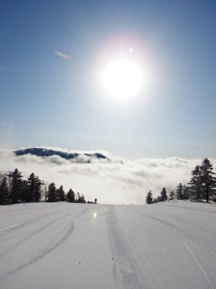

# 緊急事態宣言，全国に拡大！？？そして，かぐら4/19で終了(泣)GW後のスキー再開に期待したのに…(涙)．志賀中央エリアも19日で終了．おそらく焼額も…

📅 投稿日時: 2020-04-17 00:56:07

えー．

このBlog．

最近は，Skier_Sのスキー場レポートが全くなく．

志賀高原特派員に乗っ取られつつありますが…

今日も特派員レポートです！

まず．

あさイチは曇りスタートだった焼額．

…晴れ予想だったところ，ちょっと

外した…（涙）

放射冷却が入らなかったので，

予想の-2℃に対して

あさイチの気温は-0.5℃とちょい高め（泣）

でも，朝イチの雪質は予想通りの，

超ガリガリのハイスピードバーン！！

…あさイチこそ曇り空だったものの，

私の晴れの予想に従うように←だから，あなたが志賀高原の天気決めてるんじゃないから

8時半には青空が顔を出し始めた

ようです！

で．

昼間の最高気温は+3℃と，これも大体

予想通りの気温で．

この時期にしてはそれほど気温も高くなく，

朝10時過ぎには雪がしっとり重くなって

きたものの．

ザブザブにはならず，重めの緩んだ雪に

なった程度で済んだみたいです…

あさイチが曇り空ってところ以外は．

ふぅ．

今日も予想を当てちまったみたいだぜ…←いや，朝の予想気温も1.5℃外してるから

ってないつも通りのライトな話題の後に，

重い話題です…

皆さんご存知のように，

緊急事態宣言，全都道府県に拡大したわけですが…

…このような状況を受けて，

野沢温泉は明日で終了です…！！（涙）

（[野沢温泉スキー場Facebook](https://www.facebook.com/nozawaonsen.snowresort/posts/2764376477006254?__tn__=-R)より）

そして，志賀高原中央エリアは，今週末19日(日)で営業終了(泣）

([志賀高原中央エリアホームページ](http://shigakogen.co.jp/archives/6093)より）

さらに，かぐらスキー場も今週末での

営業終了を決めたようです…（涙）

（[かぐらスキー場Facebook](https://www.facebook.com/snowkagura/posts/2703054186488551)より）

あぁ…かぐらスキー場…

緊急事態宣言が解除になったら，

再開してくれることを期待してましたが，

そんなに甘くは無かったようです…（泣）

…緊急事態宣言期間のGW後，無事解除になって

滑りに行くことを楽しみに生きていたのに，

そのかすかな希望が打ち砕かれました（激涙）

（GW後に解除になる可能性は限りなく低いとは思ってましたが）

で．

まだ確認したわけではないのですが．

どうやら志賀高原は焼額もGW前の早期に

営業を切り上げそうで．

生き残っている他のスキー場も，

全国緊急事態宣言を受けて，

営業休止になっていきそうです…（とめどない涙）

おそらく日本の残されたスキー場，

本州だと，

安比

月山

蔵王

天元台

夏油

丸沼

鹿沢

志賀　熊の湯，横手，奥志賀

おんたけ２２４０　（今週で終了予定）

これくらいですか．

これらのほとんどが今週末までに

終わると思うのですが…

…まぁ．

自分がスキーに行けなくなっている今となっては，

営業休止自体はそれほどショックでは

ないんですけど．

5月のかぐらが無くなったのが痛い．

6月に月山に滑りに行けるのか，

…あるいは私の2020シーズンはもう

終わっているのか…

私が毎シーズン欠かさず執り行っている，

怪我なくシーズンが過ごせたことを感謝し，

雪にお別れを告げる

「シーズン終了の儀式」

をやっていないので．

このまま終わるわけにはいかんのだ…

可能性は低いけど，今シーズンもう一回

雪面に立ちたいなぁ…

ただ．

なぜかこういう状況になって．

また来週22，23日あたり，すごい

冷え込みそうなんですよね～…

23日なんて，平年比-6℃まで冷えます！

そして，この2日間．

水色で囲った5400m高度線のカットオフローが

本州にやってきますが…

これって，真冬の空気です．

右の図の赤い0℃線も，志賀高原より

南まで下がってます！

おそらく23日は，また冷えて雪が降る，

冷え冷え積雪デーになりそうなので．

この4月，やっぱり奇跡の4月

なんじゃないかな～…？？？

…この状況となった今では，

もう虚しいばかりの積雪ですが，

せめて，月山が7月まで滑れることを祈り．

月山が滑れるうちに，緊急事態宣言が

解除になることを祈って．

今は，しばらく長距離移動は慎みましょう…

…で．

これだけで終わるとちょっと寂しいので．

スキー場がちゃんと来シーズン復活するように

願いを込めて，

私が今シーズン＆昨シーズンに撮った写真を

載せておきます…

スキー場に光を！

　

　

　

　

　

　

　

　

## 💬 コメント一覧

### 💬 コメント by (しんちゃん)
**タイトル**: 希望の光を
**投稿日**: 2020-04-17 01:23:05

こんな素晴らしい瞬間をいつの間にとらえていたのでしょう。ヤケビの美しい刹那をありがとうございます。

あまりにもさみしいシーズン終了。このブログにある美しい写真でそんな気持ちをほぐしています。

写真にあるような希望の光が、世の中全体に降り注ぎ、明るい未来が平凡な日常が再び訪れることを祈ります。

### 💬 コメント by (麗美)
**タイトル**: Unknown
**投稿日**: 2020-04-17 09:13:00

辛いですよね。自分もスキーが趣味で例年11月〜5月まで年末年始と毎週末はゲレンデで過ごしています。しかし首都圏に緊急事態宣言が出されている現在は滑りに行けません。たとえ仕事に折り合いがついたとしても一国民として、首都圏に居住する一市民として、そして社会人として絶対に行ってはいけないと考え自重ています。しかし世の中には身勝手な不心得者もいて、不要不急な外出を控えるどころか「自分の趣味のためなら他人の命など知らん」と言わんばかりに、こんな状況下でもいまだに毎週末首都圏から他県へスキーに出かけています。週末まで営業を続けるとこうした身勝手な馬鹿タレが大挙して押しかける可能性があるのでスキー場には本日で営業を終了する英断をお願いします。

### 💬 コメント by (ゆーき)
**タイトル**: Unknown
**投稿日**: 2020-04-17 16:44:14

スキー自体、まったく三密ではないし、たしかにかぐらのロープウェイは、いかんですが、なんでかな、、、って、思っちゃいますね。レストランなし、行き帰りもどこにも寄らないなんて、現実的ではないからかまされませんが。

非常事態宣言も県単位だし、クソ大雑把だし、もっと滑りたかったなぁ、、、と、ボヤきます。

### 💬 コメント by (地元民(ほぼ麓))
**タイトル**: Unknown
**投稿日**: 2020-04-17 19:30:44

３月末から低温傾向。桜、早くに開花したのに、今日あたり、やっと満開かな？って感じです。開花から満開まで10日以上かかってる。

早いときは2～3日で満開になりますよね？

### 💬 コメント by (yumi)
**タイトル**: Unknown
**投稿日**: 2020-04-17 20:01:42

Ｓさぁ～ん🌞🌈❄️

むっちゃいい お写真📸ですね☺️

その✨タイトルで✨写真集が出来ますﾖ✌️

あと・・・⛷️

儀式が出来ますよう・・・✨💖✨

### 💬 コメント by (Skier_S)
**タイトル**: 来週以降残るのは，奥志賀・丸沼・鹿沢くらいか…
**投稿日**: 2020-04-18 04:39:41

＞しんちゃんさま

こういう写真，結構滑ってる途中で撮ってます…

特に朝日・夕日で光線の具合が面白い時は，かなりの枚数を撮ってるんですが，

なかなか見せる機会が無いので…

今回まとめて載せてみました．

＞麗美さま

毎週末スキーですか！

私と一緒ですね（笑）．

スキーに行けないのはお互い辛いと思いますが，

この時期なので耐えましょう…

早く事態が落ち着いて，また安心してスキーに行けるようになることを祈るばかりです．

＞ゆーきさま

私も普段から，「何があるか分からないので，行ける時に無理してでもスキーに行ってるんだ！！」

と言って，普段からかなり無理してスキーに行ってましたが．

ホントに何かがあって，スキーに行けなくなるとどっちにしろ苦しいことが

分かりました（涙）

私ももっと滑りたいですが，今はグッと我慢の時ですね（泣）

＞地元民（ほぼ麓）さま

え？今になって満開ですか！

例年より咲き始めは早かったようですが，満開は

例年と同じくらいの時期になったんですかね…

今年は桜が長く楽しめそうですね…！

＞yumiさま

おほめいただきありがとうございます～！

私の秘蔵写真の，光が面白かったシリーズです．

とりあえず，スキーやらないと死んじゃう病起因の

葬式じゃなく儀式ができるよう，今となっては祈るだけです…

### 💬 コメント by (Unknown)
**タイトル**: Unknown
**投稿日**: 2020-04-18 21:27:23

素晴らしいお写真に心洗われました  感謝感謝

### 💬 コメント by (Skier_S)
**タイトル**: ＞Unknownさま
**投稿日**: 2020-04-19 04:11:02

写真気に入っていただけたなら良かったです～！！

