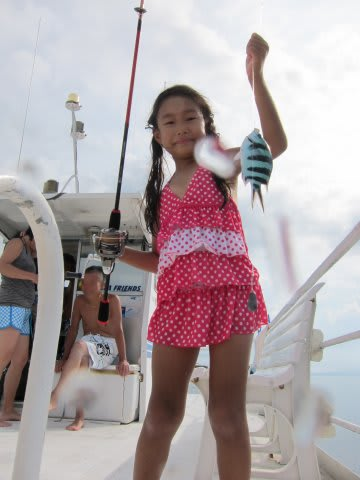

# 2014年9月　3連休，子連れ石垣ダイビング　その5

📅 投稿日時: 2014-11-14 00:53:55

🏷️ カテゴリ: [ダイビング日記](ce3a7a8d424d112fce83ee85c81a0e344.md)

ふーむ．

昨日の予想通り．

今日はそこそこ冷え込んだものの．

やはり，天然雪は降らず…（ちょっと悲しい）．

でも，[かぐらのウェブ](http://blog.princehotels.co.jp/ski/kagura/031457.php)なんかを見ると…

予想通り，人工降雪機はがんがん稼働開始している

みたいですね！

明日，明後日と引き続き冷えるので．

3連休までに，何とかなるのか…

18，19日の冷え込みが，ぐぐぐぐっと

強烈なものになってくれるように．

スキーヤーのみなさん，これから数日間の行いには，

くれぐれも気を付けましょう…

…というところで．

本題の，ダイビング旅行記へ…

---

って感じで．

ちょっと残念な感じのあった午前中のダイビングを終えると，

お昼ご飯タイム！

船の上で，おにぎり＆暖かいスープのお昼ご飯．

フィリピンに行った時の，船でのお弁当に比べると

ちと見劣りする感じだけど…

おにぎりは大きかったし，

暖かい具だくさんスープが，

何杯かおかわりできたので，結構おなか一杯．

で．お昼ご飯を食べたら．

また，釣りをする娘…

お…

今度は，なんか釣り上げたぞ…っ！

これは，ロクセンスズメダイ！？？

…娘なんかに釣られてしまうとは…

でも，釣り上げた娘は満足そうですな．

＃お魚はこのあとすぐにリリース，

＃海にお帰りいただきました…

って感じで．

娘は，釣りをしたりして遊んでいる間に，

いろいろ面倒を見てくれたショップのオーナーにも，

かなり慣れてきた様子で．

…次は，夫婦二人で潜りに行けるかな？？

んで，昼休みの後は…

船はかなりの距離を移動します．

どこまで行くのかな…？

と，思うと．

1時間近くかけて．

川平近辺まで来ましたね～．

周りに船がいっぱいいますよ～．

…これは．

そうです．

石垣島と言えば，このポイントですよね．

ブリーフィングが始まりますが…

はい．

次に潜るのは．

マンタポイント．

川平マンタスクランブルでございます！

…やっぱり，石垣に来たら必ずここは潜るのね…

っていうか．

石垣というと，やはりここが目玉ですよね．

みんな，マンタが見たいから石垣に来るわけですよね．

…私はこれまで，大体毎年どこかでマンタポイントに潜っていたし．

石垣島は，マンタ以外にもサンゴがきれいで，

潜りたいポイント満載な海だったので．

これまでは石垣に来ても

「マンタはいいから，違うポイント潜らせて～っ！！」

って感じだったのですが．

昨年は珍しく，10年ぶりにマンタポイントに潜らない

年だったし．

さらに，石垣島のサンゴがやられてしまって．

きれいなサンゴをあまり見られなくなった今．

やっぱり，ここが最大の見どころだよな～．

ってことで．

いや．

やっぱり．

おととしのモルジブ以来のマンタポイントですから．

やっぱりマンタに再会，したいよね…

…だけど．

本来なら，次は私が娘と留守番で，妻が潜る番．

なんだけど…

だけど…

私「…

　　…娘ー．

　　あのさー…

　　船でオーナーと遊んで，留守番しててくれる？」

娘「いいよ～（あっさり）」

…え？

…いいの？？

…やった～っ！！！

オーナーと仲良くなってくれた娘．

快く両親二人そろって潜りに行くことを許してくれました．

私「オーナー，すいませんけど，娘よろしくおねがいしますっ！！」

ってことで．

夫婦そろって．

マンタスクランブルへ，いざいかん！
