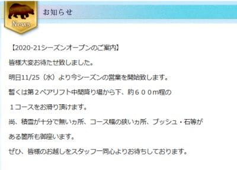
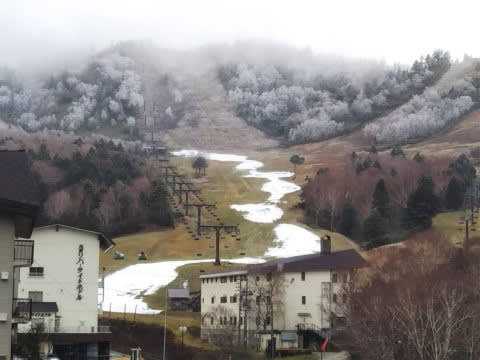
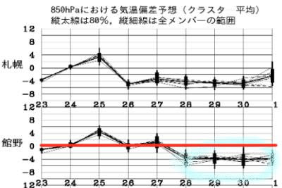

# なんと！25日から志賀高原熊の湯オープン！すごい…！

📅 投稿日時: 2020-11-25 04:48:17

なぜか仕事が切羽詰まっていて，

とんでもない時間に記事を書いている

Skier_Sです．

昨日スキーに行ってるどころじゃなかった気が…（涙）

でも，行ってしまったものはしかたがない．

というか，スキーに行かないと死ぬから，

命には代えられない…

とはいえ，命があっても会社的には

抹殺されかねない，かなりデンジャラスな

状態なので．

本来Yetiの詳細レポートを書く予定だったけど．

今日はちょっと短めの記事で…

ということで．

タイトルにも書きましたが．

なんと．

11月25日に熊の湯がオープンしますっ！！！！

（[熊の湯スキー場ホームページ](https://www.kumanoyu.co.jp/lift/)より)

…21日の特派員からの写真を見ると，

オープンまでまだかなりの積雪量が

必要そうに見えたのに…

(21日の熊の湯・某特派員提供)

熊の湯の降雪機台数を考えると，

ここから2-3日の人工降雪で

オープンさせるのは無理だよな…

25，26日は気温が上がって昼間の

降雪は厳しそうだし．

28，29日の週末も熊の湯オープンは無理

と予想していたのですが…

まさか，ここから23，24日のわずか

2日間の降雪でオープンさせるとは…っ！！

これは，熊の湯スタッフの長年の経験＆技術に，

執念と汗と涙と鼻水とその他いろんな

ものの結晶です…！（感動）←鼻水の結晶は混ざってないでしょ

すいません．熊の湯スタッフの人工降雪の

技術を甘く見てたようです．

予想を外しました…（平謝り）

すごいよ…熊の湯．

ただ，[熊の湯のYoutube](https://www.youtube.com/watch?v=vcEpcdqANH4)をみると，

まだところどころコースは狭く，

リフトをくぐるあたりはかなり雪が

薄いので，普段ならオープン判断は

厳しいレベルな気がする…

オープンを予定より2週間遅らせたくない，

というギリギリの判断と．

もしかすると，

「どうせ25，26日，昼間に気温があがって

　人工降雪打てないなら，滑ってもらおう」

って考えがあったのかも…（勝手な推測．たぶん違うと思う(笑)）

でも…25，26日は人工降雪が打てなさそう

なので，26日や27日のゲレンデ状況は

厳しいんじゃないかな…

早朝に人工降雪が行けて，何とか

なればいいんですけど…

でも．27日になれば，厳しいながらも

標高が高い志賀はギリギリ人工降雪が

打てそうだし．

28日から12月1日までの4日間は

ガッツリ冷えて，人工降雪機が

ガンガン動かせて，ちょっと天然雪も

積もりそうだし．

…29日の日曜はそこそこの状況で滑れるかも…

そして，12月5，6日の週末にも期待…！

ってなことで．

オープン当日の熊の湯がどうだったか．

明日は特派員からのレポートを載せられると

思います…

（このBlog独占契約(?)の某特派員の方々，レポートよろしくお願いします！）

## 💬 コメント一覧

### 💬 コメント by (ミーマ)
**タイトル**: Unknown
**投稿日**: 2020-11-25 10:29:21

愛する志賀情報見ずにはいられません‼️たとえ行かれなくても‼️

### 💬 コメント by (kirito0808)
**タイトル**: Unknown
**投稿日**: 2020-11-25 19:13:50

いつもスキー情報ありがとうございます!

### 💬 コメント by (Skier_S)
**タイトル**: 熊の湯はオープン初日から厳しいゲレンデ
**投稿日**: 2020-11-26 02:36:33

＞ミーマさま

コメントありがとうございます！

これからも志賀高原情報を適宜流していきます…！

＞kirito0808さま

どういたしまして…！

