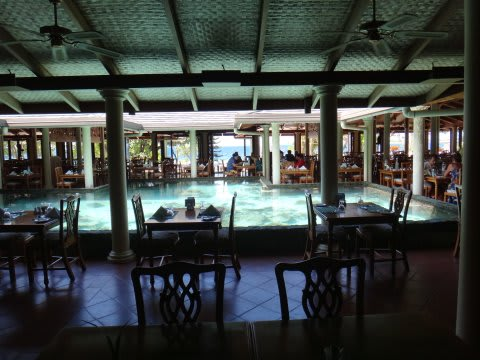

# 2012年　子連れモルジブ　ダイビング旅行記　その21

📅 投稿日時: 2012-11-24 00:07:28

ってことで．

スキーに行ってないので．

今日もダイビングレポートが続きます…

------

というわけで．

最後のダイビングを終えて，船はリゾートへ戻ってきました．

「ただいまー」

ダイビング後に何度も通ったこの桟橋も，これで最後かぁ…

うーん．寂しい…

とりあえず，4日間のダイビングも終わったので，

ダイビングショップの水槽で器材を洗って．

器材を干したりなんだりしていると，あっという間に1時半．

レストランは2時までなので，急いでご飯を食べに行かないと

お昼ご飯を食べそびれちゃうよ…

ということで，いつものレストランへ．

朝はいつもオープン直後で寂しいレストランだけど．

昼は結構人がいますね～．

うーむ．

でも，毎日3食ここだと，そろそろ飽きてきたかも…

で．

昼食の後は…

私「娘ー．（聞くまでも無いと思うけど)何やりたい…？」

娘「プール！プール！」

私＆妻（…やっぱり…）
