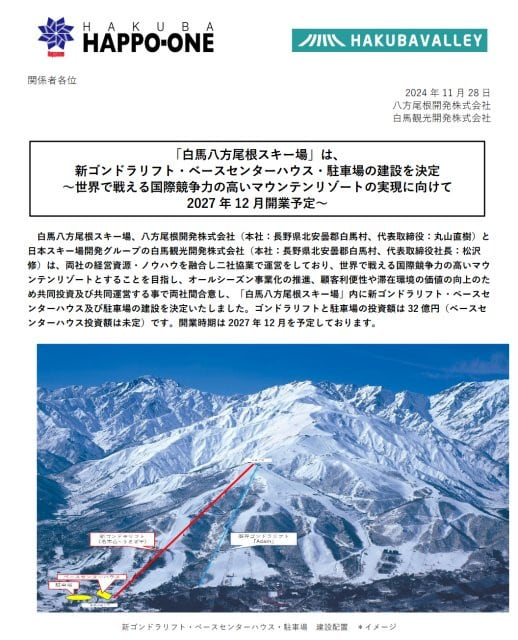
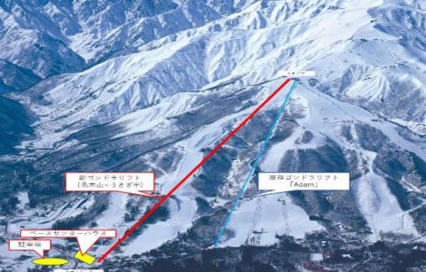
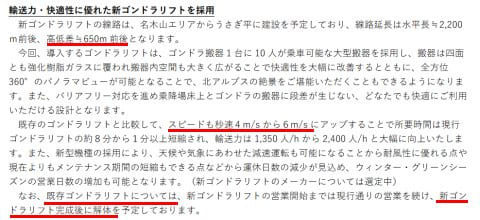
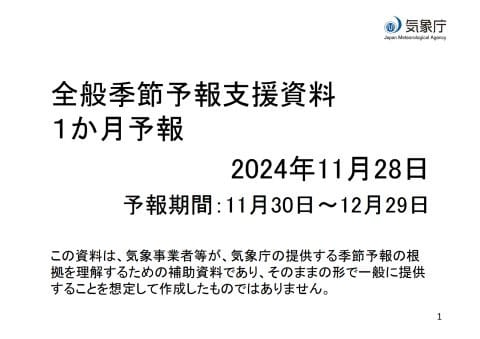
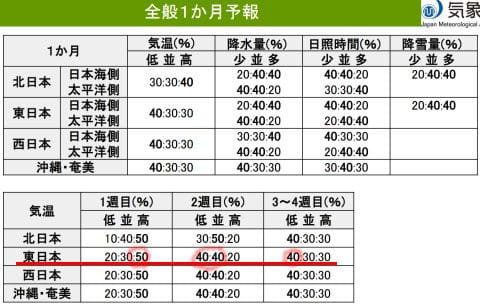
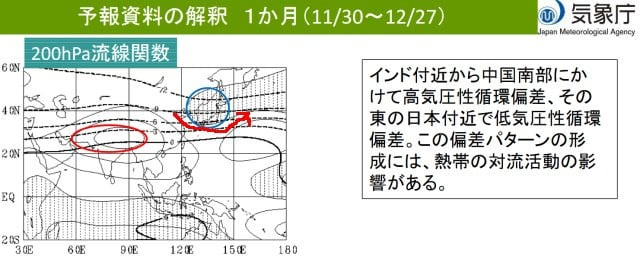
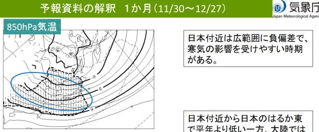
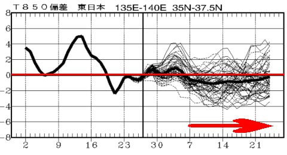
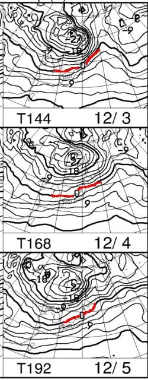

# 白馬八方尾根スキー場ゴンドラ2028シーズン新設！…そして12月の1か月予報は平年並みよりちょっと冷えるよ！

📅 投稿日時: 2024-11-29 05:31:37

🏷️ カテゴリ: [日記](cc4b5682fb7b8b144980957a978653fb0.md)

ということで．

今日…というか，昨日28日の木曜は

冷え込んで，朝の志賀高原ではうっすら

雪も積もったようで．

さらに金・土はそこそこの冷え込みが

続くので，天然雪はそんなに積もらなさ

そうな感じですが，

人工降雪機があるスキー場は，今週末は

何とかなるかな…

と思っているSkier_Sです．

で．

本日，スキー好きの界隈で話題になったのは

これじゃないでしょうか．

そうです．

2027年12月予定の，八方の新ゴンドラリフト

建設決定です！！！

([白馬八方尾根プレスリリース](https://www.happo-one.jp/wp2019/wp-content/uploads/2024/11/%E5%85%AB%E6%96%B9%E5%B0%BE%E6%A0%B9%E6%96%B0%E3%82%B4%E3%83%B3%E3%83%89%E3%83%A9%E5%BB%BA%E8%A8%AD%E3%83%AA%E3%83%AA%E3%83%BC%E3%82%B9-1.pdf)より，以下同じ)

まだ3シーズン先の話ですが，

同時に駐車場とセンターハウスも建設で，

センターハウス別で，総工費32億円ですか…

場所は現ゴンドラの白樺エリアから変わり，

名木山スタートのリーゼンスラローム沿い，

山頂駅は兎平，今とほぼ同じ場所のようです．

今のゴンドラ乗り場，駐車場が少なく

不便でしたが…これで便利になりそう！

詳細を見ると…

ふーむ．標高差650mもあるのか！！

焼額のゴンドラの1.5倍弱ですね…

スピードが6m/sって，これは焼額第1ゴンドラ

と同じスピードですが（焼額はここ10年ほど

常時減速運転で，フルスピードで運転して

ないけど），焼額フル運転だとあのコースを

5分ちょいで登っちゃうので，かなり速いです．

そして．既存ゴンドラは，新ゴンドラが完成

したら解体するようです…

そうか…ゴンドラ2本体制にはならないのか…

とりあえず，これまで何度も話題になって

おきながら，いろんな大人の事情で立ち消えに

なっていた，八方の新ゴンドラ．

ついに現実の計画となって動き始めるよう

です…！

…志賀高原も，何か大きな話題が欲しい…（ボソッ）

ってなことで．

スキー業界がちょっと元気になる話題の後は．

そうです．木曜日と言えば…

気象庁の1か月予報の発表日！

今回の予想期間は11/30から12/29までの，

ほぼ12月1か月の予想です！

果たしてこの12月は冷えるのか？

ダメダメなのか，見てみましょう…

えい！！

ををを～！！！

やったーーー！！

1週目こそ，平年より気温が高めの予想

ですが．

2週目，3-4週目は平年より低めの予想に

なってますよ！！！

特に3-4週目の，平年並みより気温が低い

方が高い予想って…

今年は3月以降ほとんどなかったんじゃ

ないかな？？

ちなみに，1か月の200hPa流線関数を見ると．

日本はすっぽり青丸の低気圧性循環に覆われ，

赤矢印で書いたように偏西風が見事に日本付近で

南に下がるパターンになってます…！

これなら冷える！！

そして，850hPa気温の1か月平均を見ると…

平年より低いことを示す網掛け領域に

本州がほぼすっぽり入ってます！

これも実にここ半年ほど見たことない，

久しぶりに見るパターンです…

ってなことで．

この12月下旬，激冷えとまでいかないまでも，

7日以降は平年を下回る感じが月末まで

続いてくれそうな感じなので…

この12月，異常高温が続く悲劇は

心配しなくてよさそうです…！！！！

…でも．

来週の3，4，5日はちょっと気温が高めで．

赤い0℃線が志賀高原より北に上がっちゃう

ので…

これが第1週で平年より高い気温が

予想されてる原因っぽいです．

この感じだと，標高が高い志賀高原でも

昼間は人工降雪は厳しい感じですね(泣)

まぁ，そこまで0℃線が北上してないので，

夜は人工雪が打てるだろうし．

雨は降らなさそうなので…

まぁ，7日の焼額オープンは何とか

なるかな．

ってなことで．

久しぶりに平年以下の気温になる1か月予報を

みて，かなり安心しましたが…

…1か月予報の3，4週目が大きく外れる

という経験をこれまで何度もしているので．

この3，4週目の予想がこのまま外れないで

いてほしい…

と，強く願うSkier_Sだったのでした．

## 💬 コメント一覧

### 💬 コメント by (ねも)
**タイトル**: Unknown
**投稿日**: 2024-11-29 06:44:20

Ｓさん

八方尾根のゴンドラのニュースありがとうございます。

好きなスキー場ですが、コロナ禍明けたら、リフト料金が超強気で💧　しかもシニア割引は雀の涙ほどになり(笑)

ひとつは良いことありそう⁉️　でも今のゴンドラは撤去なんですね(ﾟ-ﾟ)

### 💬 コメント by (Skier_S)
**タイトル**: Unknown
**投稿日**: 2024-11-30 07:48:47

八方、リフト券たかいですよね…

最近行ってませんが、食事とかも値上がりしてだんだんニセコ化していってるという話…

設備が良くなるのは嬉しいけど、お値段がすごいことになるのも辛いので悩ましいところ…

### 💬 コメント by (yats)
**タイトル**: Unknown
**投稿日**: 2024-11-30 11:03:10

白馬駅から観光センター経由で現ゴンドラ乗り場までは複雑な狭い道を通って行くので分かり難く渋滞するし駐車場も少な過ぎる。何よりメインコースのリーゼンスラロームコースを完走したらゴンドラリフトまでたどり着くの大変です。50年前から不満に思ってましたが、インバウンどのおかげでやっと実現出来そうで良かった。合宿でお世話になった民宿が未だ多数残ってますが、規模が小さ過ぎて白馬村全体の宿泊数増やせ無い。工夫して世界に通用する規模のリゾートに育てて欲しい。因みに今シーズンの宿の予約は満室とか。学生時代はバイトし、レースも出、五輪で滑降コースでボランティアした白馬八方の大ファンです。

### 💬 コメント by (Skier_S)
**タイトル**: ＞yatsさま
**投稿日**: 2024-12-01 01:23:39

ですよね…今のゴンドラ乗り場はアクセスが悪いし駐車場も少ないですよね…

そして，もう八方の宿は週末は予約不可能というのも人づてに聞きましたが，

すごいですね…

ニセコみたいに外国資本んお宿泊施設がガンガン建つのも考え物ですが，

キャパシティの拡大は必須かも…

これからも八方愛（？）を続けてください！

