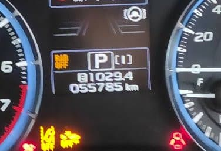

# 我がVMG LEVORG君購入から2年…2度目の12か月点検に出したよ！

📅 投稿日時: 2020-09-03 00:58:01

ということで．

もう9月にも突入してしまい．

今から1か月ほど前になる

ネタなんですが．

我がVMG LEVORG君，早くも購入から2年が

経ったようです…！

…[あの苦労](ecdca7ac058e50b9e3a2a3ae04e18b623.md)から2年．

早いものよ…

で．2年での走行距離ですが．

56000km弱．

す，少ないっ！！

1年目は走行距離32000kmほど．

2年目の走行距離24000km．

…1年24000kmとは，

我が歴史に残る走行距離の少なさ…

コロナ騒ぎで4月以降の走行距離が

全く伸びず，

5月に至っては月間走行距離，わずか100km

という，免許を取ってからの

我が人生の月間走行距離の最短記録を

更新するような状況が続いたので．

走行距離が少ないのも納得ですね…（涙）．

まぁ，車の寿命が延びるから

良しとしておきましょう…

ってなことで．

ディーラーへ2年目の12か月点検へ

もっていったのですが．

ディーラーさん「E型LEVORGで，もう５万６千kmですか！

　良く走ってますね～！」

私「…いつもに比べれば少ないんですが…」

D「来年車検ですね！新型LEVORGが出るので，

　それまでにご検討を…」

私「1.8Lのエンジンが，2Lから乗り換えるに足るか

　どうか，試乗してから考えます…」

D「とりあえず，車を見させてもらって，

　一通り見積もり出しますのでしばらくお待ちを…」

…しばらく後

D「車を見せてもらいました．見積もりはこんな感じになります」

私「ふむ」

D「まずは無料のアイサイト点検とコンピュータチェック」

私「ただならやってください」

D「そして，エンジンオイルとオイルエレメントが〇×円」

私「これ…12か月点検費用に含まれないんですね…（涙）」

D「別になります…でも，割引が効きますよ！」

と，出された値段は，近くの激安ガソリンスタンドで

激安鉱物油を入れるより安いお値段…！

私「おっと．このお値段ならやってください」

D「タイヤの溝は6mmと，新車装着タイヤなのに

　まだ溝が十分ありますね！」

私「7割以上スタッドレスで走ってるので…

　夏タイヤは減ってないかと…」

…新車の時のタイヤのまま，56000km走って

溝がまだこれだけ残ってるんだったら，

そらびっくりしますよね…

D「そして，ブレーキパッドが…フロント9mm，リア7mmと，

　ほとんど減ってないんですけど…一回換えてましたっけ？」

S「換えてません．新車のままです」

D「え！6万km近く走ってこれですか…！」

…またか…

いつも驚かれますが．

高速道路の走行が多く，普段もなるべく

ブレーキを踏まなくていい運転を心がけて

いる私の車．ブレーキパッドは20万km

くらい持つのだ…

（前のLEGACYは16万km走ってまだ半分近く

　残ってた）

D「で，ブレーキキャリパ―洗浄，点検に〇▼円です」

私「キャリパーも特に汚れてないし，

　引きずりとか起こしてないからいいです」

D「あとは，エアコンのエバポレータ洗浄をおススメしていますが」

私「工賃いくらくらいですか？」

D「1万円ちょっとです」

私「…いいです．エアコンフィルタの部品だけください」

D「わかりました．…では，見積もりは以上です」

おっと．

これで終わり？

前のディーラーは，下回りスチーム洗浄やら

添加剤類をしこたま盛り込んで，ものすごく

膨れた見積もりになっていたけど…

これだけとは，意外と良心的ですね…

しかし．

しかーし．

また今回も，

逆に肝心なものが抜けているのだ！

S「えーっと．5万kmを超えてきてるので，5万kmで

　交換推奨のエアクリーナーエレメントは

　換えたいんですが…」

D「あ，エアクリーナですね！そうですね！」　

そして．

4万kmでフロント・リアデフオイルは換えてるけど…

このLEVORG．CVTオイルをまだ

一度も交換していないのだ！

BRレガシィのリニアトロニックは

4万km程度で交換推奨だけど，

LEVORGのCVTオイル，一切の交換不要

という，「ホントか？」という仕様．

…しかし．

以前，ATF交換を推奨していなかったトヨタ車に

乗っていた時，

13万km走行時にATFオイル流路詰まりで死亡，

リビルドAT乗せ換えの修理費50万

という事態に陥り，泣く泣く

廃車にしたという痛い過去があるので，

換えておきたいのだ…

で．

LEVORG2.0のリニアトロニック．

おそらく，世界で最も大きいトルクに

耐えるCVT．

これ以外のスバル車のインプレッサ，XV，

フォレスターやレガシィ，LEVORG1.6に

積まれている通常のリニアトロニックと

比較にならないトルク容量をもたせるため，

かなりの油圧と機械的剛性をもたせて

いるので，重量も40kgくらい重い

だけじゃなく．CVTオイルも

高トルク対応版の特殊仕様なのだ…

まぁ，ファンドーネCVTじゃなく

チェーン式ってだけでも特殊で，

普通のリニアトロニックも一般の

ATFは使えないんだけど，

LEVORG2.0には，

「スバルハイトルクCVTフルード

　リニアトロニック用」

なるものが必要で．

おそらく，これはディーラーさんで換えるのが

確実なのだ…

S「あと，すみませんがリニアトロニックのオイルも

　換えてください」

D「え？交換不要なので，交換は特に推奨していないん

　ですが…？」

…交換不要なものをあえて交換させてお金を

稼ぐディーラーもありそうなものなのに．

このディーラーさんはかなり良心的なのか，

交換不要のLEVORGのリニアトロニック

オイル交換に驚いているようです…

S「過去の痛い思い出があるので，換えてもらえると

　嬉しいです…」

D「…分かりました…」

ということで．

今回，

・エンジンオイル＆エレメント交換

・エアクリーナー交換

・エアコンフィルタ交換

・リニアトロニックオイル交換．

という，5万km走行で換えておきたいものを

とりあえずは一通り交換した，

12か月点検だったのでした…

…作業終了後，

交換不要にもかかわらず，あえて

今回交換してみた，CVTオイル．

何かフィーリングが変わったり，

レスポンスに変化があったりするかな…？

と，ちょっと期待したけど．

結論としては，

CVTオイルを変えても全く分からん

というのが私の感想でした．

とりあえず．

VMG LEVORG．

着実にメンテしたので．

あと3年は，しっかり頑張って

もらわねば…

## 💬 コメント一覧

### 💬 コメント by (Noname)
**タイトル**: Unknown
**投稿日**: 2020-09-03 22:33:25

・エアクリーナー交換

・リニアトロニックオイル交換

この辺の価格が気になります

### 💬 コメント by (CVTフルード交換)
**タイトル**: Unknown
**投稿日**: 2020-09-03 22:48:44

Sさん

おっしゃる通りCVTフルードほ消耗品です。

定期的に交換するのが吉です。

神奈川県なら横浜市都筑区のプローバをオススメします。

ここはトルコン太郎という機械を使って圧送式で全容量交換してくれます。

私もBPレガシィの時に何度かお邪魔してメンテナンスしてもらいました。

### 💬 コメント by (Skier_S)
**タイトル**: 今週末もどこにも行けないかも…(涙）
**投稿日**: 2020-09-04 00:21:56

＞Nonameさま

リニアトロニックオイル交換は，15000円くらいかかりました（涙）

結構高いです．

オイル12000円，ドレンボルトガスケット100円，交換料2750円です．

エアクリーナーは，部品代だけなら3400円です．

＞Unknownさま

チェーン式CVTのリニアトロニックは，その構造上チェーンピンを

プーリーで挟み，チェーンピンとプーリーのほぼ点接触に近い

フリクションでトルク伝達するので，面接触のファンドーネCVTより

オイルにシビアそうな感じを受けるのですが…

それをメンテフリーとマニュアルに書けるほどの信頼性を

確保したのはすごいと思います…

とりあえず，BPの多段ATよりオイルにシビアそうなので，

今回は素直に純正オイルを入れておこうと思いました．

BRかVMGの2.0DITの大容量リニアトロニックに非純正のCVTフルードを

入れた報告があれば，どうな感じなのかちょっと見てみたいです．

### 💬 コメント by (ほっぽ)
**タイトル**: Unknown
**投稿日**: 2020-09-04 05:42:50

Sさん

下記の名無し投稿は私でした😅

失礼しました。

プローバさんは純正以外のオイルでCVT交換されて何台も実績があるようです。

フェイスブックでは日々の日記で公開されてます。

スバル車のことならメンテナンスもチューニングも、

選んで間違いないショップだと思います。

### 💬 コメント by (西舘)
**タイトル**: Unknown
**投稿日**: 2020-09-04 05:48:12

昨シーズン、一の瀬で表彰して頂いたあと、Sさんはよくの試乗会がシーズン最終日になってしまったと思いますが、我が家は2日延長したので、実は我が家の方が遅くまで滑ってしまったのでした。

もうすぐ、もうすぐ再び寒い世界での熱い日々が始まりますよ！

### 💬 コメント by (いか)
**タイトル**: Unknown
**投稿日**: 2020-09-04 11:20:00

私のれぼ選手は33ヶ月で78000kmほどで、春にペースが落ちただけ少し熟成がゆっくりになっています笑。もうすぐ車検でびっくりです。冬用タイヤもさすがに買わないと、、、、

私も18ヶ月でCVTオイルをDで変えてもらいました、全部は抜けないですが長く乗るなら定期的に変えるのがよさそうですよね。シフトショックが少しだけ軽減されたような気がしました。また車検のタイミングで変えてみようと思います。

### 💬 コメント by (Skier_S)
**タイトル**: 次期LEVORGが気になる
**投稿日**: 2020-09-05 05:21:06

＞ほっぽさま

やっぱりほっぽさんでしたか…

今回，無事CVTオイルもエアクリーナーも換えて，メンテしっかり

やってますので，ご安心を～！

…しかし，大容量リニアトロニックはあまりにも変態的な設計なので，

オイル設計もかなりおかしな設計のはず…

他社製品が使えるんですか！！

＞西舘さま

私は6月に月山で滑ってますよ～！！(笑)

でも，Yetiはあと1か月ちょいでオープン．

待ち遠しいです…

＞いかさま

おっと．もうすぐ車検ですか！

780000km，かなり熟成済みですね．

CVTオイル，やっぱり換えてますか．

私は換えても効果はよく分かりませんでした…

