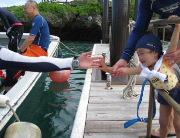
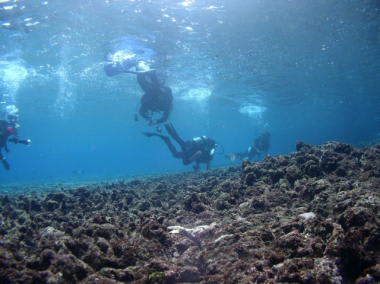
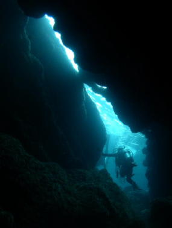
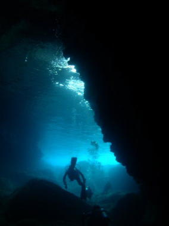
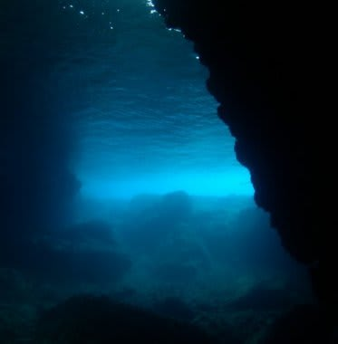
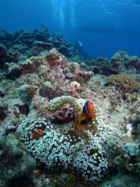
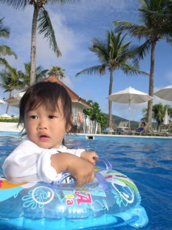

# 初の子連れダイビング旅行記＠2009年　その10　3日目スタート

📅 投稿日時: 2012-07-21 00:10:20

さて．

沖縄滞在も3日目になりました．

＃その10でやっと3日目か…

このころになると，子供を連れてのダイビング生活にも慣れてきましたね～．

娘もすっかりホテル生活に慣れた様子．

ビュッフェスタイルで好きなものを選んで，

朝ごはんをばくばく食ってます．

朝食後は，いつもどおりダイビングへGo！

今日の午前中はおばあちゃんが娘の面倒を見てくれるので，

今回2回目の夫婦バディで潜ることに．

で，娘に見送られて出発．

いってきま～す．

…娘はこのあとおばあちゃんとプールで遊べるのが楽しみのようで．

なんのためらいもなく両親を見送ってくれます．

娘がプール好きでよかったなぁ～．

んで，潜ったポイントは「ホーシュー北」

満潮のときじゃないと入れないエアドームがあり，

青の洞窟のように，暗い洞窟にきれいに青い光が

差し込んできれいだというポイント．

…しかし，さすがに満潮じゃないと入れないというだけあって．

浅いよ．

浅い．

ダイビングというより，ほとんど水面移動なんですけど．

時々，岩の割れ目に入ったりして進んでいくと…

狭い洞窟の入り口が見えます．

水深1mほど．幅は2mほど，水面より上に1mほどの開口がある

洞窟です．

奥は広くなっており，なんとなくパラオのシャンデリアケーブを

思い出すなぁ．

で，洞窟の奥で水面へ顔を出すと…

洞窟の入り口から光が差し込んできれいです．

…でも，この感じをきれいに写真にするのは難しいなぁ…

しばらく洞窟のドームの中で，入り口から差し込む光を眺めたあとは，

再び潜行して洞窟の外へ．

浅い…

で，そのあとはしばらく浅場を移動して，ちょろちょろと遊んで終了．

なんと．平均水深3m！！！

超シャローダイブでした．

でも．

夫婦で潜れて満足．

ホテルに戻ると．

また娘はプールをご機嫌で漂ってました…

お前，ホントにプール好きだな…．

お昼に，プールから出たがらない娘を強引に引っ張りあげ，

「ばしゃばしゃーっ！！！」と涙を流して泳ぎたがるところを

強制的に食事に連れて行きます．

まぁ，プールが嫌いで，ダイビングに連れて行っても遊ぶ

ことがなく，面倒を見るのが大変，というのに比べれば，

プールに浮かべておけば1時間でも2時間でもご機嫌で

泳いでいるってのは，面倒を見るには楽です．

ダイビングに連れて行くには，このくらいでいいのかも…．
