# 2014年8月　オスロブagain…再び，子連れでジンベエザメと泳ぐぞ！　その28

📅 投稿日時: 2014-10-14 03:06:52

🏷️ カテゴリ: [ダイビング日記](ce3a7a8d424d112fce83ee85c81a0e344.md)

ダイビング組が浮上してきたら．

ちょっと船を動かして…

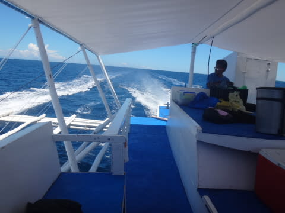

ちょっと穏やかなところにやってきました．

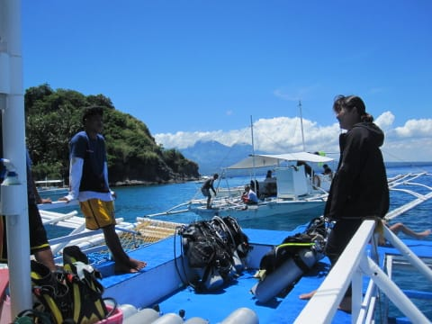

ここで，お昼ご飯タイム！

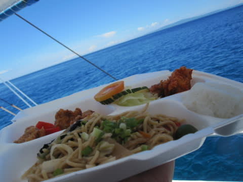

ここでのダイビングは，お弁当が

別料金で，一日一人900円．

＃ダイビングショップは円払い

フィリピンの物価から考えると高いですが．

ホテルのレストランで作っているらしいお弁当．

かなりボリュームがあって，

ダイビングでのお弁当としては，

レベルが高いほうかな～

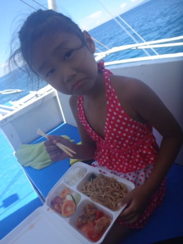

娘も満足！

って感じで．

お昼ご飯を食べて，しばらくくつろいだら，午後の

ダイビングタイム！

…これが，フィリピンでのラストダイブとなります．

で．

…今日は，1本目が私．

2本目が妻，

ということだったので．

次の3本目のダイビングは，

ふふふ．私の番だな．

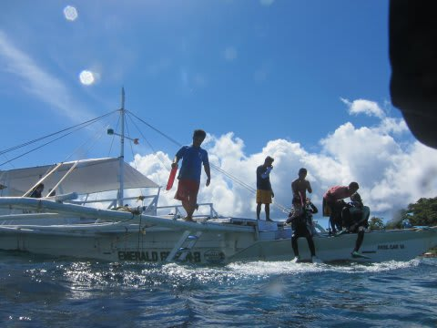

んじゃ，潜りましょうか～！

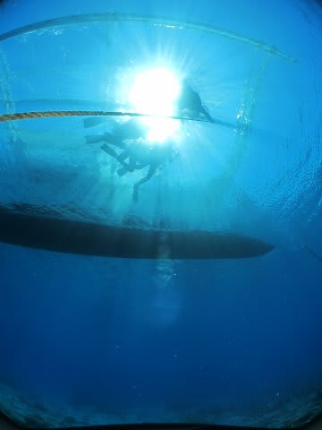

…をぉ！？

ここは，結構透明度がいいなぁ…

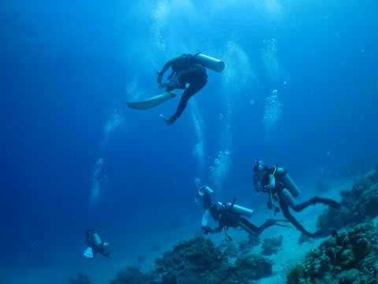

サンゴも結構元気だけど…

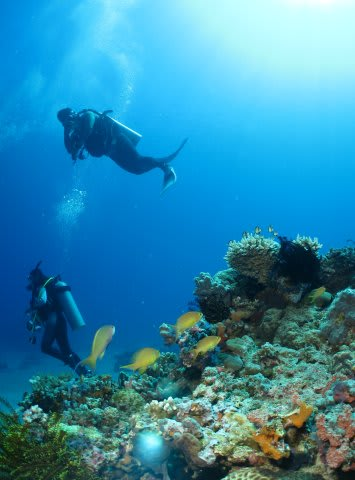

うーむ．

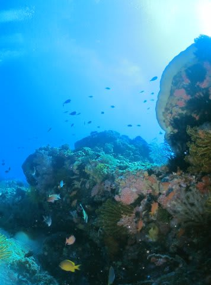

1本目のポイント，サンクチュアリの方が，サンゴが

きれいだったかな？

…と，思っていたら．

スロープの沖側に，

何か，いる…

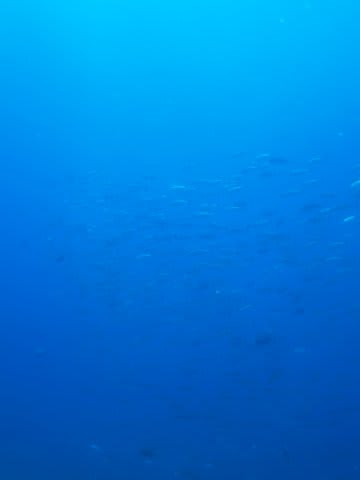

…おおお！

また，ギンガメの群れだっ！！！

…

けど，ちょっと遠かった．

近づけないので，いい写真が撮れずじまい…

って感じで．

浅瀬に上がってきますが

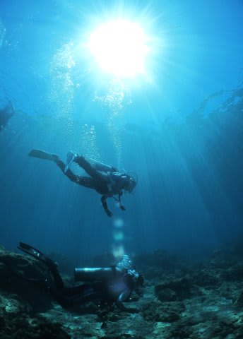

うーん．

透明度は良くて．

サンゴはそこそこきれいだけど．

もう少し魚が多いとうれしいかな～．

…とか思いつつ．

浅瀬で安全停止の後，エグジット．

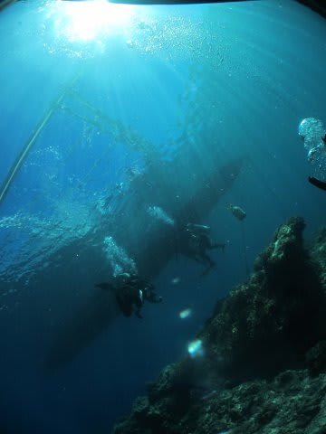

まぁ，魚がもう少しいればな～，っていう

欲はあるものの．

なんだかんだ言って．

透明度も良く，サンゴも元気だし．

ちょっと遠かったけど，ギンガメの群れもまた

見れたし．

…全体的に，満足なダイビングだったかなっ！！
