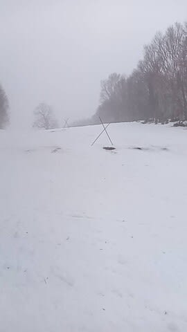
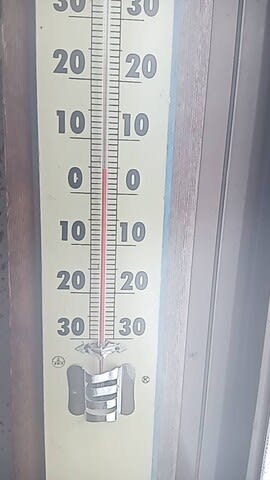

# 特派員によると、2月20日（火）の志賀は前日夜からの雨でかなり雪が減ったらしい…（涙）

📅 投稿日時: 2024-02-21 08:51:14

🏷️ カテゴリ: [日記](cc4b5682fb7b8b144980957a978653fb0.md)

えー．

最近仕事がクリティカルで…

昨晩も更新してる暇がなかったので、

朝の電車内で更新…！

昨日火曜の志賀高原ですが．

朝には雨が止んだものの、

ガスがひどくて…

月曜深夜からの、超高温＆強風＆雨の

トリプルパンチのせいで…

かなり雪が減ったみたいです(泣)

なんてったって、朝から気温が+5℃．

2月の気温じゃない…（涙）

焼額も、オリンピックコースは雪が

薄くなって滑るのがやばい部分に竿が立ち、

かなりやばい感じです…

ちなみに、21日の朝になっても

志賀高原の気温はプラスのままで、

雪になる気配はありません（涙）

あぁ…トップシーズンの2月なのに…

雨は明日まで続きそう．

この三連休、雪はちょっとやばいことに

なるかも（泣）

とりあえず、今晩余裕があれば、

今週末の天気予想します…！

## 💬 コメント一覧

### 💬 コメント by (まさ)
**タイトル**: Unknown
**投稿日**: 2024-02-21 22:57:05

いつも参考にさせていただいております。

今週の日曜日に行く予定をしているのですが雪の状況は厳しいでしょうか？

### 💬 コメント by (Skier_S)
**タイトル**: ＞まささま
**投稿日**: 2024-02-22 02:48:23

ご愛読ありがとうございます～！

日曜の雪ですか…

今日これから雪が積もれば，そこまでひどくなさそうですが…

今後あまり積雪が期待できないので，土が薄いところも多く，

バーンはところどころアイスバーンという状態になりそうです(泣)

