# 2022年10月，谷川岳→茂倉岳に登ってみた…その6　一ノ倉→茂倉岳

📅 投稿日時: 2023-08-29 07:52:12

ダメだ…

かなりクリティカルな状況…

ちょっと，今晩もほぼ寝てない

状況です．

とりあえず，今日は短めに更新しますが←更新しないで寝ようよ

明日更新がなかったら，

「Skier_Sは死んだか…」と思ってください．

ってなことで．

谷川岳レポートの続き，短め更新！

ーー

（[前回](ea4fb310fb7e9cfe317e50fde4fdacdac.md)より続く）

ってなことで．

一ノ倉へ到着しましたが…

一ノ倉に来ると，日本海側が見えるようになり…

向こうに，かすかに岩原スキー場が見えてる

じゃないですか！

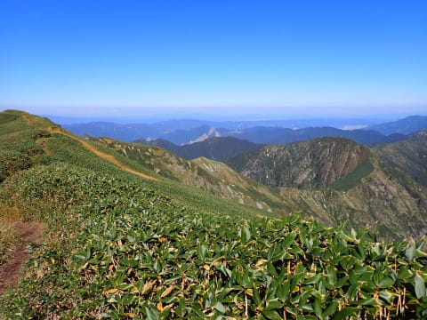

景色はいいけど，目的地の茂倉岳まで行って

休憩する予定だったので．

一ノ倉山頂では休憩せずに，写真を撮るのに

2－3分立ち止っただけで，

この先に見える，最終目的地の茂倉岳に

向かいます…！

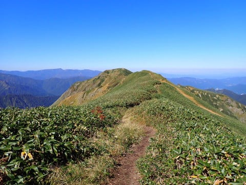

ということで．

一ノ倉岳の山頂はわずかに立ち止っただけで

通過し，最終目的地の茂倉岳に

向かうわけですが…

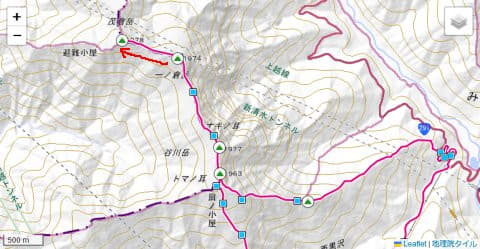

このルートは，ごく緩やかなアップダウンを

お散歩できる，ゴキゲンルートですね…！

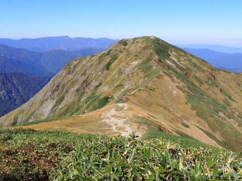

山頂が近づいてくると…

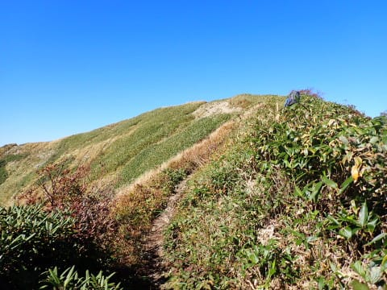

新潟方面の視界がだんだん開けてきます．

群馬の太平洋側から登山スタートして，

新潟方面が見渡せるのは不思議な感じ…

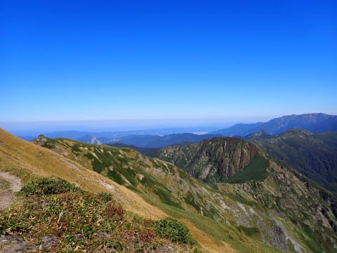

ってなことで．

景色を堪能していると．

無事，茂倉岳に到着！

一ノ倉から15分弱，

土合のロープウェー乗り場スタートから

休憩時間含め，4時間10分での茂倉到着

でした～！！

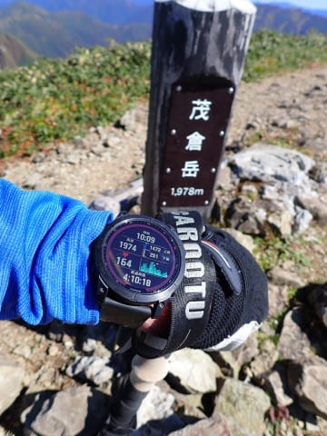

茂倉の山頂は，緩やかな広場になっていて．

ゆっくり休むのにいい感じの場所ですね．

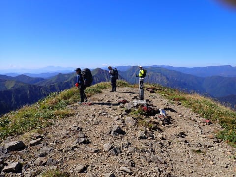

ここで景色を眺めながら，小休止．

眼下には，関越トンネルから湯沢につながる

関越自動車道が伸びていて…

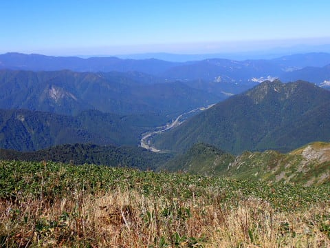

湯沢近辺のスキー場，

岩原を正面に，ガーラ・石打丸山・湯沢高原などが

見えてるし…

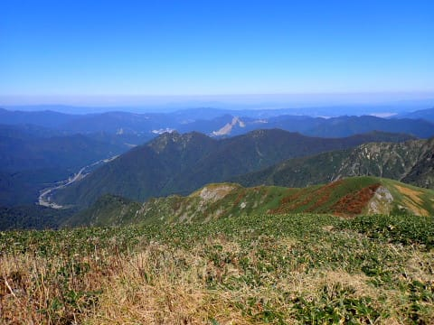

谷側馬蹄ルートにつながる道から，巻機山方面…

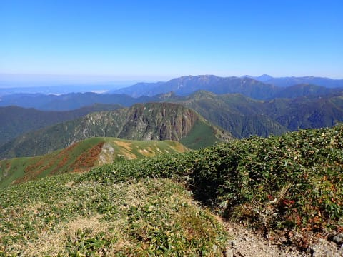

そして，いま通ってきた，一ノ倉から

谷川岳につながる尾根筋が見えます…

いや．

こんなルート歩いてきたんだから，

景色がいいのは当たり前！！

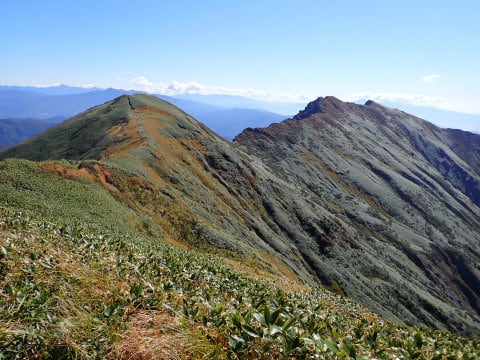

さらにそこから右につながる，

谷川岳から万太郎山へかけての稜線も

見事だし．

ホントに今日のルートは景色がいい．

茂倉岳からの景色も，谷川岳からの景色に

負けてないな！！

このルート，どこの景色も最高にいいよ…！

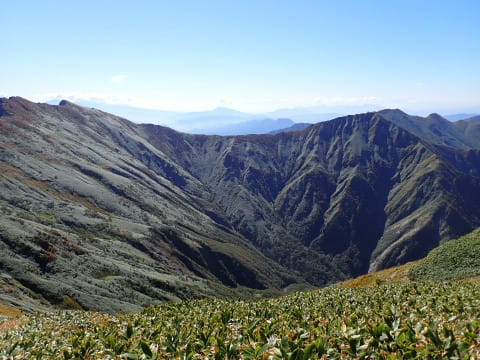

ってなことで．

山頂で景色を眺めて休むこと，20分．

10時半前には下山スタートです！

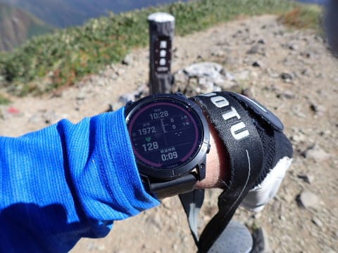

（[続く](ea1a268ae2be8c6f550d6447573f095ac.md)）
