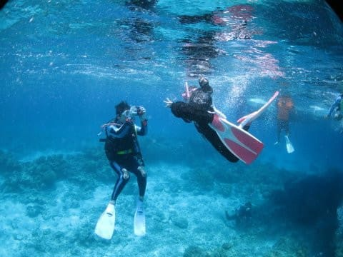

# 2017年8月，小学生の子連れで座間味でダイビングその15…座間味のラストダイブ！

📅 投稿日時: 2018-07-30 05:36:53

🏷️ カテゴリ: [ダイビング日記](ce3a7a8d424d112fce83ee85c81a0e344.md)

えー．

本日，LEVORGのリアカメラ取り付け記事を

行きたかったのですが…

この土日，健康的に娘と一緒に夜9時過ぎに寝てしまうという

生活をしてしまったため．

今日も書きためておいた，ダイビング旅行記です…

今晩はナビ取り付け記事を書きます…

では，ダイビング旅行記へ，Go!

---

ということで．

1本目のダイビングが終わったら．

今日の1便の高速船で座間味に着く

お客さんをピックアップしに，

一旦港へ戻ります…

そして．

港で乗り込んできたお客さんは…

なんと，子供4人連れ！

また，一気に船の上が賑やかになりますね～．

で．

2本目のポイントとしてやってきたのは．

これもまた，港から10分もかからないような，

比較的近めのポイント．

阿真ビーチの前にやってきました…

いや，海がきれい…！

アンカーを打ったら…

さっそくシュノーケリング組＆子供たちは，

泳ぎに行く準備！

そして，嬉々として海へ繰り出していき

ました…

やはり．

昨日までの子供たちと同じで．

この船に乗りに来る子供たち．

海が大好きな子が多いなぁ…

そして．

シュノーケリング組が泳ぎに行ったら．

次はダイビング組がエントリー！

…ですが．

このポイント名．

「阿真キンメの根」

今日の1本目に続いて．

また，根の周りにキンメモドキが群れる

ポイントです…

いや．

嫌いじゃないからいいんですけど．

キンメモドキの群れ…

でも．

さすがにこれだけ続くと．

ちょっと違うポイントでもいいかな，

…って感じですね（笑）．

しばらくして，キンメモドキがついている

根から離れて，しばらく行くと…

なんだか，みんなが集まってますね…．

何がいるのかな？

…と，覗いてみると．

おっと．

カメさんですね．

「なんだ，お前は？」

って感じでこっちをにらみつけてますが．

かなり近寄らせてくれます…

このくちばしと甲羅の柄は，

タイマイさんですね．

…めちゃくちゃ近づいても全く動じない，

かなりダイバー慣れしたタイマイさんでした…

ってな感じで．

そのあともしばらく漂って…

ボートの近くへ戻ってきますが．

ボートの下は3mほどと浅いので．

なんだか娘がダイバーにちょっかい出している

みたいです…

他のダイバーさんも，

うちの娘と遊んでくれてますね…

何度も潜って，かなり息が上がっているようで．

だんだん潜る深度が浅くなっていく娘…

そして．

今日の夕方の船で座間味を離れる我々は，

これがラストのダイビング．

娘にとっても，これが最後のひと泳ぎなので．

思いっきり泳ぎまくってますね…

ってな感じで．

エグジット！

これにて．

今回の旅行の，全てのダイビングが終了です…

あぁ…終わっちゃったなぁ…

## 💬 コメント一覧

### 💬 コメント by (新潟のスキーヤー)
**タイトル**: Unknown
**投稿日**: 2018-07-31 00:27:05

えーと…

徒然スキーヤー日記は…

こちらでよろしいのでしょうか？

本日、アトミックより連絡が入り、

私のお気に入りSXもエッジ剥離で

殉職しました。(T^T)

アトミックのサービスの方に色々お話を伺いましたが、SXは板のフレックスを最大限引き出す様な設計？接着剤？になっているため若干耐久性が犠牲に…｡みたいな回答でした！

多分、この手のトラブル多いんでしょうね…

コブコブも滑らず大事使っていたのですが、

私もSXが１シーズンもちませんでした！

ちなみに私の場合、保証期間だったので、

来季モデルが代替えで届くようですが…

SXに貼ってあった20000メーター倶楽部の

ステッカーが…涙

### 💬 コメント by (Skier_S)
**タイトル**: 新潟のスキーヤーさま
**投稿日**: 2018-07-31 01:41:38

はい．徒然ドライバー日記はこちらです…

いや，この回は徒然ダイバー日記でしたが（笑）．

いやーーー．

やっちゃいましたか．

剥離．

1シーズンもちませんでしたか…

SXの宿命ですね．

フレックスを出すために，低温接着で

柔らかめの接着剤としているみたいで．

どうも剥離しやすいみたいです…

でも，代替えで来期モデルって…

S9iってことですか？？

ビンディングも新品ですか！？？

…うらやましすぎます…

20000m倶楽部ステッカーは，

また休日に志賀にお越しいただければ

お渡ししますよ～！

…なかなかそんな機会，無いですかね…

正月休みとか，ぜひ志賀にお越しください…

