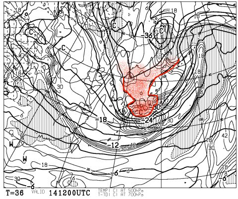
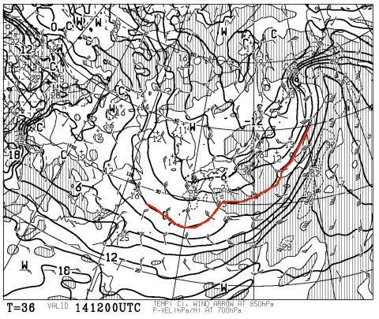
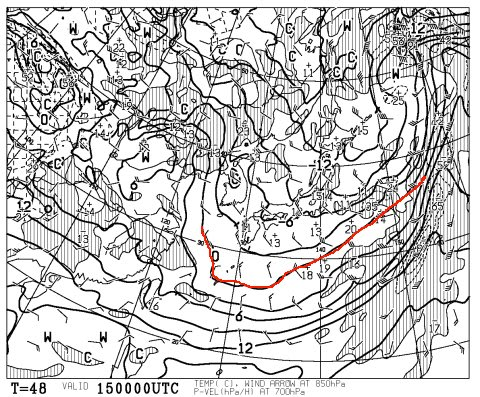
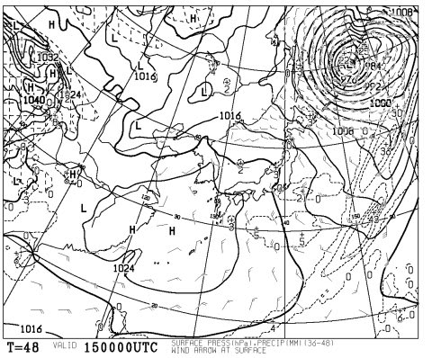
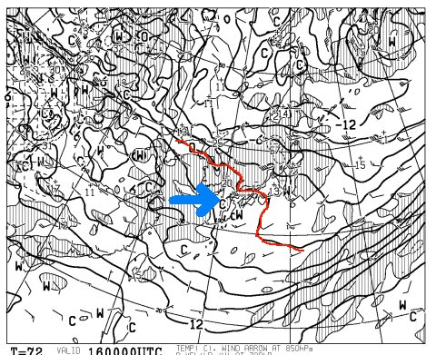
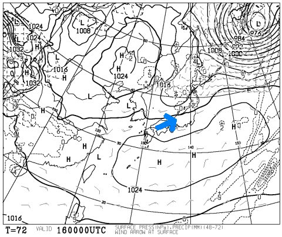

# 恒例！今週末の志賀高原の天気は…？

📅 投稿日時: 2014-03-14 01:39:57

🏷️ カテゴリ: [スキー天気予想](c6554f5c3c106093b511a8daae23757e8.md)

ってことで．

試乗レポートが始まったところなので．

「天気予想はいいから，試乗レポート書けっ！」

…って，声が聞こえてきそうなんですけど．

ですけど．

…今日は，定番の天気予想をば…

えー．

本日．

ってか，昨日ですか．

木曜の夜は，志賀高原でも雨になっちゃったみたいですね（涙）．

でも，すぐ雪になったようですけど…

んでも．

金曜日は．

冷えて雪になってくれそう！

14日金曜日，午後9時の500hpa気温図ですが…

なんと！

こんな感じで，赤くマークしたところに-30度の寒気が！

これは，そこそこの雪が降る目安…

そして，850hpa気温図を見てみると…

うむ．

0℃線は日本のはるか南まで行き．

冷えてくれそうですね～．

ということで．14日は終日雪が積もるので．

今日の雨が固まったアイスバーンを隠してくれそう…

んで．

土曜日ですが．

ふむ．

この日も850hpaの0度線は日本のはるか南ですな．

朝は-10℃以下まで冷え込みそう！

…で．

地上天気図を見ると…

あら？

あんまり降らなさそうな天気図だわ…

うーん．

できれば，土曜もどさどさ降ってほしかったんだけど．

ちょっと，アイスバーンを隠しきるには，積雪量少ないかな～．

でも．

降らないということは．

逆に言えば，晴れてくれるということで．

…土曜の志賀高原，基本的に晴れそうですね．

朝のうちは雲が残り，時々雲が流れてくるタイミングもありそうだけど．

まー，晴れそう．

そして，日曜は．

…うむ．

西から矢印で示したように，暖かい空気が迫ってきますね…

朝は冷えてるけど，昼間に向かって気温が上がるかな～．

地上天気図を見ると…

矢印で示したように，西寄りの風が入るので．

志賀高原では，晴れるパターンですね～．

…これは，日差しで雪が緩むかも…

ってことなので．

土曜：朝のうちは雪雲が残るかもしれないけど…

　　基本的に晴れ，時々雲が流れてくるかな～

　　前日に積もった冷え冷えのいい雪が圧雪された，快適コンディション．

　　運が良ければ，朝イチはブーツパフくらいの新雪が楽しめるコースもあるかな．

　　昼間も気温が上がらず，雪質はいいまま．

　　ただ，午後に向かってコースは凸凹になっていき，下地の

　　アイスバーンがコンニチハしてくるところも…

日曜：晴れ！！

　　朝は気温も低く，締まって超快適なハイスピード圧雪バーンが

　　楽しめるでしょう！

　　昼間に向かって気温が上がっていき，日差しの当たる南斜面では

　　春っぽい雪になっていくかな～．

　　でも，アイスバーンが緩んでいくので，むしろ滑りやすいかも．

　　まぁ快適な一日でしょう！

って感じで．

この週末，まーまーよさそうですな～．

## 💬 コメント一覧

### 💬 コメント by (ベベ)
**タイトル**: Unknown
**投稿日**: 2014-03-14 12:39:19

寒気と暖気の入れ替わりが早くなってきましたね。

そろそろ春ですか・・・

土曜朝はパウダーだといいですが、このへんは日頃の行いですかね^^

### 💬 コメント by (Skier_S)
**タイトル**: べべさま
**投稿日**: 2014-03-14 22:53:43

土曜朝は，新雪が積もってそうですけど…

10㎝，多くて20㎝かなー．

やっぱり，せいぜいブーツパフ程度っぽいです…

日曜は，やっぱり昼間は気温が上がって．

あー，春だなぁ，って感じになりそうです．

うーむ．

いつまでも真冬でいてほしいっ！

