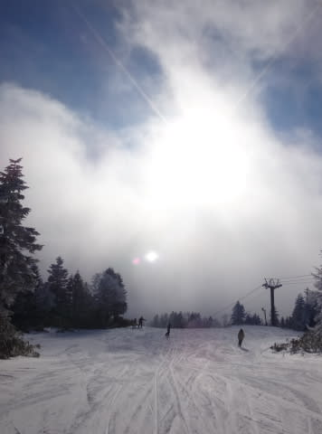
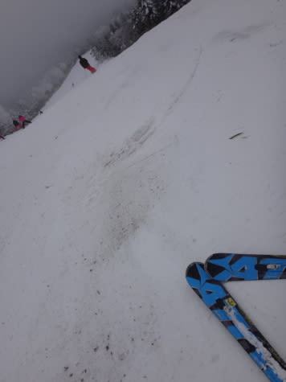
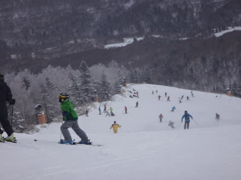
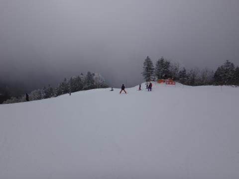
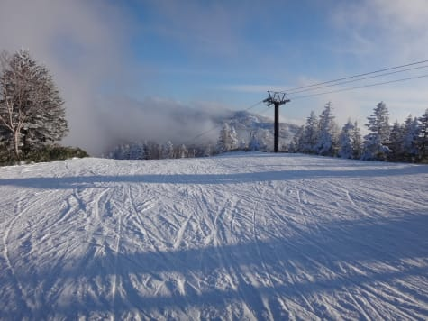

# 3連休最終日，1月11日の志賀高原速報モード！

📅 投稿日時: 2016-01-12 00:21:14

相変わらず，最終リフトまで滑ってから

5時間運転して，ついさっき帰宅したSkier_Sです．

ってことで．

今日も帰宅が遅かったので，本日の志賀高原．

速報モードで…

えー．

本日，朝は．

予想外に，雲の合間から日が射す天気でスタート！

…

…で．

当然，朝，日が射していたってことは，

朝は雪が降ってなかったということで．

昨日からの積雪は…

…

3cm．

わずか，3cm．

そう，たったの3cm．

何度でも繰り返しますが，ほんの3cmっ！！！（激涙）．

なので．

朝，1-2本滑ったら，すぐゲレンデに

ブッシュさん（元米国大統領ではない）がそこかしこで

コンニチハしてくる状態で…

そして．

3連休なので．

ゴンドラ待ちが出るほどではなかったけど，

午前中はちょいとゲレンデは混んでいました…．

そして．

多くの人に削られたゲレンデは．

昼前にはかなりの部分がアイスバーン状態に（涙）．

でも．午後はゲレンデはガラガラになり．

朝一瞬晴れたのち，

昼間はずっと曇ったりうっすらガスが出たりだった

今日一日．

午後3時ごろには，また日が射す一日で．

…結局，今日も積雪は増えずじまい…（涙）．

焼額も，まだオリンピックコースやミドルコース，

エキスパートコース，白樺コース，ブナコースが

クローズのままです（大粒の涙）．

一体，いつになったら志賀高原全面滑走可能に

なるんでしょうか…（泣）．

…とりあえず．

詳細レポートは，また明日のお楽しみに…っ！←また，雪不足のあんまり楽しくないレポートなのでは？（自己突込み）

## 💬 コメント一覧

### 💬 コメント by (いか)
**タイトル**: Unknown
**投稿日**: 2016-01-12 17:27:04

志賀高原は連休も積雪増えませんでしたか…

来週の大雪早期警戒情報に期待です！

こちら八方は、毎日15-30センチ積もってゲレンデ状況はいい感じです(ただし上部のみ、日曜日は午前運休でした)。

その積雪がしっかり圧雪された今日は13-14SX先生で今シーズン最高の小回りを堪能して参りました。人間ダメになりそうな感じの圧雪バーンでしたよ！(お休みを連休につなげている時点ですでにダメ)。

### 💬 コメント by (Skier_S)
**タイトル**: いかさま
**投稿日**: 2016-01-13 00:22:41

八方は状況改善したんですね…

でも，上だけですか．

名木山や国際はまだダメですか…？？

でも，今日は良かったんですね…

いいなぁ…

来週18，19日は今シーズン初めての，

パウダードサドサ天気図なので，

ちょっと期待しています．

…14，15日もかなりの寒気が入るんですが，

雪がドサドサ積もる天気図ではないです…（涙）．

### 💬 コメント by (いか)
**タイトル**: Unknown
**投稿日**: 2016-01-13 23:38:27

名木山はトリプル側のみ人工雪で滑れます、唯一の下山コースですね。名木山ペア側は諸事情で人工降雪も打てず、原っぱです…。国際は白くはなってきましたが、まだまだですね…。

私は今週末以降3週ほど行けなさそうな感じなので、今週末までに降ってほしいのです…。今週末以降は、行けないストレスから物欲選手権が開催されそうで怖いです。

### 💬 コメント by (Skier_S)
**タイトル**: いかさま
**投稿日**: 2016-01-14 00:38:38

名木山は滑れるんですね…．

国際，咲花などはまだまだですか…

今週末ですが…明日14日は降ります．

が…志賀や信州では積もらなさそうです（涙）．

そのあとはしばらく，そんなにドサドサ積もらなさそう．

積もるのは，来週．

19日，20日は来ます．

ドサドサ来ます．

かなり来ます．

…来週はゲレンデ状況が一気に改善するはず！

…来週滑れない恨みは，物欲選手権で

果たしてください（笑）．

