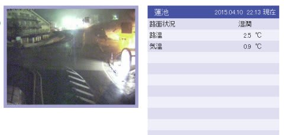
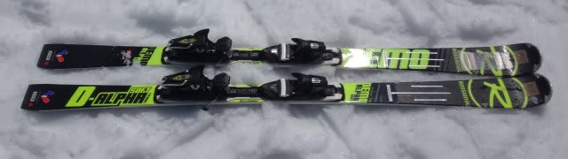
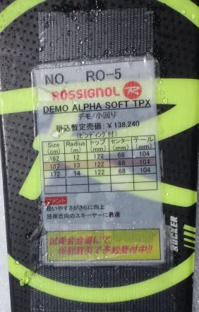
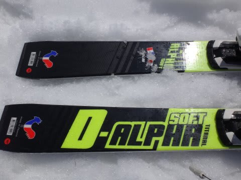
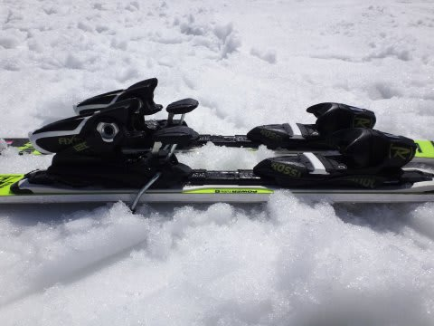

# 2016シーズンモデル，スキー試乗レポート第11回…ROSSIGNOL編その2

📅 投稿日時: 2015-04-10 22:28:52

🏷️ カテゴリ: [スキー板試乗](c0bd8048615710cee890e403a36cc9a2b.md)

えー．

現在．

志賀高原は，雨のようですね（涙）．

うーむ．

気温は+1度弱と，極めて微妙な感じなので．

まぁ，水曜に予想した感じの，

降るのは，標高の高い山頂付近では湿った雪，

低いところではみぞれ～雨…

って感じで，山頂付近は雪だと思いますが…

んで．

明日，土曜ですが．

午前中の早い段階，9時ごろには雪orみぞれは止みそうな雰囲気．

昼間は曇り空で，夕方には，日が射すタイミングがあるかも？？

朝のうちはうっすら湿った新雪が被った下地に，ざらざらした固めのバーン．

昼に向かって緩んでいく…って感じでしょう．

そして日曜は…

晴れそうですね～．

そして．

この時期としては標準的な暖かさになるので．

まぁ，昼間の雪はザブザブですね…

という感じで．

天気予想のあとは．

まだ続く，2016シーズンモデルのスキー板，試乗インプレッション．

今日は，ロシニョール編です．

では，どうぞ～！

○ROSSIGNOL DEMO ALPHA SOFT TPX 167cm

基礎小回りベースオールラウンド

DEMO ALPHAには，R21プレートのモデルと，この優し目のTPXプレートのついた

「DEMO ALPHA SOFT」の2機種があるわけですが…

こちらは優し目の，TPXプレートが付いたSOFTモデル．

長さが167cmってことで，小回り用っぽい感じ．

角づけするだけで，サイドカーブに沿って楽にするすると回ります．

たわむ前から，わずかに角づけすればトップとテールのエッジが

しっかり効いて回り始めるので，角づけだけでクルクル

小回りができます．

そこからスピードが出てくると，トップとテールの

しっかりしたエッジグリップと，そこそこの張りの強さで，

エッジに乗った，グリップ感の強いの小回りができます．

返りは適度．張りはそこそこあり，踏み応えに粘りがある感じ．

スピードを出すと良くたわんで，たわんだエッジに沿って

小さい半径で回っていきます．

フレックスに比べ，トーションがしっかりしている感じ．

試乗したコンディションはかなり柔らかい春雪だったけど，

こんな柔らかい雪でも良くたわみ，たわんだエッジに沿って

切れていく感じの，小さめのターンで回っていけます．

トップとテールがしっかりグリップしているので，

板はキョロキョロすることなく，安定感・安心感もあります．

…でも．スピードを出すとたわみすぎて，小回りスペシャルに

なっちゃうかな．

角づけしただけで楽に回り始め，踏み込み量で回転弧も

コントロールでき，比較的楽にキレキレなエッジに乗った

小回りターンができる板ですね～
