# 2月1，2日の週末の志賀高原スキー場の天気は…土曜は曇りのち晴れのいい感じ！日曜は南岸低気圧で気温が上がった湿った雪

📅 投稿日時: 2025-01-30 02:18:21

🏷️ カテゴリ: [スキー天気予想](c6554f5c3c106093b511a8daae23757e8.md)

えー．

そろそろ2月になるので．

普段なら2月1日から使える焼額山の

セカンドシーズン券販売の案内が出る

ころですが，今シーズンはまだ

セカンドシーズン券の案内がでて

ませんね…

今シーズンはまさかセカンドシーズン券，

やらないのかな？？？

で．

本日の志賀高原は，午前中はそれほど

降っておらず，朝の積雪も数㎝程度

だったようですが…

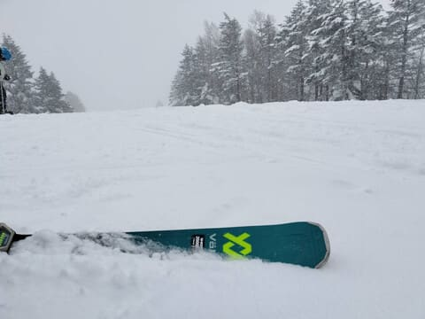

午後はかなり寒くなり，本格雪降りに

なったようで．

午後だけで10cmほど積もったようです…！

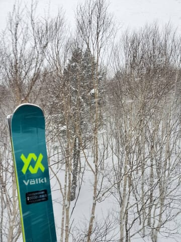

で．

ライブカメラを見ると今でもガンガン

降っていて，すでに夕方からの

積雪も30cmくらい積もってるみたいです…！

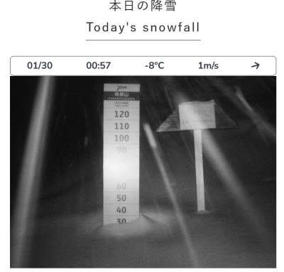

（[焼額山スキー場ライブカメラ](https://www.princehotels.co.jp/ski/shiga/livecamera/)より）

まだまだ降っているので，明日の

朝はパウダーねらい目です…！！

ってなことで．

ここしばらく雪が降ってなくて，

雪が硬めだった志賀高原．

この積雪で，また完全ハイシーズンの

雪に戻りそうですが．

この週末の志賀高原．

平日に雪が積もり，週末に晴れる

最高パターンになるのか？？？

天気図を見てみましょう…！！

まず．

1月30日(木)の850hPa図ですが．

志賀高原には水色の-9℃線が

かかっているので…

明日もかなり冷えますよ！！

寒いです！！

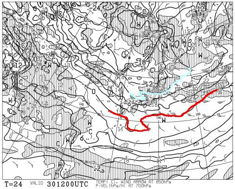

そして，この日の地上天気図を見ると．

相変わらずJPCZがわかりやすく伸びて

いて．

志賀よりわずかに西側に刺さるように

たなびいているので…

これだと，木曜も一日志賀高原は雪降りに

なりそうな感じ．

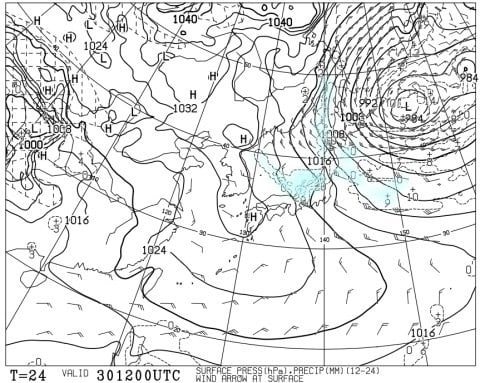

で，続く31日(金)の850hPa図を見てみると．

この日も志賀高原に近いのは水色の-9℃線．

この日もそこそこ冷えますね～！！

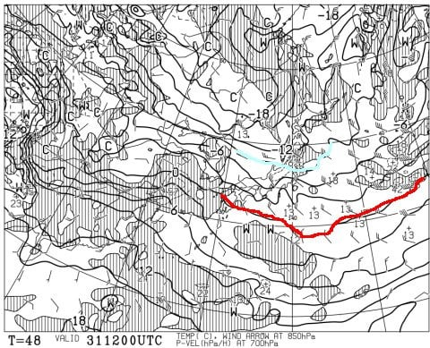

この日の地上天気図は，高気圧に

覆われているものの，北陸に雪雲が

かかっているので．

高気圧が近づいてる間の北風のうちは，

北風で山に雪雲がかかるパターン．

この日は高気圧に覆われてても，

午前中は雪降りでしょうか．

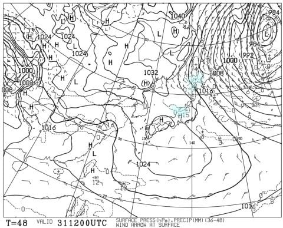

そして肝心な週末，2月1日の土曜は．

850hPa図を見ると，水色は-6℃線．

これが志賀より北に行っているので…

金曜までよりは冷えが弱いですね．

でも，この時期なら平年並みくらいかな？

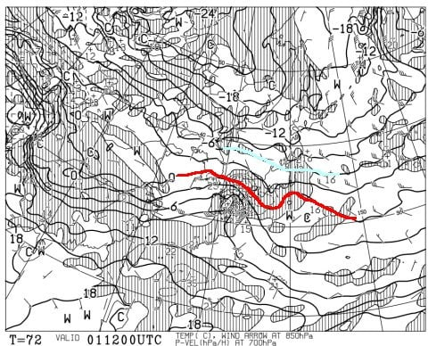

で，地上天気図を見ると．

え？？

金曜に本州を覆った高気圧は早くも東に

去り始め．

西から低気圧が近づいてます…（泣）

週末のすっきり晴れは望めなかったか…

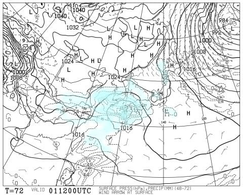

続けて2月2日(日)の850hPa気温を見ると．

うーーーん．

この日は赤い0℃線が志賀に近づくので…

気温がかなり上がりそう（泣）

まぁ，0℃線が志賀より北に入ってないので，

液体が降る心配はないですが…

で，この日の地上天気図を見ると．

あぁぁぁ…ダメか．

本州は見事に低気圧に覆われているので，

降りそうです…

それも南岸低気圧で気温が上がるので，

かなり湿った重い雪です（涙）

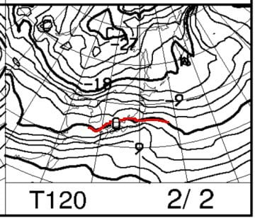

ってなことで，まとめると．

30日(木)：朝は-10℃以下の激冷え．

　-13℃くらいまで冷えるか？

　朝の積雪は30～50cm．圧雪バーンも

　圧雪の上に5-10cm．

　冷え冷え＆雪降りで，風も強まり

　そうなので，根性の無いスキーヤーは

　ふるい落とされる天気．

　終日新雪が供給されるので，

　午後の雪は人が多いコースは

　モフモフに荒れていく．

　風に弱いゴンドラは運が悪ければ

　運休するかも？

31日(金)：この日も朝は-10℃．

　朝までの積雪は10cmくらいかな？

　冷えたいい雪が積もり，圧雪コースは

　柔らかい圧雪の上に1-2cmの新雪で

　滑りいい．

　午前中は雪がぱらつき，昼間は

　曇り空．午後は時折日が射す

　時もあるかも…

　雪が柔らかいので，午後は雪は

　荒れていく．

1日(土)：朝の気温は-9℃程度．

　朝は曇っているかもしれないけど，

　だんだん空は晴れていく．

　朝イチはトップシーズンらしい冷え

　冷えでいい感じのシマシマバーン！

　ただ，雪は柔らかめなので昼頃には

　荒れ始め，午後は急斜面はバーンが

　荒れていくか…

2日(日)：朝の気温は-5℃程度と高め．

　朝から曇り～雪降り．

　朝は湿った重い雪が降ったりやんだり．

　朝はエッジが効くしっかりした圧雪

　バーン！

　昼すぎから重めの雪が時折強く降るかも．

　雪はそれほど深く積もるほどではなく，

　ゴーグルに水滴が着くかもしれないけど

　バーンは滑りいい感じ．

　午後はやはりバーンはちょっと

　凸凹して荒れてくる

…という感じでしょうか．

運よく土曜は高気圧がやってくるけど，

この高気圧は一瞬で通り過ぎて，

日曜に南岸低気圧がやってくるのが

惜しい…

日曜は南岸低気圧なので，気温が

上がって雪が重くなります．

でも，まぁ土曜は晴れ間もあるし．

日曜も液体の危機はなさそうだから．

まぁ，そこそこ楽しめる週末かな！

…そして．

来週は火曜あたりから冷えて，

かなりすごく積もりそうな予感…！！

下の図の，850hPaの5400mの特定高度線が，

北緯35度くらいまで下がると冷えて雪が

降るんですが…

ちょうど雪が大量に降っている今，

28日のあたりとかは，灰色と白の境目の

5400mの特定高度線が35N付近まで

下がっているのがわかりますし．

あるいは赤色でマークした1月8，9日や

12日のあたりも灰色領域が35N付近まで

下がってますが，この時期も雪が降って

ましたよね…

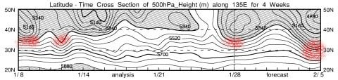

で．この上の図の2月5日あたり．

グレーの両気が35Nどころか，30Nくらい

まで下がってます．下がりすぎです．

ここまで下がることはそうそうないです．

…これは，めちゃくちゃ冷えて，

雪が降る証拠です…

ということで．

来週はおそらく，2月4日の火曜以降

数日間，かなりの雪が降り続けそう

です…！

来週の週末，2月8，9日の飛び石

4連休もいい感じになりそうな予感…！！

## 💬 コメント一覧

### 💬 コメント by (関西のおっさん)
**タイトル**: Unknown
**投稿日**: 2025-01-30 09:06:34

いつも楽しく拝見させて頂いてます。

先月の年末年始ヤケビで滑ってたときにいらっしゃるかなと思いながら滑ってたんですがわかりませんでした。

もしよろしければ教えてください。

来週の火曜日から木曜日、志賀高原に行く予定をしているのですがスキーヤー様のブログでかなり寒く雪が降る？との事を書いていらっしゃいますが、行くのが困難なくらい降りそうでしょうか？ご教示頂ければ幸いです。宜しくお願い致します❗️

### 💬 コメント by (まだついていってる・・)
**タイトル**: 2ndシーズン券
**投稿日**: 2025-01-30 10:45:43

志賀高原プリンスホテルのHPからリフト料金に入って、WAmazing Snowのサイトで2ndシーズン券、出ています・・

SPC会員で

大人 :33,000円

中高生 :28,500円

シニア :28,500円

さてどうするか思案中・・・

### 💬 コメント by (Skier_S)
**タイトル**: 眠い…
**投稿日**: 2025-01-31 03:07:01

＞関西のおっさんさま

コメントありがとうございます～！

正月は29日から3日まで滑ってましたが…発見できませんでしたか…

来週火曜から木曜は，ちょうど雪がピークになるころですね…

北陸道や上信越道は間違いなくチェーン規制．ヘタすると名神の米原近辺にもチェーン規制がかかるかもです…

まぁ，志賀高原は雪に慣れてる人が来るので，途中でスタックする車が詰まるとか

いうことはないかなと思いますが…

＞まだついていってる・・さま

お久しぶりのコメントありがとうございます～！

あ，もうWamezingからは購入できるんですね…

アソビューにはなかったので，今シーズンはもしかしたら2ndシーズン券ないのかと

思ってました…

情報ありがとうございました！！

### 💬 コメント by (関西のおっさん)
**タイトル**: Unknown
**投稿日**: 2025-01-31 22:56:59

＞ Skier_S さんへ

＞ 眠い…... への返信

ご返信ありがとうございました。

志賀高原には20年以上通ってるのですが年末年始にしか行けないもので２月のトップシーズン事情がわからず質問させて頂きました。中央エリアをメインにしてましてヤケビにはちょっと行かせてもらうくらいですがいつかご挨拶させてください。ありがとうございました。

### 💬 コメント by (Skier_S)
**タイトル**: ＞関西のおっさんさま
**投稿日**: 2025-02-01 23:31:59

はいはい～！

焼額にお越しの際は，ぜひ私を探してみてください…

お待ちしています！

