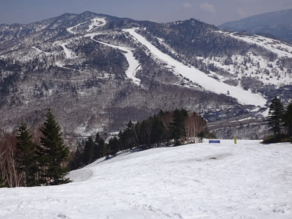
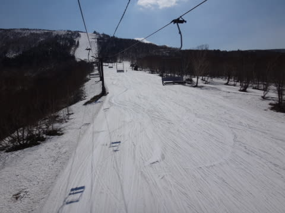

# 4月29日，GWスタートの祝日の志賀高原は…ガラガラ晴天．暑かったよ！

📅 投稿日時: 2015-04-29 20:32:48

というわけで．

今日も限りなく短い睡眠時間で志賀高原にやってきた

わけですが．

…さすがに早朝に間に合うように出てくるのは無理だったので．

焼額通常営業開始の8時半に到着！

…あー．

道路はもう，完全にドライですな．

朝から気温はすごく高く，今朝も志賀高原まで，

夏タイヤでまったく問題ない道路状況でしたよ～．

んで．到着後．

ゴンドラで山頂へ向かうと…

…なんてこったい！！！

朝8時半の時点で，山頂でプラス10度超えてるじゃないかっ！！！（涙）．

天気はぴかぴか晴天なのはいいんだけど…

…この強烈な日差しと，プラス10度を超える気温の

ダブルパンチのおかげで．

朝8時半時点で，すでに雪は春のズブズブ雪に

なっちゃってるんですけど（泣）

そして．

容赦なく照りつける太陽は．

私にとって大切な，目に入れても痛くないほどかわいい

雪ちゃんを痛めつけ…←いや，雪が目に入ったら痛いから

あうーん．

朝からもう，なんだかねっとりした感じの雪になって．

すべりが悪いよ…

そして，人が滑ってないところはかなり汚れが浮いた

雪に…

ここ数日の高温で，

白樺コースは，コース半分が土になっちゃってます．

ぶなコースは，日曜の段階で

「もうだめか？」

と思ったけど，まだもってますね～．

でも，長さ20mほどにわたって，コース幅2m．

あと何日もつかな～．

第2高速リフト沿い，唐松コースも…

まだ全面に雪があるっぽく見えますが．

コースの端っこ．かなり土が出てきて，幅が

狭くなってきました…

さらに．

第2ゴンドラで滑る，パノラマコースも．

ついに．

なんだか茶色くなってきてるよ～

近づいてみると…

あら．あらら．

穴が開き始めてる…（涙）

まあ，焼額の滑走可能な全域で，土が出ているのは

この4箇所だけで．

それ以外は，まだこんな感じだから．

滑る分にはぜんぜん問題ないのですけどね～．

ってことで．

…雪が多かった今年ですが．

この1週間ほどの雪解け速度はハンパなく．

うーん．

なんだか，現時点では

「例年よりはちょっと多い程度」

ぐらいに減ってきた気が…

これからもあったかい日が続きそうなので．

…5連休のころには「例年並み」かそれ以下まで

減る可能性も…（激烈涙）．

ぴかぴか晴天なのはうれしいんだけど．

昼間の気温は，山頂でもプラス14度ってのは．

…ダメでしょ…（涙）．

せめてもの救いは．

今日のゲレンデ．

普通の平日より人が少ないんじゃない？？？

ってほどのがらがらだったってことくらいですかね～．

（誰も写っていない…人が滑らないので，汚れが浮きまくっている）

で．

午後は奥志賀に行ったんですが．

ここは北斜面だから，雪解けが遅いのか．

ここはまだ，例年より雪がたっぷりある感じかな～

ぜんぜん土が出てくる気配もない感じ．

奥志賀ゴンドラ側も，まだコース幅いっぱい滑れて．

ゴンドラ乗り場まで，雪がほぼ全面に残ってます．

…ただ．

雪は強烈なストップスノーだったのが残念…

一番マシな雪質なのは，やっぱり奥志賀は第2高速ペア沿いかな～．

ここの急斜面は，そこそこ滑る雪なんだけど…

…でも，全面コブです（^^;

コブが好きな人はいいけど，そうじゃない人はちょっと…

って感じで．

ピカピカ晴天で，ガラガラだったのはいいんだけど．

ウェアのジャケットを着てられないくらいの，

Tシャツでも問題ないくらいな暑さのおかげで．

かなりの荒れたストップスノーになっちゃって．

うーん．

ちょいと微妙な感じの今日の志賀高原だったのでした…

うーん．

やっぱり早朝がいいのかな～．

ってことで．

私は明日以降も，まだまだ連続で志賀高原滞在予定です（笑）

これから連日の，GW現場レポートをお楽しみに…！←だから，楽しみにしてる人なんているの？（自己突っ込み）

## 💬 コメント一覧

### 💬 コメント by (はなげ親分)
**タイトル**: ええ～
**投稿日**: 2015-04-29 21:24:09

12連休ですか？

うっ、うやましぃ～(笑)

思い切り楽しんでくださいね

。

レポート楽しみにしてます!

### 💬 コメント by (Skier_S)
**タイトル**: はなげ親分さま
**投稿日**: 2015-04-30 06:35:09

さすがに11連休ではないです(笑)

8連休です。

いま、早朝滑ってます～

今日も晴天です！

### 💬 コメント by (komu)
**タイトル**: Unknown
**投稿日**: 2015-04-30 19:00:41

今日はご一緒いただきありがとうございましたm(_ _)m

それにしてもあの夫婦、うまかったですね～

明日は早朝からガリガリ滑りましょう

### 💬 コメント by (Skier_S)
**タイトル**: komuさま
**投稿日**: 2015-04-30 20:59:33

今日はお疲れ様でした～

ご一緒いただきありがとうございました～．

…しかし．

やはり，トップ選手は違いますね…

あの荒地を，まるで整地のごとく滑ってましたね．

とてもまねできません…

また明日，早朝でお会いしましょう！

