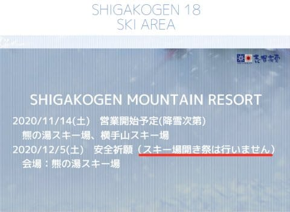
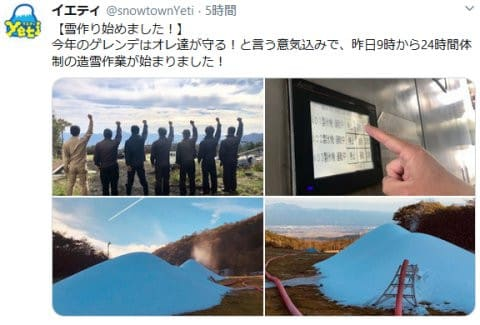

# Yeti，2021シーズンオープン日確定！…やっぱり10月30日でした（涙）

📅 投稿日時: 2020-10-22 00:08:27

🏷️ カテゴリ: [スキー雑談](c1f9d2cb7478308da16419928ea3945e9.md)

えー．

今シーズン．

毎年恒例の，志賀高原スキー場開き祭が

無いと聞いて，ちょっとがっくり

来ているSkier_Sです．

（[志賀高原索道協会ホームページ](https://www.shigakogen-ski.com/)より）

うーむ．

今シーズンも，やっぱりいろんなイベントが

中止されそうな気配…（涙）

そして．

良くないニュースは続くのか．

先日，[狭山スキー場が11月12日オープン](eb4aa4e1b54a7f3a3cc3e082368d16e6b.md)

というニュースを聞いて．

…ヤバい．

Yetiオープンは10月末か…？？

と，心配していたら．

本日．

悪い予想の通り，

イエティのオープンが10月30日

という衝撃の情報がリリース

されました…！（涙）

（[スノーパークイエティホームページ](https://www.yeti-resort.com/)より）

10月23日オープンだと信じていたのに…

まぁ，狭山オープンが11月になった時点で．

30日オープンになるかなとは思っていたけど．

実際に30日オープンと知らされると，

ちょっとショックですね…

2018シーズンなんて，10月第1週の

10月6日にオープンしていたのに．

それから4シーズンで約1か月オープンが遅くなる

とは…（涙）

とりあえず．

昨日からようやっと本格的に雪を作り

始めたようで．

（[イエティTwitter](https://twitter.com/snowtownYeti/status/1318833508928819200?ref_src=twsrc%5Etfw%7Ctwcamp%5Eembeddedtimeline%7Ctwterm%5Eprofile%3AsnowtownYeti&ref_url=https%3A%2F%2Fwww.yeti-resort.com%2F)より）

…これで，あと1週間でコースが完成するのか…？

と，ちょっと心配になる感じもありますが．

あと1週間ちょいでオープン．

…そして私は，10月31，11月1日はいろいろ

予定があるので（涙）

初滑りは11月3日になるかな…

10月にスキーができず，

初滑りが11月になるなんて…

このBlog始まって以来の出来事です（激涙）

そして，オフシーズンが4か月を超えるのも，

このBlogを書き始めてから初めてかも…？

とりあえず，予想より遅くはなってしまったけど．

Yetiオープン日も決まり，私の初滑りも決まりました．

あとは，2021シーズン突入を待つばかり！！

## 💬 コメント一覧

### 💬 コメント by (ほっぽ)
**タイトル**: イエティ
**投稿日**: 2020-10-22 06:43:13

Ｓさん

全く残念なお知らせでしたが、10月にOPENするだけマシと思うようにしました。

ナイター利用者としては平日ナイター営業が２月で終了というのがイタイです。

とはいえ、当初風のうわさで聞いた話ではナイター営業自体が無い

とも聞いていたので、取り合えず初日から２月末まで通うつもりです。

私は10/30のナイターからシーズンインします。

### 💬 コメント by (アリス)
**タイトル**: イエティー
**投稿日**: 2020-10-22 07:27:21

Skier_S様

少し教えてください。

イエティーですが、コースがA～Dまであるみたいですがオープン直近は、コース限定でしょうか？

### 💬 コメント by (ゆーき)
**タイトル**: Unknown
**投稿日**: 2020-10-22 08:36:40

スキー場開き祭がないとは、、、

あれ、リフト券は安いし、

昨シーズンは、前売り1日券4300円で売ってくれたし、

楽しみにしてたんだけどなぁ、、、

### 💬 コメント by (Skier_S)
**タイトル**: 11月のシーズンイン
**投稿日**: 2020-10-22 23:05:08

＞ほっぽさま

え？ナイター営業無しの噂があったんですか…

それに比べればマシですね！

10月30日のナイターから参戦ですか…10月中の初滑り，うらやましいです（涙）

＞アリスさま

12末ごろまで，滑れるコースはAコースのみです！

それもオープン直後はすごい幅が細い廊下コースです…

https://www.youtube.com/watch?v=57xeOxV2TeE&feature=emb_logo

こんな狭い廊下コースに人がいっぱいですので，注意して滑らないといけません…

＞ゆーきさま

12月第1週のスキー場開き割引はやってくれるんじゃないかと期待してますが…

でも，前売り一日券はアナウンスが無いからやらないのかもしれません．

いろいろ残念です…

### 💬 コメント by (アリス)
**タイトル**: 動画ありがとうございます
**投稿日**: 2020-10-23 12:10:02

Skier_S様

動画ありがとうございました。

大変良くわかりました。

スタート地点は、夏休みの都内の流れるプールみたいですね。

コース内はマイペースでぶっ飛びって訳にはいかないみたいです・・・

### 💬 コメント by (Skier_S)
**タイトル**: ＞アリスさま
**投稿日**: 2020-10-24 01:30:20

斜度もゆるいですし，人も多いしコースも狭いし，

スピードが出せるのは朝のうち数本くらいでしょうか…

それ以外は，ちょっと怖くてスピードを出すのは無理なので，基礎練習に

なります…

### 💬 コメント by (たむ)
**タイトル**: Unknown
**投稿日**: 2020-10-24 08:37:31

例年より、営業開始時間が一時間遅くなっていますね。悲しい...

### 💬 コメント by (Skier_S)
**タイトル**: ＞たむさま
**投稿日**: 2020-10-25 20:22:36

えええええ！！

ホントだ！！

気づきませんでした…（涙）

そして，オールナイト営業もなくなってますね…

ナイターが22時までやってくれるだけ，まだ良かったと

思うことにします…（泣）

