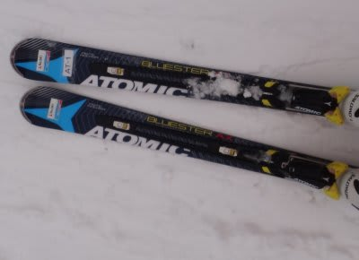
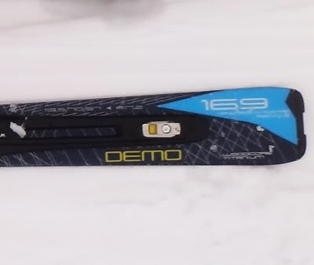
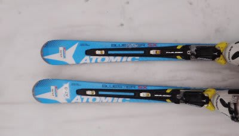
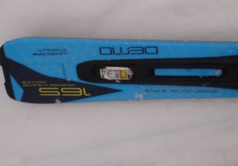
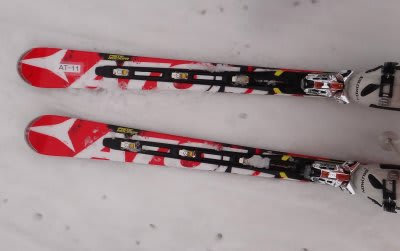
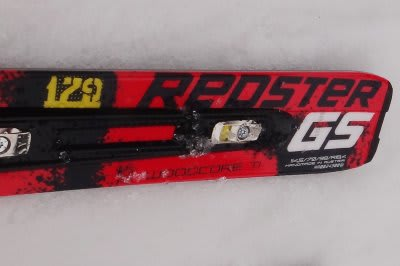

# 2012/2013モデルのスキー試乗レポート　ATOMIC編

📅 投稿日時: 2012-03-16 00:07:21

🏷️ カテゴリ: [スキー板試乗](c0bd8048615710cee890e403a36cc9a2b.md)

試乗レポート，続きます．

今日はATOMIC編で，行ってみよう！

------

○ATOMIC

ATOMIC BLUESTER AX 169cm

オールラウンド基礎板．

今シーズンのD2 DEMO X TypeA の後継機ですね…

名前も変わりましたが，トップロッカーになった上に，コントロールデックの

形もかなり変わってます．

…でも．サイドカーブは113.5-70-97と，今シーズンモデルの113.3-70-97と

ほとんど変わってないですが．

で．DEMO Xの後継機だけど，フレックスの強さはそれほど感じず，

トップからテールまできれいにたわみます．

私が今履いている初代D2は，トップを押さえて角付けをすると，

まず板のトップ部分がたわんで，それが板全体のたわみを引き出して

ターンしていく…

という感じで，角付けをしてワンテンポ待つと驚くべき旋回性能を

発揮しますが，このモデルは「ワンテンポ待つ」がなくなりましたね．

角付けをした瞬間，板のトップがグリップを開始し，向きを変え始めます．

それも，トップを押さえる必要なく，角付けだけでトップが食い込み，

板全体のたわみを引き出して回っていく感じです．

トップを押さえずに，くるぶし荷重でOK.

荷重ポイントは，今風な感じです．

DEMO Xは比較的強いイメージがありますが，思った以上にフレックスは

柔らかく，169cmという長さもあるのか，スーッとたわんで，ミドルターン

くらいの回転弧になっていきます．

得意ターンはミドルターンですね．

驚いたのは振動が異常に少ないこと．

雪面コンタクト性がすごい高い感じがします．

荒れた斜面を滑っても，ばたついた感じが全くちっともこれっぽっちも

伝わってこないという，まるで雪面との間にクッションをはさんだかのような

不思議な安定感．

そのため，荒れた斜面でもけっこうなスピードで安定して下りて行けます．

スピードレンジはハイスピードまで十分耐えます．

スピードを出しても足元のばたつきがなく，ハイスピード時の雪面コンタクトはぴかイチ．

この，振動が少ないことによる「しっとり感」はこれまでのD2とは違いますね～．

切り替えも，これまでのD2と違ってトップをそれほど押さえる必要なく

谷回りに入っていけるので，トップが詰まるリスクも少なく，安定して

切り替えられます．

板が異常に強いわけでないのに，不思議な振動のなさと雪面コンタクトで

スピード耐性が高いという，なかなか面白い乗り味の板でしたね．

ATOMIC BLUESTER SX　165cm

小回りベース基礎板．

こっちは，今年のD2 DEMO X Type-Sの後継機ですね…

去年のXではないType-Sは履いたことがあるのですが．

来シーズンのモデルは履き心地が全く違いますね…

恐ろしいほどの異常な安定感．

脅威の雪面コンタクト．

なんだ！この板は…

トップより，テールより荷重とか，そんなことは全く

気になりません．

どこに乗っても，どこを押さえても曲がる許容範囲の広さがあります．

どう乗っていっても，板全体で雪面を捉えきれいに曲がっていきます．

それも，春のザク雪の荒れた斜面なのに，全くそれを感じさせないで，

まるで整地のように好きなラインで小回りができます．

どこを押さえても曲がるので，基本的に軸を左右に傾けるだけで

楽に小回りに入って行けます．トップを食い込ませたりする必要は

ありません．

やっぱり，この板も腰からくるぶしを結んだ軸を作って，

そこを押さえたポジションキープで，左右に動けば驚きの

小回りに入ります．

板のたわみで曲がる板ではなく，角付けの瞬間から回り始めます．

…これもロッカー効果なのかな？

確か，この板はトップロッカーで，センターはキャンバーだった

気がするんだけど…

また，板のたわみで回るわけじゃないので，切り替えでたわみが

開放されて板がすっ飛んで行き体が遅れる…ってことも

無いです．ローリスクな，安定度の高い板です．

軸の左右の傾きだけで簡単に小回りに入れる脅威の板．

でも，逆に言えば，ちょいと小回りスペシャル過ぎるのかも…

大まわりは絶対不可能，って感じがしましたが．

とりあえず，気に入った．

REDSTER GS 179cm

GS入門用．

GS用ということで，しっかりした大回り板を期待したけど…

DEMO X Type-Aよりずっとマイルド．

かなりフレックスが柔らかく，スピードを出すとかなりたわむので，

179cmとは思えない中回りターンになってしまいました．

…これでGS競技はちょいと無理だぞ．

トーションはそこそこ強めなので，グリップはするんですが，

フレックスがGS用とは思えないマイルドさ．

でも，すごいターンに入りやすいです．

ターン前半の入りやすさは，Type-Aとも共通しますが

切り替えでトップを押さえる必要なく，角付けを入れ替えるだけで

板がすっと谷回りに入っていくので，ターンの導入が楽です．

この板も，くるぶし～かかと荷重をキープしていく板ですね．

朝イチ焼額用大回りマシンと期待した私には，あまりにもたわみすぎて

179cmの板にしては小さく回りすぎてしまい，ちょっと期待はずれでしたが…

体重のない人，脚力のない人がGSに出るにはいいのかも．
