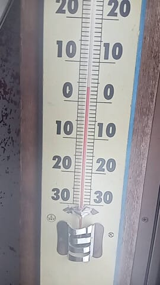
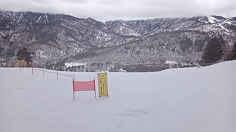
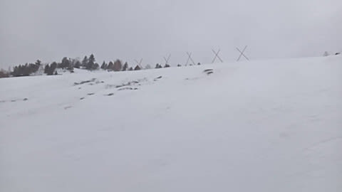
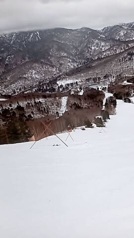
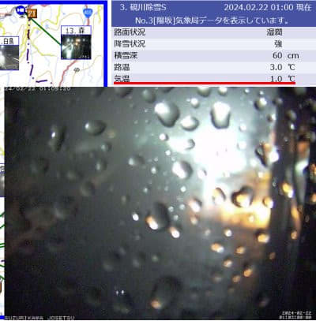

# 2月23，24，25日3連休の志賀高原スキー場の天気は？…23日曇り時々小雪，24日朝は曇り時々小雪，午後は晴れ間も？25日は朝曇り～晴れ，午後は曇り

📅 投稿日時: 2024-02-22 02:46:18

🏷️ カテゴリ: [スキー天気予想](c6554f5c3c106093b511a8daae23757e8.md)

えー．

どうやら本日，21日水曜日の志賀高原も，

一日高温の雨だったみたいで…

特派員からの写真を見ると．

朝の気温が＋4℃（涙）

今日もダメダメの天気か…

ゲレンデの雪は，2日連続の高温の雨で，

かなり溶けてしまったようです…（涙）

オリンピックコースの入り口に，

ブッシュが出ているとの注意看板が

出ていると思ったら…

’

かなり広い範囲で土が出ちゃってた

みたいです（激涙）

いや．

これ，ヤバいですね…

特派員曰く，

「オリンピックコースは風前の灯」

という一言が…（泣）

そのほか，GSコースの一部やブナコースの

一部も土が出始めてて．

今，ホントに2月か？？？

というゲレンデ状況になっちゃったみたい

です（泣）

…ただ，まだ土が出ているのは一部のみ．

コースのほとんどはまだ雪があるようですが…

でも，2月でこれってのはちょっとヤバい

感じです…

そして．

志賀高原は，深夜1時現在で雨．

ライブカメラのレンズに水滴がついて．

気温が＋1℃…

ホントに2月か？？

（[北信建設事務所道路気象状況カメラ](http://hokushin.pref-nagano-roadcamera.jp/)より）

ってなことで．

これから週末にかけて，

雪がどっさり3mくらい積もってゲレンデが

回復してくれたりしないかな？

と期待して天気図を見るわけですが…

…

…

…

…

ダメですね（泣）

いや．

気温は冷えるんですよ．

22日の昼あたりから結構冷えて，

3連休はそこそこ気温が冷えるんですが．

…でも，積もりません．

雪はパラパラと降るものの…

ほとんど積もるような雪ではなさそうです（涙）

とりあえず．

今日も仕事がまだ終わってないので（泣）

天気図解説は無しで，予想だけ書いておくと．

22日(木)：朝の気温は‐6℃ほど．

　昼間の最高も‐3℃程度で，そこそこ冷える．

　朝は雪，昼間は曇り時々雪がぱらつく．

　朝までに湿った重めの雪が5～10cmくらい

　積もるかも．

　朝はわずかに積もったこの雪でゲレンデ

　状況は一瞬回復するものの，人が滑ると

　下地の硬いのがすぐ出てきそう．

　急斜面では，かなり固めのバーンに

　やられそう．

23日(金，祝)：朝の気温は‐8℃くらい．

　昼間も‐5℃前後と，この時期とすれば

　普通の冷え込みに戻ってくる．

　天気は朝は曇り時々小雪．

　積もるほどの雪ではない．

　斜面が急なバーンは昼頃になると

　下地の硬いのが出てくる．

　かなりのバーンでツルツルガリガリ祭りが

　開催されるか…

24日(土)：朝の気温は‐9℃ほどと

　冷え込みそう．

　天気は朝は小雪がぱらつく曇り空．

　昼から午後に向かって天気は回復

　していくか…

　でも，昼間もせいぜい‐5℃程度と

　気温は低いので，バーンはかなり

　固めの下地．

　これもじきに急斜面は下地のツルツルが

　磨かれたアイスバーンになる可能性が…

25日(日)：朝の気温は‐7～8℃くらい？

　昼間も‐3℃程度までしか上がらず，

　この日もまぁまぁの冷え込み．

　天気は朝のうちは日も差すかもしれないけど，

　午後は曇り空，夕方ごろに雪がちらつき

　始めそう…

　この日も雪が積もらないので，朝から

　バーンは固め．

　終日硬めの雪にいじめられそうな一日(泣)

…という感じでしょうか…

とりあえず．

明日は朝までの積雪で，ちょっとでも

ゲレンデが回復してほしいところ…

せっかく冷えたのに雪が降らないと，

雨で融けた雪が凍るだけなので，

全面アイスバーン祭りになり，かなり

悲しいんですが(泣)

とりあえず．

来週もちょっと雪が降るようなので，

そこに期待…

…でも．

ドサドサ降ることはなさそう(涙)

## 💬 コメント一覧

### 💬 コメント by (レインボー76)
**タイトル**: Unknown
**投稿日**: 2024-02-22 13:48:43

木曜日の志賀高原情報

朝の蓮池-5℃。湯田中から上までずっとあられ混じりのみぞれ。

日体大検定のため8時00分開始のニゴンスタート。

パノラマからサウスへ。シーズン最硬。パノラマもイースト(三高)もかっちかち。ゴーグルは凍って視界不良。

オリンピックが開いてたので入ったらブッシュ、石ころ、大石、カチカチでこぼこの洗礼を受けました。閉めといてよと思いました。(書いてあったのかも？でも滑ってたら読めないです)

その後、雪になってから状況は好転。

GSも白樺も唐松もサウスも、うっすらと新雪が乗って、滑りやすくなってきましたが、11時終了。明日は更に冷えそうです。

### 💬 コメント by (Skier_S)
**タイトル**: ＞レインボー76さま
**投稿日**: 2024-02-23 00:31:46

シーズン最硬だったんですね…

午後はもっとすごかったみたいです．

明日はまたさらに硬くなります…（涙）

しばらくは雪が積もらないので，根本的に改善しそうにないです．

あぁ…トップシーズンの2月というのに…

