# 1月7，8，9日の3連休のスキー場の天気は…危険な南岸低気圧を無事乗り切れるのか？まさか…雨？？

📅 投稿日時: 2017-01-05 01:47:12

ということで．

大人の事情で昨晩帰宅したばかりというのに．

本日も日帰りで志賀高原へ行ってしまった，

Skier_Sです．

うーーーむ．

つい先日．

20000mクラブのとある方が，

ラストリフトを滑ったあとに関東へ帰宅したはずなのに．

次の朝イチからまた志賀高原を滑っているという

恐怖のイリュージョンを見て．

「え？自宅滞在5時間で関東⇔志賀高原一往復！？

　…自分は絶対そんなことできない…

　お，恐るべし，20000mクラブのおかしい人すごい人！！」

と，思ったばかりなのに．

…まさか．

まさか，それを自分がやってしまうとは…

人間，正常な判断力を失うと

とんでもないことをやってしまうということを

学びました．←なんのこっちゃ？

ってことで．

本日の志賀高原，朝イチは晴れて，

最高の圧雪バーンを楽しめましたが．

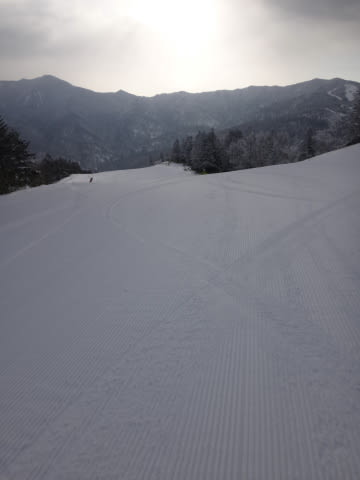

平日というのに人は多く．

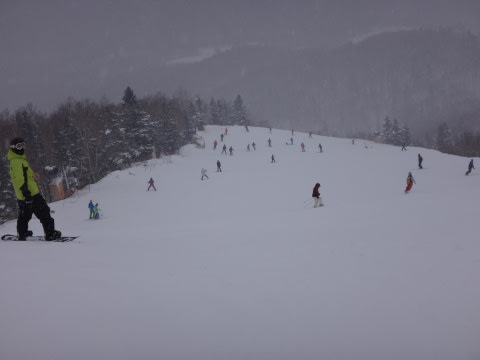

そして，昼前にはガスがかかりはじめ．

午後はかなり視界が悪い一日でした…

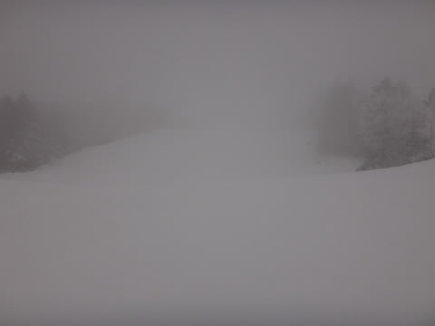

本来なら，本日は．

このゲレンデ状況をレポートするところですが．

それも，無謀日帰りで帰宅が遅いので．

速報でレポートして，速攻で寝たいところですが．

なんと．

正月休みが終わったばかりというのに，

もうすぐ3連休じゃありませんか！！

ということで．

スキーに嵌ってしまったおかしい人たちからの

3連休の天気予想のリクエストがありましたので．

本日は眠い目をこすりながら，天気予想に行ってみるのだ．

えー．

まずは，あした．

5日の天気ですが．

をを！850hpa気温図は，水色の-9℃線が

志賀に近づいているし．

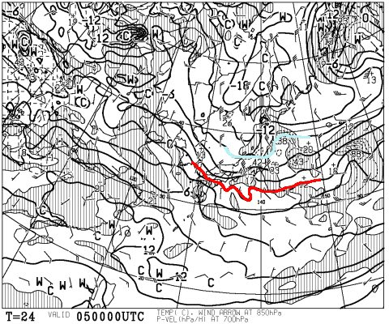

地上天気図は，東日本は冬型の形をしてます！

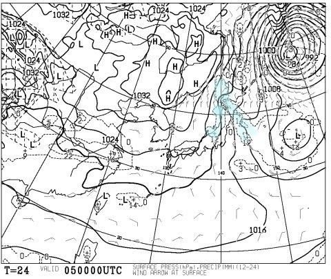

日本海に水色で塗った降水域も予想されているので．

…これは．

5日の志賀高原は，終日-10℃以下の，

冷え冷え雪降りデーになりそう！

そして．

3連休の前日，

6日は…

ふむ．この日も850hpa図の-9℃線が志賀高原近辺に

かかってるし…

地上天気図は，冬型が緩んで

高気圧が近づいてきてますね～．

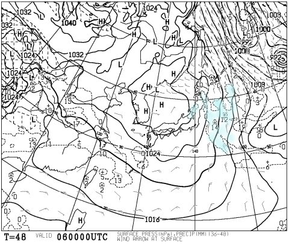

だもんで．

この日は朝まで雪が残るかもしれないけど．

朝まで降った雪がきれいに圧雪された，

トップシーズンらしいやわらか圧雪バーンが

楽しめそう…

非圧雪コースは，ブーツパフくらいの

パウダーが行けるかな？？

6日はかなりいいコンディションだろうなぁ…

で．

3連休に入って．

初日，7日ですが…

…

…

あれ？？

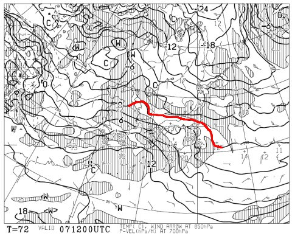

な，なんてこった…！！

赤くマークした0℃線，志賀高原に近づいてるじゃないかっ！？？

そして，地上天気図は…

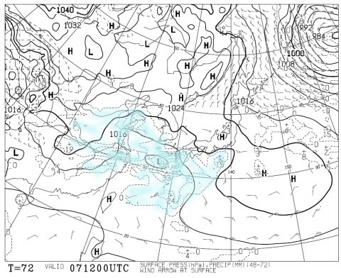

何か，西からひたひたと近づいてます．

そう．

降水域を伴った低気圧が，ひたひたと迫ってます…

…でも．

7日はまだセーフ．

気温は上がるけど，晴れそう．

雲が多めかもしれないけど，日差しも期待でき．

降られることなく過ごせそう…

そして．

中日の8日，だ．

850hpa図は…

うぐぐぐぐぐ．

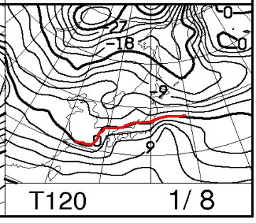

0℃線はぎりぎり志賀高原…

これは，危険だ．

そして，地上天気図は…

見事な南岸低気圧．

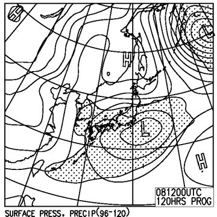

降水を示す網掛けは，本州全域をほぼ覆っており．

…これは．

志賀高原は雪か雨かきわどいところ．

0℃線の位置がわずかに北にずれれば…

…雨！？？

とりあえず．

標高が低いスキー場，群馬や岐阜のスキー場は

雨を覚悟しておきましょう（涙）．

志賀高原も，雪が降ってもかなり重い雪です．

で．

最終日の9日は…

をを！

0℃線が南に下がってくれます！

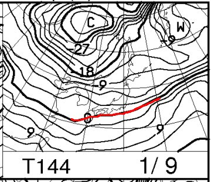

ちょっと一安心…

地上天気図はこんな感じで，

しっかりした冬型の天気図ですな．

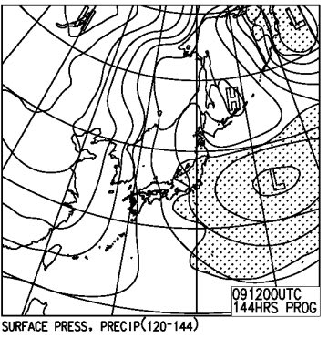

だもんで…終日雪がちらつくかな．

ってことで．

まとめると．

3連休前：5日は終日冷え冷え雪が積もる！6日は朝まで雪が降ってるかもしれないけど，

　晴れて，最高のコンディションになりそう…

7日（初日）：雲は多いものの，おそらく晴れ．時折雲が太陽を隠すか…

　気温は朝は-5度程度だけど，昼間は0℃近くまで上がり，

　この時期としては暖かい．

　雪質は朝は最高！いい感じでかっ飛ばせる圧雪バーンになりそう！

　昼は南斜面はちょっと日差しで緩むか…

　でも，天気も良く滑りよい一日．

8日（中日）：朝は曇り，気温は朝から高め．

　昼すぎごろから，ウエアに着くとすぐ融けるような

　重い雪が降り始める．

　まだわからないけど，運が悪ければ標高が低いところは

　雨っぽくなる可能性も…

　

9日（最終日）：前日から雪がぱらぱら降り続け，朝は重い雪が

　積もっている．圧雪バーンは圧雪の上にうっすら新雪か？

　終日曇り～雪．この日の気温は平年に近い冷え込みに戻る．

という感じかな…　

まだ，8，9日はどうなるか，詳細には

分かりませんので，また後日，追って詳細予想情報を

追加します…

うーむ．

しかし．

8日が危険．微妙．

低気圧がもう少し北に行く予想になると

アブナイ…

なぜ，3連休を狙ってこんな天気に…（涙）．

とりあえず，

8日は低気圧がそれほど北上しないよう，

フルパワーで祈りますので．

志賀は雪になるはず．

いや，私が雪にしてみせますので，

大丈夫なはず！！←志賀高原の天気を決めているのはお前なのか！？？

…しかし．

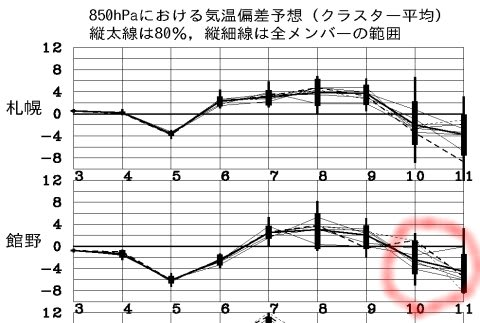

あれ？？

3連休が終わった10日から…

冷え冷えで，いい雪が降りそうな予感…

なぜ．

なぜ，3連休が終わってから…（涙）

## 💬 コメント一覧

### 💬 コメント by (Goku)
**タイトル**: 新雪入荷中
**投稿日**: 2017-01-05 11:45:53

只今ヤケビ、朝から新雪ドカドカ入荷中♪

ちょっと水分がある雪なので、しっかり積もりそうです。ってかほとんど吹雪で視界ありませんけど…

### 💬 コメント by (Skier_S)
**タイトル**: Gokuさま
**投稿日**: 2017-01-06 03:01:22

あら．

本日もすべってたのですね…

うらやましいです…

でも．今日の積雪で，

3連休はブッシュの心配をせずに

済みそうですね～！

また3連休にお会いしましょう！

### 💬 コメント by (ゆうこ)
**タイトル**: やっとシーズンイン
**投稿日**: 2017-01-06 20:14:52

ご無沙汰してます。

明日からやっとシーズンインです。

いつもの宿に泊まる予定です。

昼間は、半分くらいはダイヤモンドで子どもとソリしてます。

見かけたら声かけてください！

黄色のウェアに赤のパンツ、子どもは水色のウェア着てます。

### 💬 コメント by (Skier_S)
**タイトル**: ゆうこさま
**投稿日**: 2017-01-06 23:48:45

お久しぶりです！

ようやくシーズンインですか．

私は今回家族連れではないので，

いつもの宿ではないです…

子連れじゃないので，ひたすら焼額

ぐるぐるしてると思います…

もし，見かけたらよろしくです～

