# BRレガシィのナビの外し方…KENWOODの彩速ナビのMHLケーブルを差し替えてみた

📅 投稿日時: 2017-07-26 02:12:58

🏷️ カテゴリ: [車](cba0e8330b3f2ded7c1addfacc75d4547.md)

ということで．

[昨日の記事](e539b891ae419b0a5fe4f51c7b1f0534f.md)の続き．

接触不良を起こした，BRレガシィ君のナビに刺さっている

MHLケーブルの差し替えのため，ナビの取り外し作業に

かかったわけですが…

まず．

ナビを外すには．

初めに，センタークラスタパネルを

外さなくてはならないわけですね．

だもんで，センタークラスターの角で，

周りのインパネを傷つけてしまわないよう，

テープで周りのインパネ部分を養生しましょう…

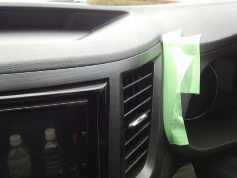

養生が済んだら，センタークラスタ上部の隙間に

内装はがし（私は内装はがしをもっていないので，

細いマイナスドライバーで代用…傷つけないように注意！）

を差し込んで…

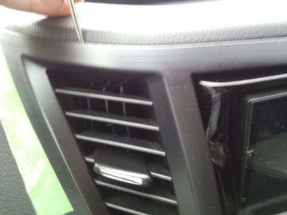

軽く手前に引っ張ると，こんな感じで簡単に外れます．

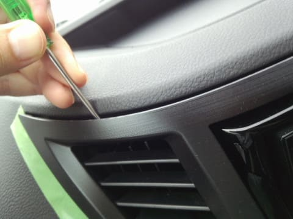

後は隙間に手を突っ込んで…

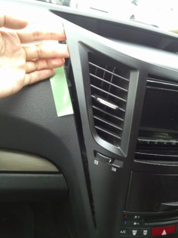

手前に引っ張ると，上側のフックは

簡単に外れていきます．

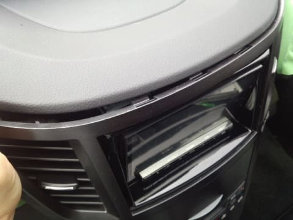

横にもこんな感じでファスナーがついてますが…

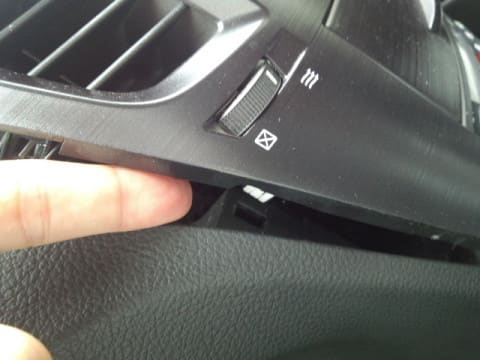

センタークラスタを手前側に引っ張れば，

全てパコパコと簡単に外れます．

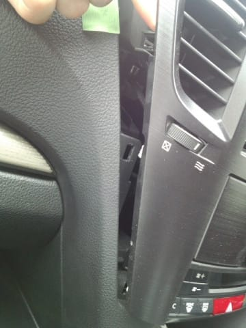

はい，外れました～！

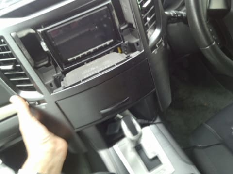

こんな感じで，トップ側5か所のフック，

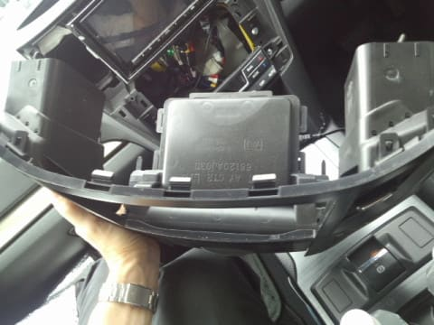

そして，サイド側は左右に2か所ずつのフック＆ファスナーで

止まっているように見えますね…

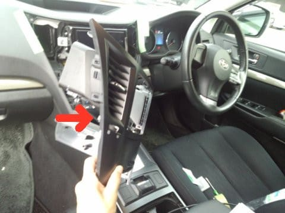

ちなみに，センタークラスタの裏側はこんな感じ．

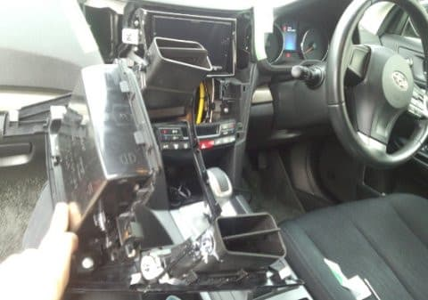

さて．

これで，ナビ様とご対面できたので．

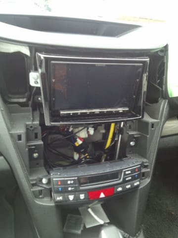

次は，ナビ本体が止まっているねじを外します…

まずは，このネジを左右1本ずつ

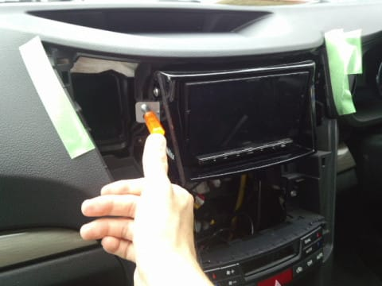

そして，このネジも左右1本ずつ，

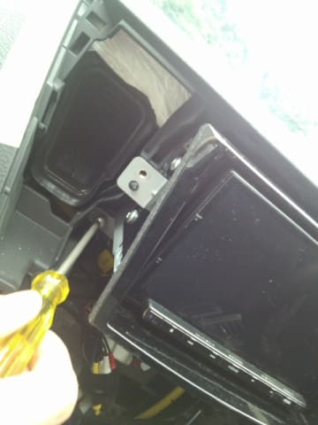

この，計4本を外せば，ナビの固定が外れて，

手前に引き出せるようになります…

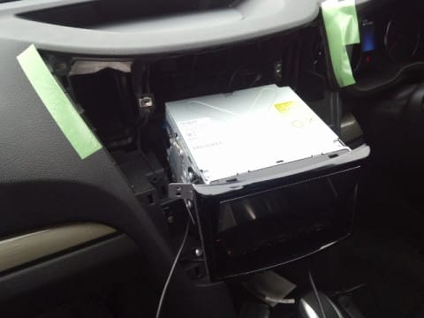

あとは，ナビの後ろに手を差し込んで，

MHLケーブルをコネクタから抜いてやって…

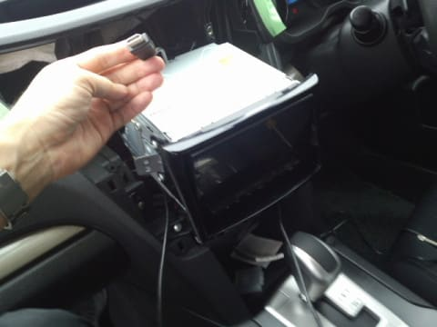

新しく買ったケーブルをそのコネクタに

差し込みます．

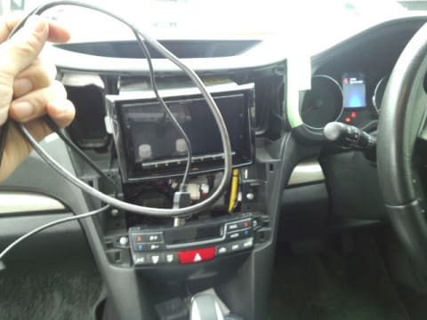

差し込み終わったら，スマホにつないでみて，

正しく動作するか確認してみましょう…

うーむ．

ホントに今回の故障，単なる断線だったのか？？

それとも，ナビ本体のどこかが故障しているのか…？？

ドキドキの一瞬！！

いざ，起動！

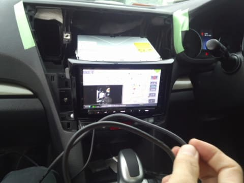

をを！！

ちゃんとスマホ画像が写ってますよ！

（このシーンをスマホで写真に撮ろうとしてるところが写ってる…）

ということで．

どうやら，ナビ本体は壊れておらず．

このケーブル交換で無事直りそうです！

ひと安心…

ということで，あとはナビ様をもとの位置にもどして…

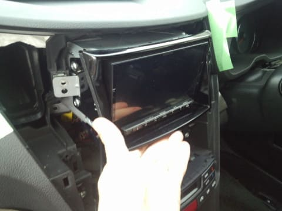

元通りねじ止めして…

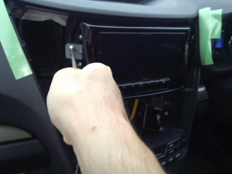

あとは，小物トレイの12Vソケットのあたりの

天井から，ケーブルを通してやって…

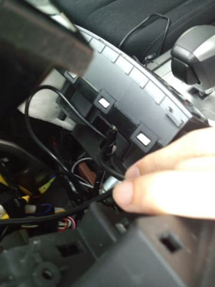

私の場合，ここからMHLケーブルが

出てくるようにしてます．

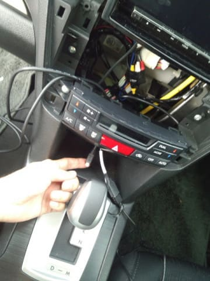

ということで．

ここまでできたら，あとはセンターコンソールをはめるだけ．

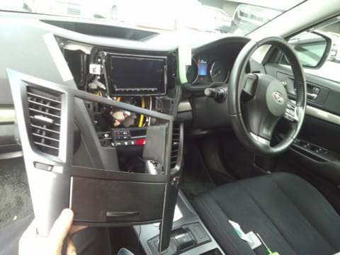

位置を合わせたら…

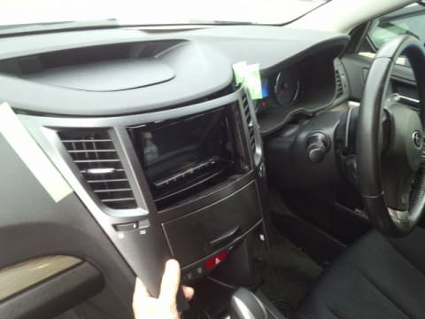

あとはぐっと押し込んでやれば，

はまります．

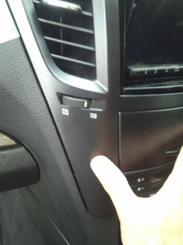

グイッと押し込んでいけば…

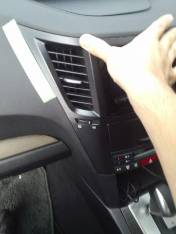

こんな隙間があったところも…

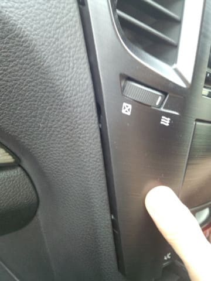

こうやって，ぴったりはまります．

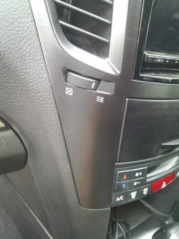

…ということで．

無事完成！

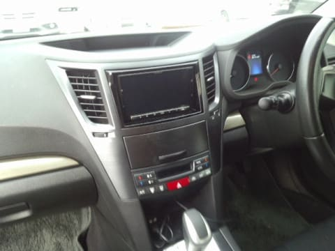

写真を撮りながらやっても，

作業時間はせいぜい30分程度．

ちょいとめんどくさかったけど，

ケーブル代だけで修理できたので，

良しとしておこう…

ってな感じで．

もう少し乗ることに決めた，BRレガシィ君．

これで，ナビもあとしばらくは

元気に動いてくれるかな…
