# 2014年10月，小学生の子連れでパラオへダイビングに行ってみた，その１…怪我した娘を連れて，いざ出発

📅 投稿日時: 2015-07-16 00:59:06

🏷️ カテゴリ: [ダイビング日記](ce3a7a8d424d112fce83ee85c81a0e344.md)

というわけで．

娘が怪我した翌日．

…パラオへの出発日．

…この日は，夜出発なので．

娘は学校へ，私は仕事へ行くわけですが．

娘はテープだらけの顔を友達に見せたくないらしく，

朝「学校行きたくない～（泣）」

とゴネたようだけど．

痛みはだいたい収まったらしく．

ちゃんと学校へ行ったようで…

とりあえず，ちょっと安心．

で．

この日．

私としてはありえない「早上がり」で急ぎ帰宅し，

夕暮れ時に，成田空港へ到着…

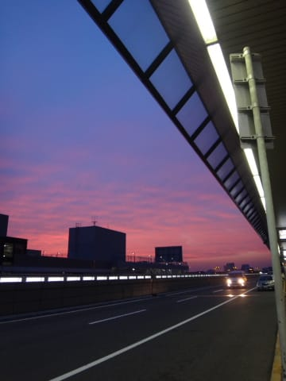

…そして．

空港につきましたが．

…

…

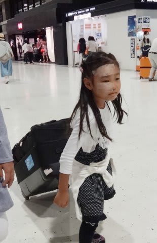

あー．娘よ．

顔全体がテープで覆われていて．

かなり痛々しいなぁ…（涙）．

まぁ，触ったりしない限り，もう痛みは

ほとんどないらしいのですが…

…ホントに．

なぜ．

よりによって，パラオに行く前日に…（泣）．

写真を撮ろうとすると，怪我した側を

隠すようにポーズをとる娘．

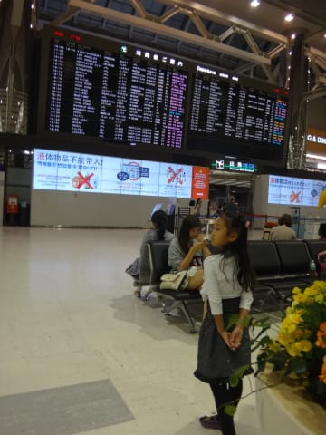

…

…うむ．

わかる．

わかるよ，その気持ち．

ってことで．

なんてったて，仕事が終わってから駆け付けた成田空港．

到着したのは，出発時間にきわどい到着だったので．

出国審査を通ると．

すぐに搭乗時間になり…

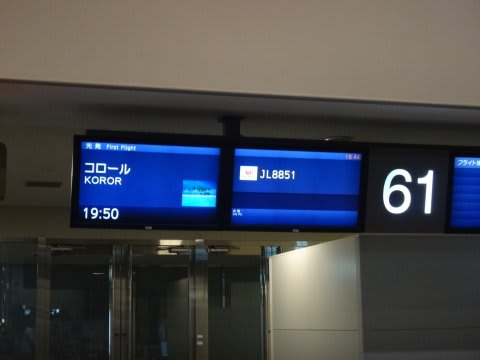

いざ，JALチャーター便へ搭乗！

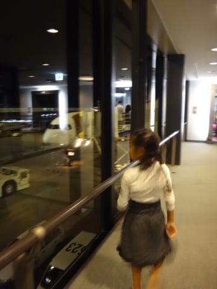

…もう，国際線には慣れっこの娘．

飛行機に乗る前からすごく楽しみにしていて．

映画を見たり…

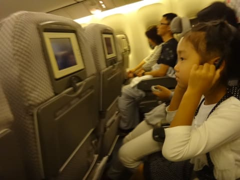

これも楽しみにしている「飛行機のお弁当」を食べたりして．

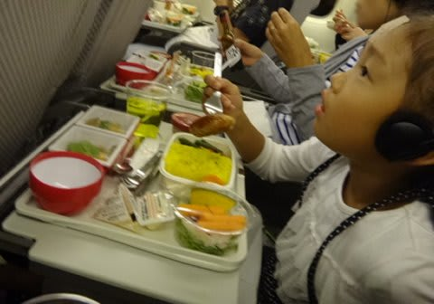

余裕でくつろいでます．

そーいや．

普段はスターアライアンスを愛用し，

NHやSQに乗ることが多い我が家．

実に久しぶりに，JLの国際線に乗ったけど．

ビールがプレモルだったり…

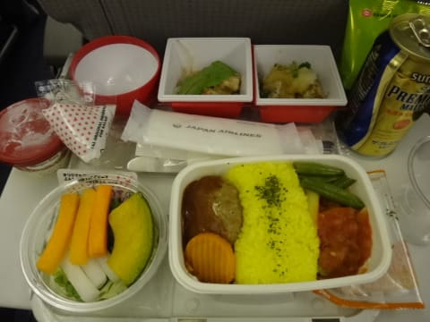

デザートのアイスがハーゲンダッツだったり．

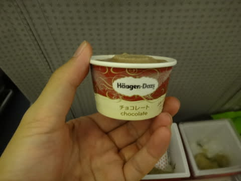

意外と高級か？？

娘も生意気にふんぞり返りながら，アイスを食べてたけど…

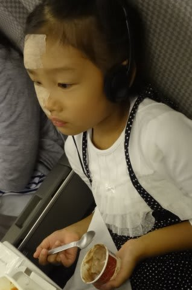

＃やっぱりテープが痛々しい…

やはり深夜便なので，いつも通り，

ぐっすり寝てしまう娘．

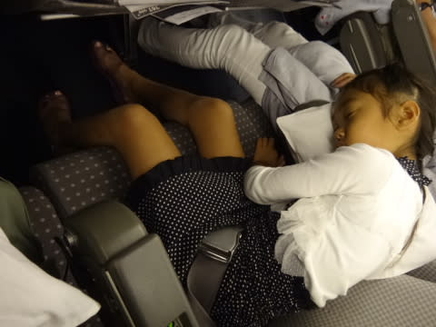

＃怪我してる側を下にしてるけど…痛くないのか？？

ということで．

成田からはわずか4時間半ほどのフライト．

食事を食べ終わって2時間も経たないうちに，

パラオに到着！

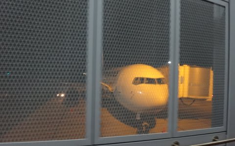

うーむ．

グアム乗換に比べると．

やっぱり，直行便は楽だわ…
