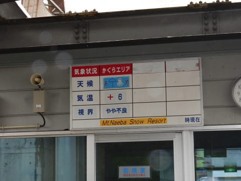

# 5月28日（日），かぐら営業最終日の詳細レポート…残念ながら雨＆ガスだったけど，雪はたっぷりのファイナルデー！

📅 投稿日時: 2017-05-30 02:25:41

ということで．

かぐらもついに営業終了してしまったのですが．

まだ雪がたっぷりなので，今週末が滑れないと

未だに呑み込めていないSkier_Sです．

本日は．

昨日速報した，かぐらファイナルデー．

写真たっぷりでの，詳細レポートです！

えー．

まず．

朝，かぐらへ向かう道が．

かなり本格的な雨，なんですが…（激涙）．

天気が悪いので．

先週激込みだった，朝イチのロープウェー

待ちも短いですね…

雨の天気表示板が悲しさを誘います…

気温はかぐらエリアで+6℃と．

日が射さないと，ちょいと肌寒さを感じる

程度の気温のようで．

ロープウェーでみつまたゲレンデにあがると…

うはーーー！

雪が減ったなぁ…（涙）

でも，まだみつまた高速リフトまで

雪の上を滑って来れるだけましか…

しかし，この一週間の雪の消え方．

かなり早かったようで…

みつまたエリア，完全に

廊下になっちゃってますね．

とはいうものの．

例年，最初に雪がかなり危なくなる

みつまたからゴンドラ乗り場に滑り降りるコース．

まだかなり雪がついてたし…

例年に比べれば恵まれてるよ！！

…って感じで．

ゴンドラに乗って，かぐらエリアにやってきたわけですが…

…

…すごいガスだよ（涙）

ここ，正面にかぐらメインバーンがすっきり見える

場所なのに…

何も見えない（泣）

リフトに乗ってゲレンデに出ても…

雨＆ガスでまともに前が見えない…（涙）

ゲレンデの雪質は．

雨が降っているので．

当然のごとく，たっぷり水を吸った雪です（悲）

まぁ，雨が降ってくれた方が，板が

滑るので良しとしておこう…←無理やりポジティブシンキング

そして．

天気が悪いので，リフトも混まなかったので．

これも良かったとしておこう…←強引にポジティブシンキング

って感じで．

雨が降り，前が見えないゲレンデを．

気分がくじけそうになりながら滑り続けます…

そして，見えない中．

コブ溝に土も出てくるようになり（泣）．

さすがの私も，

「もう，帰ろうか…」

と思った，午後1時半ごろ．

ををををを！

雲が，

雲が切れ始めてきました！

メインバーンの上半分だけでしたが．

ゲレンデが見えるようになってきましたよ！

ゲレンデが見えるタイミングを利用して．

ジャイアントコースを見に行ってみましたが…

あら？

先週はほとんど土が出てなかったのに．

かなり土が出てますね…（泣）．

そして，かなりブッシュも出てるんですけど！（涙）

うーむ．

コブも浅いし，かなりコブ溝に土が出てるので．

ちと楽しくないかな～．

…と，メインゲレンデに戻りますが．

ガスが切れたのは一瞬で．

すぐ，またガスが出てきちゃいました…（涙）

ダメだ．

今日はやっぱりダメか…

でも．

天気が悪いおかげで．

午後は，リフト待ちはかなり短く．

タイミングによっては飛び乗り！

まぁ，天気の悪い中滑ってるので．

これがせめてものご褒美（？）だよなぁ…

と，しばし滑っていたところ．

今度は午後2時半を過ぎると…

をを！

今度はすっきり晴れてきました！

かぐらゲレンデの下まで，すっきり見えるように

なってきました！

いや…

ゲレンデが見えるって，素晴らしい…

しかし，ゲレンデが見えるようになると．

ありゃ？？

ありゃりゃ…

メインバーンも，もうかなり

土が出てきてるのが，良く分かり

ますね…（涙）．

とはいえ．

まだメインバーンのほぼ幅いっぱい

雪が残ってますし．

パークもまだ全然大丈夫だし．

まぁ，ファイナルデーでこれだけ雪があれば，

ゼイタクでしょう！

…しかし．

先週はまだ滑れたテクニカルコース．

下側はもう完全に終わっちゃってますし．

ジャイアントコースも，ボトルネック部分は廊下状態に

なっちゃってるのが，ちょっと残念…

＃この時期に雪が増えたら，いろんな意味で怖いけど

ということで．

なぜか営業終了1時間前に，わずかに晴れるという

ファイナルデーだったわけですが．

まぁ，最後はいつも通りの全面コブ状態となり．

この日の16時をもって，かぐらエリアの今シーズン

が終わったのでした…

そして，今シーズンの名残を惜しみつつ．

下山を始めますが…

ゴンドラコース．

営業最終日まで，しっかり雪の厚みがある

状況で残りましたね～！

いつもは途切れそうになる部分も，

安心して通れるレベルですし…

ゴンドラ乗り場前も，まだまだ

雪はいっぱいあるし…

最終日の夕方まで，みつまたからゴンドラ乗り場へ

下りるコースが無事に残っていたなんて…

私の知る限りでは，初めてです！！

んで．

みつまたエリアも…

コース幅は狭くなったけど．

ガッツリ硫安で固めた雪の上を滑って

帰れます．

いやーー．

いつもなら，営業終了2週間前くらいの状況なので．

まだ，シーズンが終わるという感じが無いんですが．

来週も営業してほしいくらいなのですが．

…でも．

泣いても笑っても，本日で

今シーズンのかぐら営業は終了．

ロープウェーに滑りこんで．

今シーズンのかぐら滑走も，これで

終わりです…

あぁ…

来週は，もうここが滑れないのか…

と思いつつ，ロープウェーを下山し．

今シーズンのかぐらにお別れを告げたのでした…

（悪天候だったので，満車にならなかった駐車場）

しかし．

いつもなら．

「これ，営業できるのか？」

というほど雪が減っても．

[すさまじい根性で営業を続けるかぐらスキー場．](e1b1b0bbedf7954674e12476c8a823b3a.md)

とてもこれが，この日で営業終了する

ゲレンデと思えない…

例年の根性があれば．

あと2週間は営業できそうなんだけどなぁ…

あぁ…もったいない…

## 💬 コメント一覧

### 💬 コメント by (まいる)
**タイトル**: 今シーズン終了ですか？
**投稿日**: 2017-05-30 19:57:09

Sさん、お疲れさまです

今シーズンのスキーは終了ですか？

今シーズンは雪が多くて良かったですねー

そーそー、先日の回答ですけど、私が買ったカメラは、EOS kiss x7です。

### 💬 コメント by (しんちゃん)
**タイトル**: お疲れ様でした
**投稿日**: 2017-05-30 22:23:00

かぐら最終日のご滑走お疲れ様でした!(^^)!

綺麗な写真がいっぱいで、Nikon AW130調子よさそうですね。悪天候の中、防水機能が威力を発揮したのではないでしょうか(*^^*)

今後も綺麗な写真や、試乗レポート、転倒回数報告等々楽しい話題を楽しみにしております。

### 💬 コメント by (Skier_S)
**タイトル**: まだシーズンは続く
**投稿日**: 2017-05-31 03:01:26

＞まいるさま

いやー．

まだ月山がありますよ！

シーズンはまだ続きます～！！！

カメラ，Eos kissですか…

一眼買われたんですね．

私も一眼レフ欲しいのですが，

お金が…

＃あと，コンパクトデジカメに慣れると

＃大きなカメラを持ち歩くのが億劫に

＃なってきました（笑）

＞しんちゃんさま

終わっちゃいました…かぐら（涙）．

Nikon AW130ですが，ホワイトバランスが

不安定なのか，雪の色がコロコロ変わって

見えるのがちょいと不満…

特に晴天時の色温度が高すぎ．

青空と一緒に雪面を写った写真では，ほぼ確実に

色相がシアン側にコケます（涙）．

いろいろあるのでAW130 の使用レポートは

また後日書く予定です（笑）．

お楽しみに～！！

