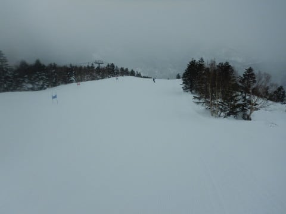
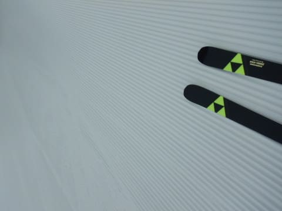
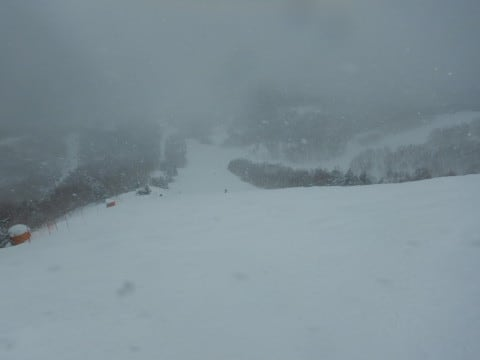
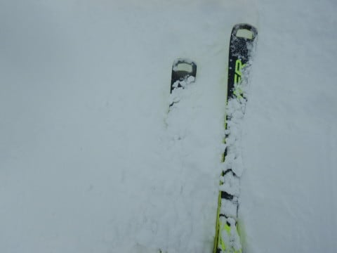
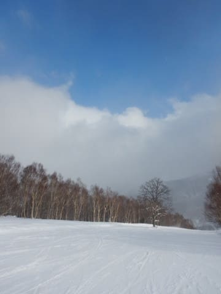
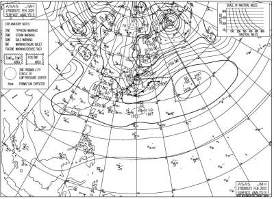
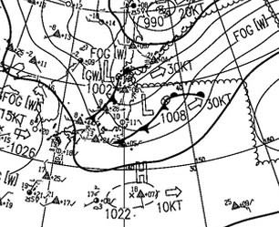
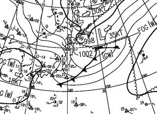
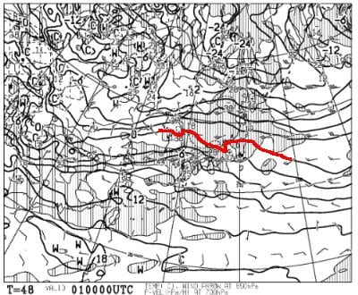
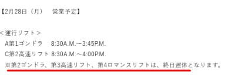

# 2022/2/27(日)の志賀高原スキー場，速報レポート！…終日雪．午後は弱まったものの，予想外れて午前激しく降る

📅 投稿日時: 2022-02-28 01:23:32

えー．

今日もいつも通り営業終了までしっかり

滑って，遅めの帰宅だったので，

本日の志賀高原，いつもの速報モードにて！

ってなわけで，日曜の志賀高原ですが．

金曜の予想では，

　天気は基本的に終日曇り．

　時折薄日が射したり，

　雪が舞ったりという天気．

という予想だったんですが…

まぁ，朝イチは曇り空で．

そして，気温も－6℃予想に対し，

－7℃と1℃の誤差で．

さらにいい感じの冷え冷えシマシマバーン

だったので…

金曜段回の予想の，

　おそらく朝は曇り．

　朝の気温は－6℃程度．

　あさイチはしっかり締まった

　スピードが出るシマシマ！

という部分までは，

「大体予想通りの天気だな…」

と思っていたところ…

なぜか，朝9時頃から激しい雪になり．

そのまま昼過ぎまで，視界が悪くなるほどの

ガン降りの雪になりました（涙）

午前中は圧雪バーンにも雪が積もっていく

ほどの激しい降りで．

根性の無いスキーヤーがふるい落とされていく

天気となり…

数多くの人から，

「こんなに雪降る予想でしたっけ？予想外れてません？」

と，チクチクいじめられました（激涙）

でも，午後2時頃には雪が弱まり，ほぼ止んだし．

さらに，昼ごろには日が射すタイミングもあったし…

さらに，朝イチから午前10時ごろまで，

奥志賀ゴンドラは強風で運休だったし．

午後もちょっと風が強くて，焼額は

第2ゴンドラも減速してたし．

雪は終日冷え冷えでいい感じだったし…

　午後に向かって気温が冷えて

　行くので，雪は終日緩まない．

　ちょっと風が強くなる時もあり，

　ゴンドラが減速する時もあるかも．

って部分も含め，午前中のガン降りの雪以外は，

予想が当たってるんですが←ここ強調しておくところ

…でも．

午前中のガン降りの雪は予想してなかった…（涙）

で．

なんで予想以上に雪が降ったのかしらん？？

と．

いつもの予想天気図ではなく，日曜午前9時の

解析天気図を見てみると．

…これ，前線が二つに分離してる！

朝9時に志賀高原の北側直近に

寒冷前線がいて，こいつが午前中に

志賀を通過して，激しい雪になったんですね…

午後3時の段階では，志賀を通過した前線は

消滅して，南側の前線だけになってるし．

…こんな，午前中に志賀高原を通過する前線．

金曜段回の予想天気図にはなかったよ…（泣）

うん．

しかたがない．

今回，予想図になかった前線が発生して，

予想を外したのはしかたがない！！←自分への言い訳

…とりあえず．

なぜ今回予想が外れたのかが気になって，

ついつい必死に帰宅後に原因を調べてしまった，

Skier_Sだったのでした…

で．

今後の天気ですが，

28日は意外と朝らか終日いい感じの晴天で，

かつ冷え冷えなので…

かなりいいコンディションなんじゃないかな？

で．

3月1日ですが…

これはヤバい感じ…！！

なんと．

850hpaの0℃線が，志賀高原より

北まで上がっちゃいます！！

これ，降れば液体の可能性が高いのですが…（涙）

とりあえず，1日は何とか夕方までは

降らずにいてくれそう．

降るのは夜からになりそうなので，

地上の気温が下がる夜なら，志賀は

液体にならずに済みそうかな…

ただ，1日の夜から2日の朝にかけて，

かなり湿っぽい雪になり．

標高が低いところは，降り始めは

みぞれっぽい感じになるかも…？？

そのあとはしばらく天気が良さそう

ですが．

次はちょうど5，6日の週末にちょっと冷えて，

雪が降りそうな予感…！

とりあえず．

今のところ，1日夜はちょっとヤバそうですが．

志賀は液体になることはなさそうなので，

ちょっと安心です…

ってなことで．

明日また本日の志賀高原詳細レポートします～！

PS.

28日月曜，天気は良さそうですが

焼額は第2ゴンドラ動かないので

ご注意を！

（[焼額山ホームページ](https://www.princehotels.co.jp/ski/shiga/winter/)より）

## 💬 コメント一覧

### 💬 コメント by (スシネコ)
**タイトル**: Unknown
**投稿日**: 2022-02-28 12:57:20

Ｓさんのことだから、速攻で予報差の原因究明をするんだろうなぁ、と思っていましたｗ

この天気図で寒冷前線が通過すると、現地ではああいう天候になるのだなぁ、と脳内名寄せして気象情報も楽しく読ませていただきました。

p.s.

「ふるい落とし機能」の発動、人が減るので実は私、大好きだったりして･･･

### 💬 コメント by (副院長)
**タイトル**: Unknown
**投稿日**: 2022-02-28 17:54:05

本日月曜日、良い天気で、奥志賀、焼額山、一ノ瀬、高天もバーンは良好でした。ただ、一ノ瀬あたり、16時半までリフト営業なんですよね。1ゴン最後に乗ると、第2高速16時終了に間に合わない。西館に泊まってるものとしては　一ノ瀬グルグルして、マージン取って、16時25分にダイヤモンド乗るのは意味あるかな？玄関to1ゴン改札約6時間かけて来てる私としては、25分延長は、有意義かなとか、考えさせるほど、良い天気でした。

朝一を攻めろって話もありますが、朝弱いんです。

### 💬 コメント by (Skier_S)
**タイトル**: コメント回答遅れました…すみません
**投稿日**: 2022-03-02 02:14:47

＞スシネコさま

外れてすぐ原因を調べてフィードバックし続ける，この営みを10年以上続けたから，

ここまで予想できるようになった…と自負しています(笑)．

ふるい落とし機能が発動すると，ゴンドラ待ちがすくなくなるのは確かに

ちょっと嬉しいかも…

＞副院長さま

月曜は良かったでしょうね～！！

うらやましい…

西館泊りだと，ラストをダイヤにした場合は，山ノ神滑り降りた後，

西館へちょっと登りを歩かなきゃならないのが問題かも…

それが気にならなければ，ダイヤ終了もありだと思います．

でも，朝イチシマシマを滑らないのはもったいない…！！！

