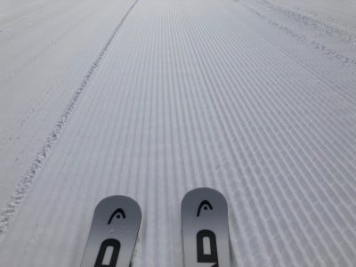

# 2021/2/12(金)の志賀高原スキー場特派員情報…晴れ~うす曇り，気温は上がったけど雪はそんなに緩まず，でも混んだみたい…

📅 投稿日時: 2021-02-13 00:02:27

🏷️ カテゴリ: [日記](cc4b5682fb7b8b144980957a978653fb0.md)

普段のトップシーズンなら，

どれだけ仕事が忙しくても絶対休むはずの

飛び石連休の谷間ですが．

…今年は寂しく，休みを取らずに仕事してた

Skier_Sです．

で，本日も志賀高原特派員情報をお送りするのですが．

…今日は連休の谷間だからか，多数の特派員が

志賀に行っていて．

いつもより大量の写真が手元に集まりました…！

特派員の皆さん，ありがとうございます！

そして，連休の谷間ということもあり，

普段の平日より混んでたみたいです．

ってなことで．

本日の志賀高原ですが．

すっきり晴天というより，うっすらと雲で

太陽が隠された，うす曇りで始まった朝．

あさイチの気温は-6℃と，

ここはおおむね予想通りの

気温になってくれて…

そして…あさイチは見事なシマシマ！！！

みごとなシマシマっぷりに，おこみんも

喜んでます！

(もう，最近はおこみん写真が無いと落ち着かない…）

雪質もいい感じのトップシーズンシマシマ！

うがーー！

滑りたい！！

天気自体は，時折すっきり晴れたものの…

全体的にうっすら雲がかかることが

多かったみたいで．

気温自体は，昼間に+3℃と，

これもまたぴったり予想通りの

気温まで上がったようですが．

薄っすら雲がかかっていたおかげで，

視界は良くて寒すぎないのに，

日が射さなくて雪が緩まない…という，

いいコンディションだったようです！

ただ…

平日と思えないほどゴンドラは混んだようですね…

焼額の1ゴンは15分待ちを超えたのかな？

30分待ちっていう放送もあったようですが…

そして，2ゴンも当然混んでいたようで…

そのほか，奥志賀ゴンドラもゲートの

外まで並んでいたという報告が

ありました．

とは言いながらも．

ゴンドラの輸送定員が原因で混んでいたので，

ゲレンデがそんなに混んでいたわけではなく．

午後になると，ゴンドラ待ちもそれほど

無くなったようで．

いつもよりは人が多めながらも，

コースは好き放題のラインが取れるほどの

人口密度だったようで．

そして，うす曇りのおかげで．

標高が低めのところでも，ちょっと

しっとりしたくらいで済んだらしく．

一の瀬も．

焼額も，夕方まで雪は緩まないで

いてくれて．

終日，フラットないいバーン

コンディションで滑れたようです…！

あぁ…

いいですね…

…そして．

特派員レポートの方が，焼額だけに留まる

私の滑走レポートよりも，いろんなゲレンデの

いろんな写真があっていいかも…！

…と，思った人がいても．

それは決して口にしてはいけません…

(このBlogの主が「自分はいらないんだ…」といじけます）

で．

あと，15日(月)の詳細天気図が出ましたが…

…あう．

志賀高原には，850hpaの+3℃線が…

そして，降水域がかかってるので…

これは，やはり15日は空から液体が

落ちてきます(涙）

それも，朝から降ります．

終日降りそうです．

ただ，強風の南風にはならなくて

済みそうかな…

とりあえず．

週末は雨にならずに良かった，と思うべきか…

## 💬 コメント一覧

### 💬 コメント by (m&t)
**タイトル**: Unknown
**投稿日**: 2021-02-13 03:10:47

Sさん！自粛生活でついつい余計なものを買ってしまいますね・・・。我々二人共、物欲選手権に参戦し、スキーウェアをおろして二年目なのに、また新しいウェアをアウトレット価格で買ってしまいました!

コロナ禍の日本経済に勝手に貢献したとします。

コロナが収まって、またスキー場で皆んなが集まる事が出来ると良いですね。

### 💬 コメント by (レインボー73)
**タイトル**: Unknown
**投稿日**: 2021-02-13 14:52:59

土曜日の志賀高原情報

朝のニゴンは大名行列か？　志賀高原繁盛繁盛！

シラカバ、カラマツは、かっみかみ。ヤケビブルーがやけび、じゃない、やけにまぶしい。

今日はダイヤモンドでポール練習。

ダイヤではポールって安くはれるんですよ。一人500円。隣でやってた某高校は５人位だから2500円。意外と安い！

国体選手からポール初心者まで、73歳から小３まで、めっちゃ楽しい。圧巻は、小６男の子と小３女の子。天才！

滑るたびに上達する。それも半端なく！　上手い。

かわいいな、と思う私の気持ちが、尊敬と劣等感に、

明日も張ります。

### 💬 コメント by (レインボー73)
**タイトル**: Unknown
**投稿日**: 2021-02-13 19:10:08

north fox 様、今日はありが10匹、ありがとうございました。お互い面白すぎて、ゆっくりお話できませんでした。

志賀高原常連の皆さんの、生き生きした姿を見て、とても嬉しく思いました。明日もポール張りますから、よろしかったらまたお願い申し上げます。

### 💬 コメント by (Northfox)
**タイトル**: 楽しい一日でした
**投稿日**: 2021-02-13 21:47:49

レインボーさん、ようやくお会いできて嬉しかったです（^^）

お陰様で初のポールを体験出来て楽しかったです。

他の沢山の常連さんとも一緒に滑れて本当に楽しい一日でした。

明日もまたお願いします！

### 💬 コメント by (Skier_S)
**タイトル**: 今日が15日の雨の前にいい雪滑れるラストチャンスだったのかな
**投稿日**: 2021-02-14 03:09:14

＞m&tさま

あら．物欲選手権大敗ですか！

日本経済への貢献，ありがとうございます(笑)

私も本音を言えばスキー場への直接貢献をいっぱいしたいところです…

＞レインボー73さま

今日は晴天，バーンコンディションも最高といい一日だったようですね…

ヤケビは混みましたが，一の瀬方面はそれほどなかったようで．

キッズ達，ポールも上達すごいんですね…

そろそろ技術的に追い越されそうです（恐怖）

＞Northfoxさま

もう，完全に志賀高原常連メンバーに組み込まれてますね（笑）．

いろいろイベントがあって面白いですよ．

今晩は飲みに巻き込まれませんでしたか…？（笑）

### 💬 コメント by (Northfox)
**タイトル**: Unknown
**投稿日**: 2021-02-14 17:21:35

昨晩は夕食以外のお酒を伴う飲食は有りませんでしたよ。

しかし今日は会う人が皆私を見るなり「昨日は大丈夫でしたか？」と言ってこられ、大事故からの生還者の様でした。^ ^；

### 💬 コメント by (Skier_S)
**タイトル**: ＞Northfoxさま
**投稿日**: 2021-02-15 02:21:55

夜は平穏無事に過ごせたのですね…

でも，大事故からの生還者ですか(笑)．

