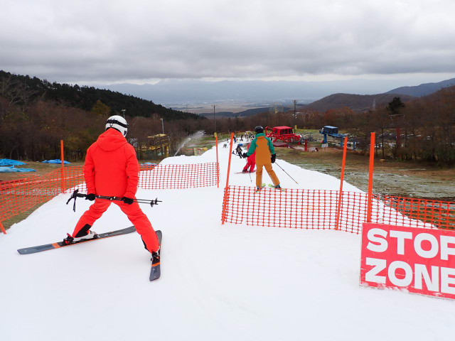

# 2024/11/16(土)のイエティの詳細レポート！…リフト待ちは少なめだったけど，ゲレンデ幅が例年より狭いので混雑がすごい(泣)

📅 投稿日時: 2024-11-18 03:59:45

🏷️ カテゴリ: [2025スキー滑走日記](cacd3fbf84d4a679ee61a5894c3f95e14.md)

えー．

18日に日付が変わった，深夜2時現在．

志賀高原は硯川でも気温がプラスで，

雨が降ってましたが…

深夜3時を過ぎると気温がマイナスになり，

カメラ表面にも雪の粒が着いている

ように見えます…！

（[北信建設事務道路気象状況カメラ](http://hokushin.pref-nagano-roadcamera.jp/)より）

これから数時間後の18日月曜の昼ごろに

向けてさらに気温が下がっていき．

標高が低いところでは18日の昼頃まで

雨ですが…

18日午後から19日朝にかけて，志賀を

含む長野北部，新潟では雪が降りますよ！！

少なくとも10cm，日本海側に近い新潟

では30cmくらい積もりそう！

…ただ，雪が降るのは一晩のみ．

19日火曜の朝にはやんでしまいそうですが…

でも，20日朝までは人工降雪機が動かせる

気温が続きそうなので．

18日昼過ぎから20日朝までの約2日間，

人工降雪機が動かせそうですよ～！！！

で．

大変良いニュースとして．

その後また22日の夜から冷えそうですっ…！

見ての通り，22日，23日，24日の3日間．

850hPaの赤い0℃線が志賀高原より南にあり，

…天然雪の降雪はそれほどなさそうだけど，

長野や新潟のスキー場は，22日の夜から

24日まで，全力で人工降雪が打てます！！

とりあえず，FZCX50の850hPa気温の

1週間推移を見ても，18，19日と並んで

22～23日に冷えそうな感じに見えます…！

…この通りなら，1か月予報が外れたという

ことですが…スキーヤーにとってはいい

ニュースです！！

とりあえず，23，24日に冷えるので．

今週末の23日のオープンは厳しそうですが…

現時点の気象庁予想が正しければ，

24日を過ぎたら，オープンするスキー場が

出てきそうな予感…！

ってなことで，本題へ．

本日は予告通り，土曜に行ってきたイエティの

詳細レポートです…！

…まずは，いつも通り朝9時のオープン前から

並びますが…

今日は先週までより並んでいる人が多くて，

ちょっと混みそうな予感…

予定時間の9時ちょうどにゲートオープン，

ゲレンデへ向かい…

いざ，本日の1本目へ！

雪はあさイチの圧雪が効いてフラットで，

硬すぎない程度に硫安が効いいい感じ！

あさイチは，前に人が少なくて飛ばしたい

放題に飛ばせていい！！

…けど．

ゲレンデ，先週と比べてそんなに

広がってないな…（泣）

一番最後の急斜面の手前の一時停止は

継続されてましたが，係員による待ち

指示はなかったので，そこまで詰まる

ことはなく．

この一時停止からの下は，ちょっとだけ

広がっていたかな…

で．朝の数本はリフト待ちが少なかったけど．

今日は今シーズン初めてナイター営業が

ある週末なので，午後は混むだろうなぁ…

と，朝のうちは思っていましたが…

夜は雨の予報だったからか，振り返って

みると，意外と午後も意外と混みません

でした…

そして．

今日はスタートでの滑り出しの人数制限を

していなかったので．

じきにコース上の人口密度は高くなり…

オープンから30分で，ちょっとリフト待ちが

でてきたり…

一時停止でちょっとだけ詰まったりしましたが．

この日のピークのリフト待ちは，午前中は

10時過ぎくらいに最大でこのくらいで．

まぁ3～5分待ち．

この時期にしてはリフトはそれほど混まず．

心配した一時停止待ちも，数回は発生した

ものの，ほとんどは待ちなくスルー可能！

さらに…

昼頃には，お昼休みの人が抜けたからか，

リフト待ちもかなり短くなって．

昼頃1時間はこの程度の待ち時間！

スタート待ちも，一時停止待ちもなく．

リフト待ちも，いつものこの時期のイエティ

よりはマシだな…！！

と，思ったものの．

例年よりコース幅が狭いので，追い越しが

困難ということもあり．

リフトが好いているタイミングでも，

コース上の人口密度はかなり高めで…

リフト待ちが少ないのに，人口密度の

高さのせいで，滑った時の快感度が

かなり低め（泣）

さらに，昼休みが終わった午後にはまた

リフト待ちも3分を越えてきて…

うーん．

スタート待ちがあった先週の方が

快感度は高かったかも（泣）

同じ待つなら，リフトよりスタートで待って，

コースがすいてる方がいいかも…

さらに，午後になると．

この狭いコースの上に，たくさんの雪山が

つくられてきたので…

さらにちょっと滑りにくい感じに（涙）

ただ，雪の厚みは十分に確保されているので．

この写真の部分と，一番最後の急斜面に

写真のようにちょっと茶色い部分が

出てきたくらいで，雪に穴が開いたり

することはなかったので，その点は

良かったかな…！！

午後のリフト待ちは，タイミングによっては

このくらい待ったけど．

運よく…

というか，運悪くというか．

午後2時半過ぎから時折ポツポツと，

軽い雨が降ったというのもあり．

ウェアが濡れず水滴が着く程度の

降りだったにもかかわらず，この雨で

人が結構減った感じで，リフト待ちは

この程度になり．待ち時間が短いときは

3-4組しか待ってないタイミングが

あったりと，ナイターのある本日，

午後の混雑を覚悟したけどそこまで

リフトは混みませんでした…

ただ，コース上の人口密度は相変わらず

最後まで高かったけど（泣）

雨は4時前には完全にやみましたが．

4時にはコース整備で一旦クローズ．

そして，午後5時のナイターオープンを

待ちます…

ただ．コース整備が遅れ，予定より10分ほど

遅い5時10分くらいにオープン！

オープンと同時にコースへ飛び込みます！！

ポールポジションは逃したけど，

本日2度目のシマシマバーン！

硫安が効いてなくて板が潜る感じ

だったけど，人口密度が高いゲレンデに

悲しみを覚えていたので，思いっきり

かっ飛ばせる快感を味わえました…

が．

2本目からは，雨がやんでいたこともあり，

もう昼間と同じ人口密度のゲレンデとなり…

コースも荒れ，リフト待ちも出てきたので．

帰宅後のお仕事をせねばならぬこともあり．

ナイター開始1時間弱でこの日は切り上げたの

でした…

…という感じで．

思ったほど混まなかったものの，

コースの狭さがちょっと悲しかった

今週のイエティですが．

18，19日の冷えと．

その後の22，23，24日の冷えで，コース幅が

一気に広がってくれるといいなぁ…

…というより．

週末までにこの冷えで，かぐらとか

菅平とか横手・熊とかいっぱいオープン

してほしい…
